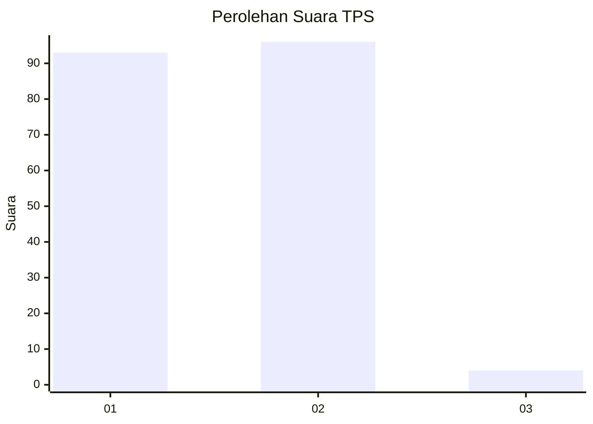
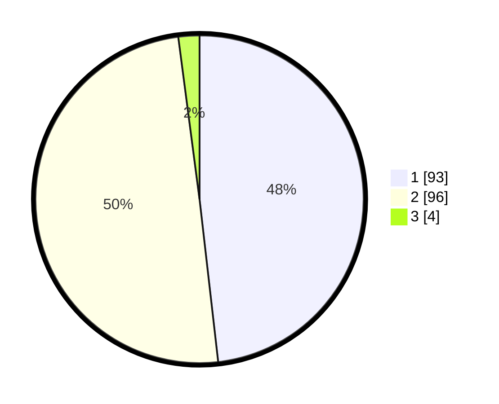

# Hasil

## Grafik

## Tabel

| No. | Nama Paslon    | Suara | Suara (raw) | Persentase |
|:--- |:-------------- | -----:| -----------:| ----------:|
| 1   | ANIES MUHAIMIN | 93    | [93][p-1]   | 48,19      |
| 2   | PRABOWO GIBRAN | 96    | [96][p-2]   | 49,74      |
| 3   | GANJAR MAHFUD  | 4     | [4][p-3]    | 2,07       |

[p-1]: https://github.com/gigit-pemilu/pemilu-2024-72-sulawesi-tengah/blob/main/pilpres/hitung-suara/sub/72-sulawesi-tengah/sub/01-banggai/sub/01-batui/sub/1006-bugis/sub/001-tps/sub/paslon-1.txt
[p-2]: https://github.com/gigit-pemilu/pemilu-2024-72-sulawesi-tengah/blob/main/pilpres/hitung-suara/sub/72-sulawesi-tengah/sub/01-banggai/sub/01-batui/sub/1006-bugis/sub/001-tps/sub/paslon-2.txt
[p-3]: https://github.com/gigit-pemilu/pemilu-2024-72-sulawesi-tengah/blob/main/pilpres/hitung-suara/sub/72-sulawesi-tengah/sub/01-banggai/sub/01-batui/sub/1006-bugis/sub/001-tps/sub/paslon-3.txt

## Foto C Plano

https://sirekap-obj-formc.kpu.go.id/a5e3/pemilu/ppwp/72/01/01/10/06/7201011006001-20240215-002526--4aa36b8d-d2d7-4974-9ca1-e06a978ccf86.jpg

https://sirekap-obj-formc.kpu.go.id/a5e3/pemilu/ppwp/72/01/01/10/06/7201011006001-20240215-002718--e2fd046a-d4de-4df4-84d4-4595bcf13d68.jpg

https://sirekap-obj-formc.kpu.go.id/a5e3/pemilu/ppwp/72/01/01/10/06/7201011006001-20240215-002819--28738c21-4d3e-44d4-a05c-3b79c45537e6.jpg

## Metadata

| Key        | Value               |
| ---------- | ------------------- |
| Time Stamp | 2024-02-15 23:29:50 |

## DATA PEMILIH TETAP

Jumlah pemilih dalam DPT: **238**.
 * L: **109**.
 * P: **129**.

## DATA PENGGUNA HAK PILIH

Jumlah pengguna hak pilih dalam DPT: **191**.
 * L: **85**.
 * P: **106**.

Jumlah pengguna hak pilih dalam DPTb: **4**.
 * L: **4**.
 * P: **0**.

Jumlah pengguna hak pilih dalam DPK: **0**.
 * L: **0**.
 * P: **0**.

Jumlah pengguna hak pilih: **195**.
 * L: **89**.
 * P: **106**.

## JUMLAH SUARA SAH DAN TIDAK SAH

JUMLAH SELURUH SUARA SAH: **193**.

JUMLAH SUARA TIDAK SAH: **2**.

JUMLAH SELURUH SUARA SAH DAN SUARA TIDAK SAH: **195**.

