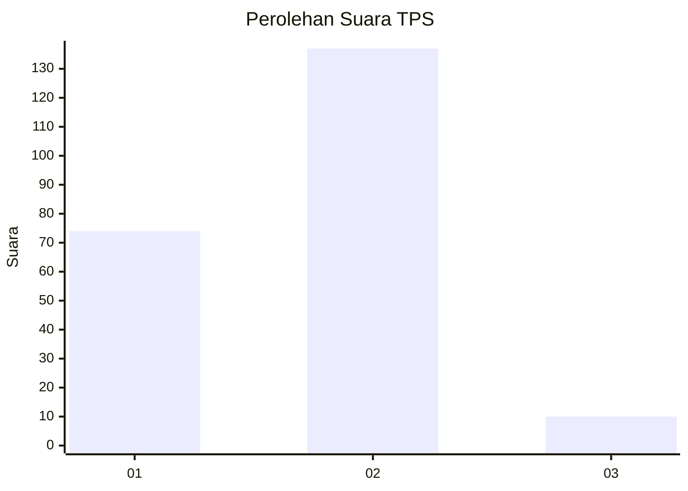
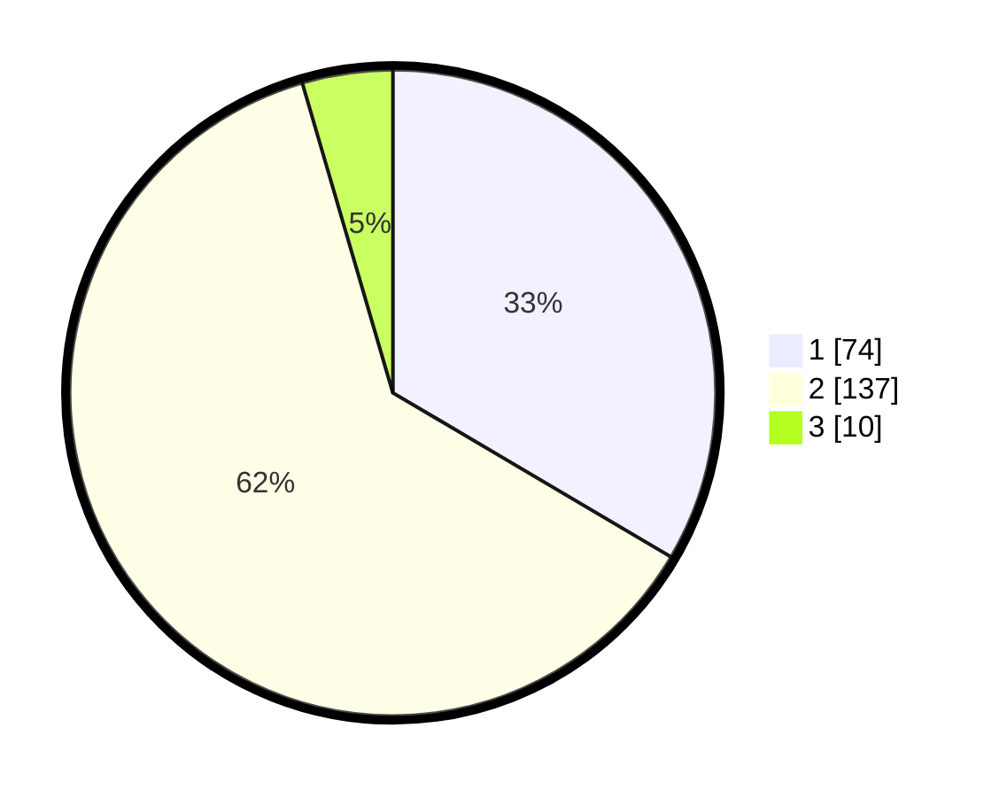

# Hasil

## Grafik

## Tabel

| No. | Nama Paslon    | Suara | Suara (raw) | Persentase |
|:--- |:-------------- | -----:| -----------:| ----------:|
| 1   | ANIES MUHAIMIN | 74    | [74][p-1]   | 33,48      |
| 2   | PRABOWO GIBRAN | 137   | [137][p-2]  | 61,99      |
| 3   | GANJAR MAHFUD  | 10    | [10][p-3]   | 4,52       |

[p-1]: https://github.com/gigit-pemilu/pemilu-2024-72-sulawesi-tengah/blob/main/pilpres/hitung-suara/sub/72-sulawesi-tengah/sub/01-banggai/sub/01-batui/sub/1007-balantang/sub/005-tps/sub/paslon-1.txt
[p-2]: https://github.com/gigit-pemilu/pemilu-2024-72-sulawesi-tengah/blob/main/pilpres/hitung-suara/sub/72-sulawesi-tengah/sub/01-banggai/sub/01-batui/sub/1007-balantang/sub/005-tps/sub/paslon-2.txt
[p-3]: https://github.com/gigit-pemilu/pemilu-2024-72-sulawesi-tengah/blob/main/pilpres/hitung-suara/sub/72-sulawesi-tengah/sub/01-banggai/sub/01-batui/sub/1007-balantang/sub/005-tps/sub/paslon-3.txt

## Foto C Plano

https://sirekap-obj-formc.kpu.go.id/31c9/pemilu/ppwp/72/01/01/10/07/7201011007005-20240215-075509--844ba6ed-2ac9-41da-900e-5f46c0f2d393.jpg

https://sirekap-obj-formc.kpu.go.id/31c9/pemilu/ppwp/72/01/01/10/07/7201011007005-20240215-010534--66a52c79-be3a-4d52-a49a-1a8d37c157b1.jpg

https://sirekap-obj-formc.kpu.go.id/31c9/pemilu/ppwp/72/01/01/10/07/7201011007005-20240215-075653--546d623c-857c-4868-a56e-e9624f635583.jpg

## Metadata

| Key        | Value               |
| ---------- | ------------------- |
| Time Stamp | 2024-02-16 00:00:26 |

