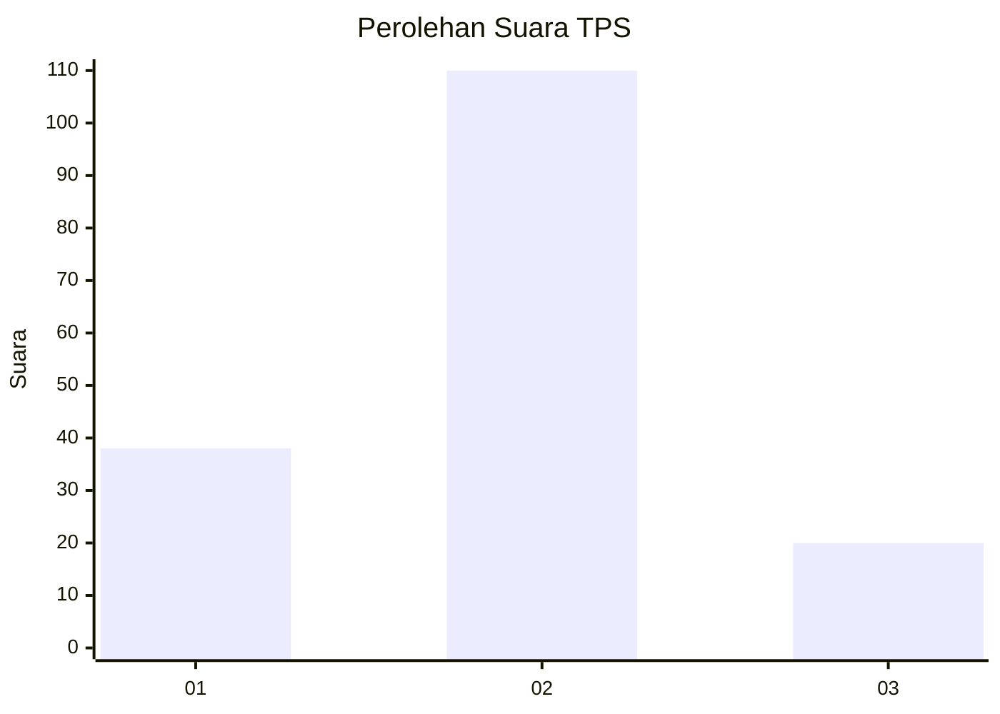
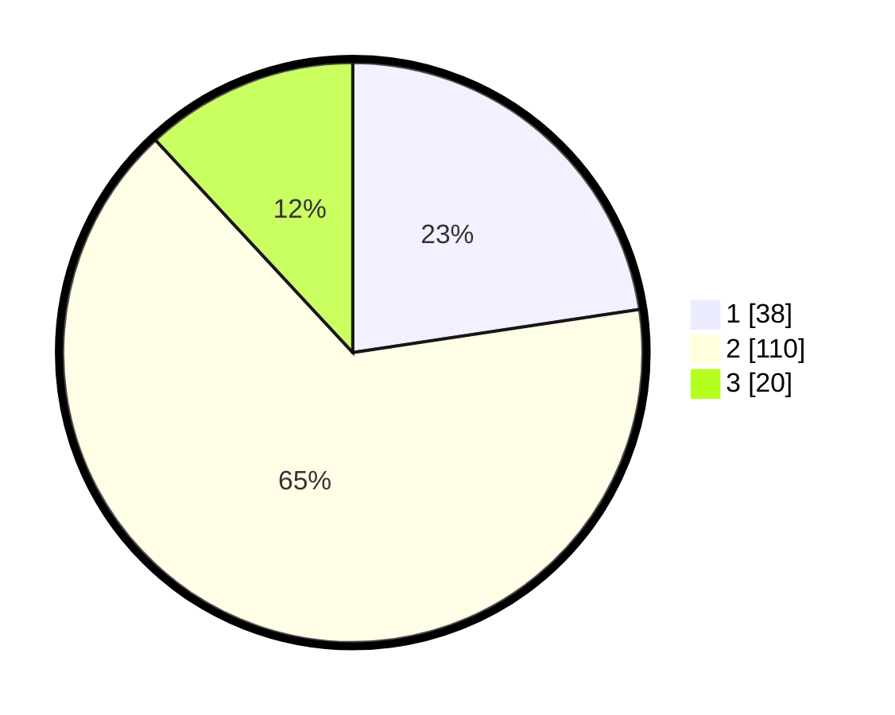

# Hasil

## Grafik

## Tabel

| No. | Nama Paslon    | Suara | Suara (raw) | Persentase |
|:--- |:-------------- | -----:| -----------:| ----------:|
| 1   | ANIES MUHAIMIN | 38    | [38][p-1]   | 22,62      |
| 2   | PRABOWO GIBRAN | 110   | [110][p-2]  | 65,48      |
| 3   | GANJAR MAHFUD  | 20    | [20][p-3]   | 11,90      |

[p-1]: https://github.com/gigit-pemilu/pemilu-2024-72-sulawesi-tengah/blob/main/pilpres/hitung-suara/sub/72-sulawesi-tengah/sub/01-banggai/sub/01-batui/sub/1009-tolando/sub/003-tps/sub/paslon-1.txt
[p-2]: https://github.com/gigit-pemilu/pemilu-2024-72-sulawesi-tengah/blob/main/pilpres/hitung-suara/sub/72-sulawesi-tengah/sub/01-banggai/sub/01-batui/sub/1009-tolando/sub/003-tps/sub/paslon-2.txt
[p-3]: https://github.com/gigit-pemilu/pemilu-2024-72-sulawesi-tengah/blob/main/pilpres/hitung-suara/sub/72-sulawesi-tengah/sub/01-banggai/sub/01-batui/sub/1009-tolando/sub/003-tps/sub/paslon-3.txt

## Foto C Plano

https://sirekap-obj-formc.kpu.go.id/2866/pemilu/ppwp/72/01/01/10/09/7201011009003-20240215-073857--65b2b397-8f73-4a1c-b32f-8faa33bf4227.jpg

https://sirekap-obj-formc.kpu.go.id/2866/pemilu/ppwp/72/01/01/10/09/7201011009003-20240215-144102--0640377e-8d51-4940-a558-b56099f678ae.jpg

https://sirekap-obj-formc.kpu.go.id/2866/pemilu/ppwp/72/01/01/10/09/7201011009003-20240215-144327--8ba99ff4-0506-4486-8153-9cf17b660579.jpg

## Metadata

| Key        | Value               |
| ---------- | ------------------- |
| Time Stamp | 2024-02-15 19:30:26 |

