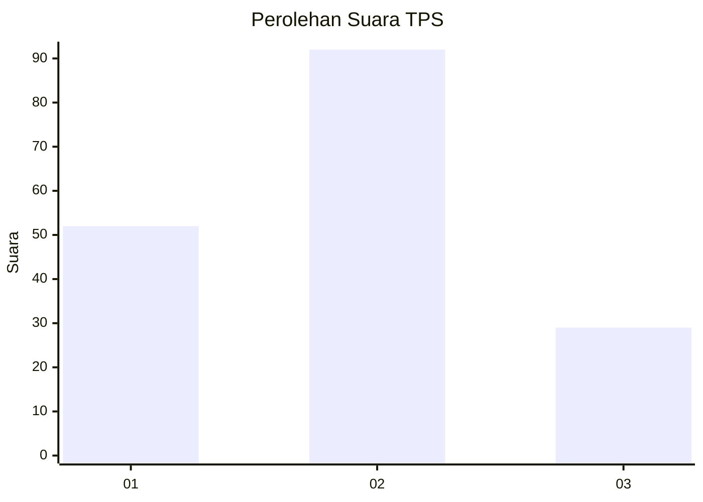
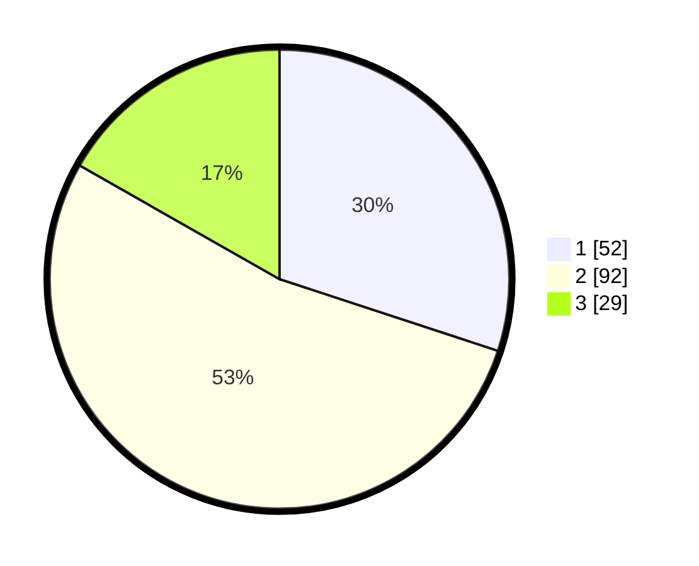

# Hasil

## Grafik

## Tabel

| No. | Nama Paslon    | Suara | Suara (raw) | Persentase |
|:--- |:-------------- | -----:| -----------:| ----------:|
| 1   | ANIES MUHAIMIN | 52    | [52][p-1]   | 30,06      |
| 2   | PRABOWO GIBRAN | 92    | [92][p-2]   | 53,18      |
| 3   | GANJAR MAHFUD  | 29    | [29][p-3]   | 16,76      |

[p-1]: https://github.com/gigit-pemilu/pemilu-2024-72-sulawesi-tengah/blob/main/pilpres/hitung-suara/sub/72-sulawesi-tengah/sub/01-banggai/sub/04-luwuk/sub/1009-luwuk/sub/004-tps/sub/paslon-1.txt
[p-2]: https://github.com/gigit-pemilu/pemilu-2024-72-sulawesi-tengah/blob/main/pilpres/hitung-suara/sub/72-sulawesi-tengah/sub/01-banggai/sub/04-luwuk/sub/1009-luwuk/sub/004-tps/sub/paslon-2.txt
[p-3]: https://github.com/gigit-pemilu/pemilu-2024-72-sulawesi-tengah/blob/main/pilpres/hitung-suara/sub/72-sulawesi-tengah/sub/01-banggai/sub/04-luwuk/sub/1009-luwuk/sub/004-tps/sub/paslon-3.txt

## Foto C Plano

https://sirekap-obj-formc.kpu.go.id/39bf/pemilu/ppwp/72/01/04/10/09/7201041009004-20240215-070032--a5a0bc6c-03b7-4727-980c-f2da2ebde92b.jpg

https://sirekap-obj-formc.kpu.go.id/39bf/pemilu/ppwp/72/01/04/10/09/7201041009004-20240215-070215--2a6e68c5-ab0d-4c4d-b73d-43e60d05f997.jpg

https://sirekap-obj-formc.kpu.go.id/39bf/pemilu/ppwp/72/01/04/10/09/7201041009004-20240216-213913--d2ef017f-45b0-4e72-ad89-0553836b98ea.jpg

## Metadata

| Key        | Value               |
| ---------- | ------------------- |
| Time Stamp | 2024-02-16 22:01:00 |

