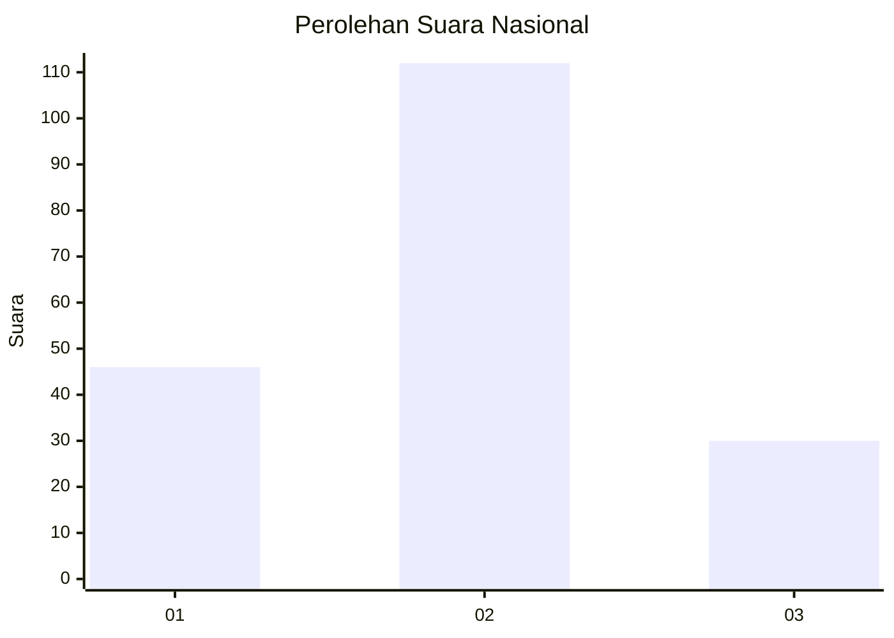

# Hasil

## Grafik

## Tabel

| No. | Nama Paslon    | Suara | Suara (raw) | Persentase |
|:--- |:-------------- | -----:| -----------:| ----------:|
| 1   | ANIES MUHAIMIN | 46    | [46][p-1]   | 24,47      |
| 2   | PRABOWO GIBRAN | 112   | [112][p-2]  | 59,57      |
| 3   | GANJAR MAHFUD  | 30    | [30][p-3]   | 15,96      |

[p-1]: https://github.com/gigit-pemilu/pemilu-2024/blob/main/pilpres/hitung-suara/sub/72-sulawesi-tengah/sub/01-banggai/sub/04-luwuk/sub/1011-soho/sub/005-tps/sub/paslon-1.txt
[p-2]: https://github.com/gigit-pemilu/pemilu-2024/blob/main/pilpres/hitung-suara/sub/72-sulawesi-tengah/sub/01-banggai/sub/04-luwuk/sub/1011-soho/sub/005-tps/sub/paslon-2.txt
[p-3]: https://github.com/gigit-pemilu/pemilu-2024/blob/main/pilpres/hitung-suara/sub/72-sulawesi-tengah/sub/01-banggai/sub/04-luwuk/sub/1011-soho/sub/005-tps/sub/paslon-3.txt

## Foto C Plano

https://sirekap-obj-formc.kpu.go.id/6a3b/pemilu/ppwp/72/01/04/10/11/7201041011005-20240215-060014--797e9ceb-0d0c-46d2-8ba4-439a50d15baa.jpg

https://sirekap-obj-formc.kpu.go.id/6a3b/pemilu/ppwp/72/01/04/10/11/7201041011005-20240215-060150--4b91517e-a451-4ca5-8ef2-ba4b4764abb4.jpg

https://sirekap-obj-formc.kpu.go.id/6a3b/pemilu/ppwp/72/01/04/10/11/7201041011005-20240215-060300--143f92db-51be-4b5e-bebf-b3bf6df0140d.jpg

## Metadata

| Key        | Value               |
| ---------- | ------------------- |
| Time Stamp | 2024-02-15 15:00:29 |

## DATA PEMILIH TETAP

Jumlah pemilih dalam DPT: **0**.
 * L: **216**.
 * P: **138**.

## DATA PENGGUNA HAK PILIH

Jumlah pengguna hak pilih dalam DPT: **5**.
 * L: **655**.
 * P: **550**.

Jumlah pengguna hak pilih dalam DPTb: **0**.
 * L: **660**.
 * P: **500**.

Jumlah pengguna hak pilih dalam DPK: **0**.
 * L: **555**.
 * P: **0**.

Jumlah pengguna hak pilih: **0**.
 * L: **550**.
 * P: **0**.

## JUMLAH SUARA SAH DAN TIDAK SAH

JUMLAH SELURUH SUARA SAH: **188**.

JUMLAH SUARA TIDAK SAH: **2**.

JUMLAH SELURUH SUARA SAH DAN SUARA TIDAK SAH: **190**.

