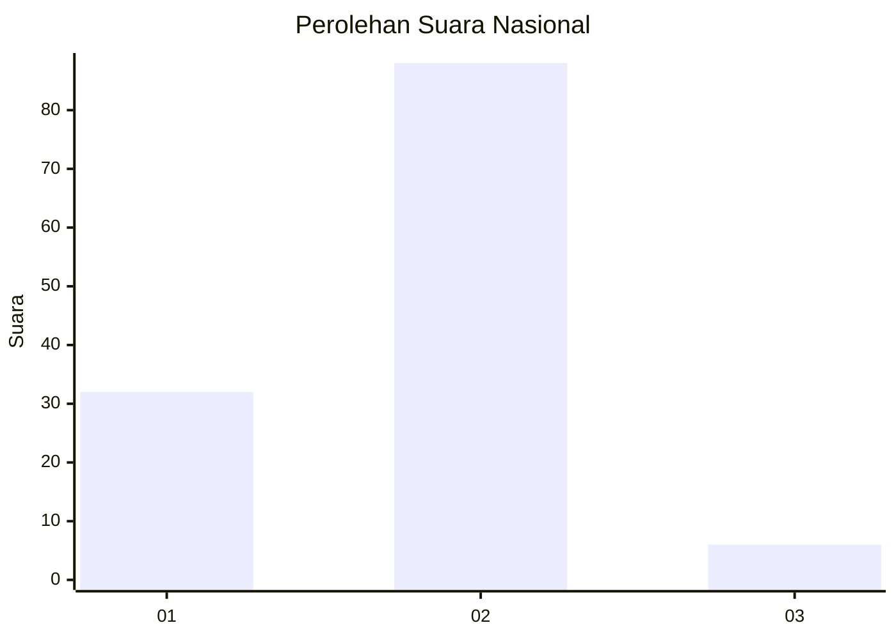
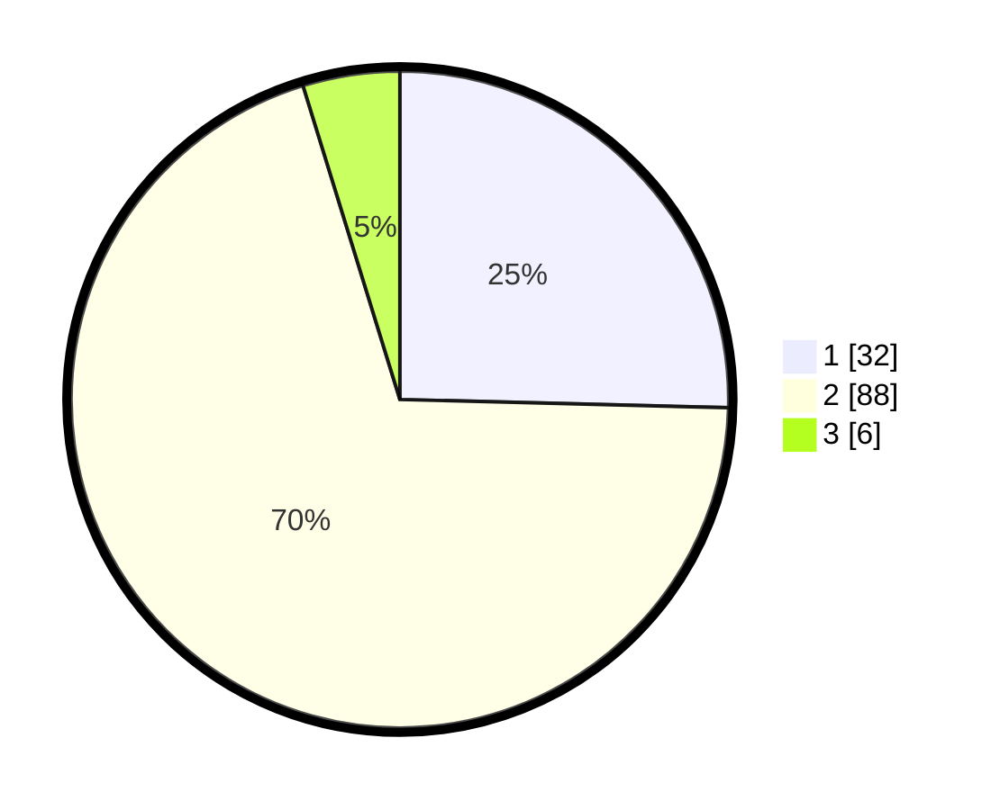

# Hasil

## Grafik

## Tabel

| No. | Nama Paslon    | Suara | Suara (raw) | Persentase |
|:--- |:-------------- | -----:| -----------:| ----------:|
| 1   | ANIES MUHAIMIN | 32    | [32][p-1]   | 25,40      |
| 2   | PRABOWO GIBRAN | 88    | [88][p-2]   | 69,84      |
| 3   | GANJAR MAHFUD  | 6     | [6][p-3]    | 4,76       |

[p-1]: https://github.com/gigit-pemilu/pemilu-2024/blob/main/pilpres/hitung-suara/sub/72-sulawesi-tengah/sub/01-banggai/sub/14-moilong/sub/2001-saluan/sub/002-tps/sub/paslon-1.txt
[p-2]: https://github.com/gigit-pemilu/pemilu-2024/blob/main/pilpres/hitung-suara/sub/72-sulawesi-tengah/sub/01-banggai/sub/14-moilong/sub/2001-saluan/sub/002-tps/sub/paslon-2.txt
[p-3]: https://github.com/gigit-pemilu/pemilu-2024/blob/main/pilpres/hitung-suara/sub/72-sulawesi-tengah/sub/01-banggai/sub/14-moilong/sub/2001-saluan/sub/002-tps/sub/paslon-3.txt

## Foto C Plano

https://sirekap-obj-formc.kpu.go.id/a178/pemilu/ppwp/72/01/14/20/01/7201142001002-20240215-084227--19a786b7-0483-4802-a51d-9e9af6ee3daf.jpg

https://sirekap-obj-formc.kpu.go.id/a178/pemilu/ppwp/72/01/14/20/01/7201142001002-20240215-084332--c5c7ca7b-0c50-44dd-91a8-d813ee651ccf.jpg

https://sirekap-obj-formc.kpu.go.id/a178/pemilu/ppwp/72/01/14/20/01/7201142001002-20240215-084417--d5e28d3d-6a53-42c7-9f1e-f1023e876109.jpg

## Metadata

| Key        | Value               |
| ---------- | ------------------- |
| Time Stamp | 2024-02-16 22:01:00 |

