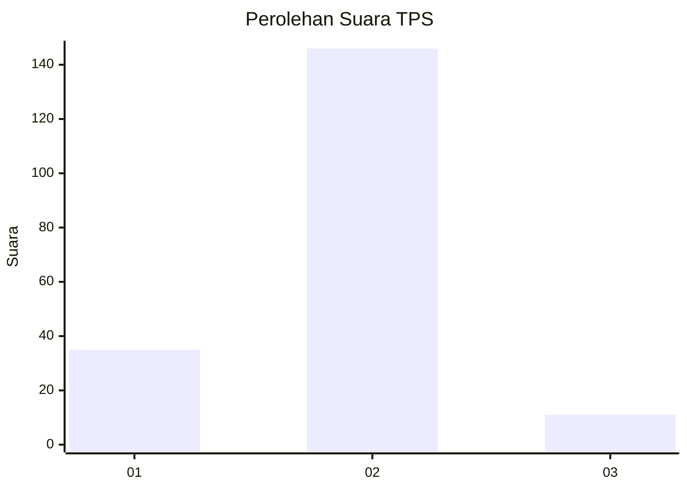
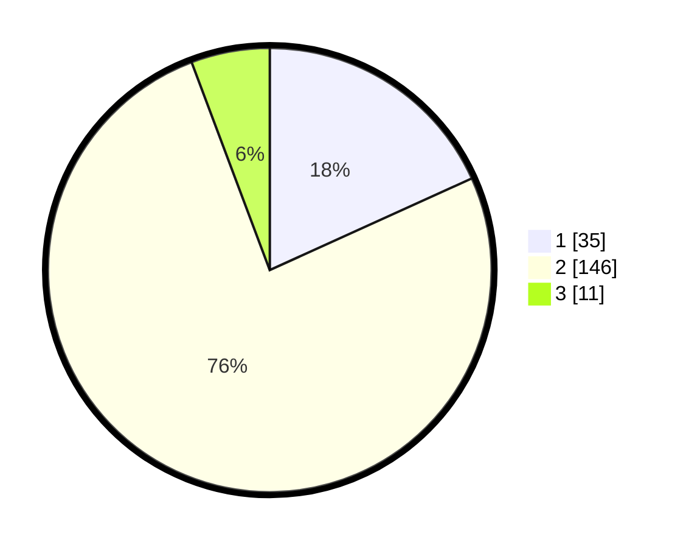

# Hasil

## Grafik

## Tabel

| No. | Nama Paslon    | Suara | Suara (raw) | Persentase |
|:--- |:-------------- | -----:| -----------:| ----------:|
| 1   | ANIES MUHAIMIN | 35    | [35][p-1]   | 18,23      |
| 2   | PRABOWO GIBRAN | 146   | [146][p-2]  | 76,04      |
| 3   | GANJAR MAHFUD  | 11    | [11][p-3]   | 5,73       |

[p-1]: https://github.com/gigit-pemilu/pemilu-2024-72-sulawesi-tengah/blob/main/pilpres/hitung-suara/sub/72-sulawesi-tengah/sub/01-banggai/sub/23-nambo/sub/1005-nambo-lempek/sub/001-tps/sub/paslon-1.txt
[p-2]: https://github.com/gigit-pemilu/pemilu-2024-72-sulawesi-tengah/blob/main/pilpres/hitung-suara/sub/72-sulawesi-tengah/sub/01-banggai/sub/23-nambo/sub/1005-nambo-lempek/sub/001-tps/sub/paslon-2.txt
[p-3]: https://github.com/gigit-pemilu/pemilu-2024-72-sulawesi-tengah/blob/main/pilpres/hitung-suara/sub/72-sulawesi-tengah/sub/01-banggai/sub/23-nambo/sub/1005-nambo-lempek/sub/001-tps/sub/paslon-3.txt

## Foto C Plano

https://sirekap-obj-formc.kpu.go.id/ea27/pemilu/ppwp/72/01/23/10/05/7201231005001-20240215-030326--09828752-3cbc-4690-95df-351f6e51b8bd.jpg

https://sirekap-obj-formc.kpu.go.id/ea27/pemilu/ppwp/72/01/23/10/05/7201231005001-20240215-030035--6343dddd-286a-4461-a2aa-111133526f3d.jpg

https://sirekap-obj-formc.kpu.go.id/ea27/pemilu/ppwp/72/01/23/10/05/7201231005001-20240215-030205--c2a25465-7ee2-44ba-9344-b70287d9e06f.jpg

## Metadata

| Key        | Value               |
| ---------- | ------------------- |
| Time Stamp | 2024-02-15 09:00:24 |

