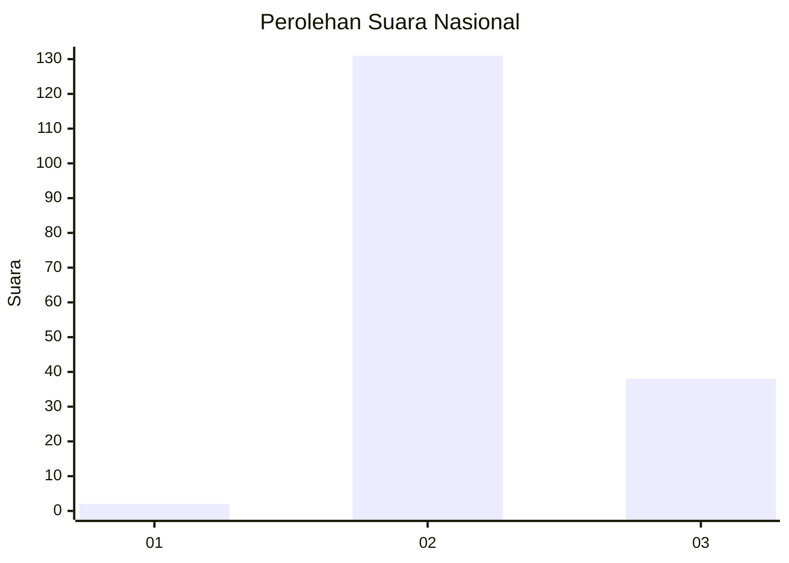
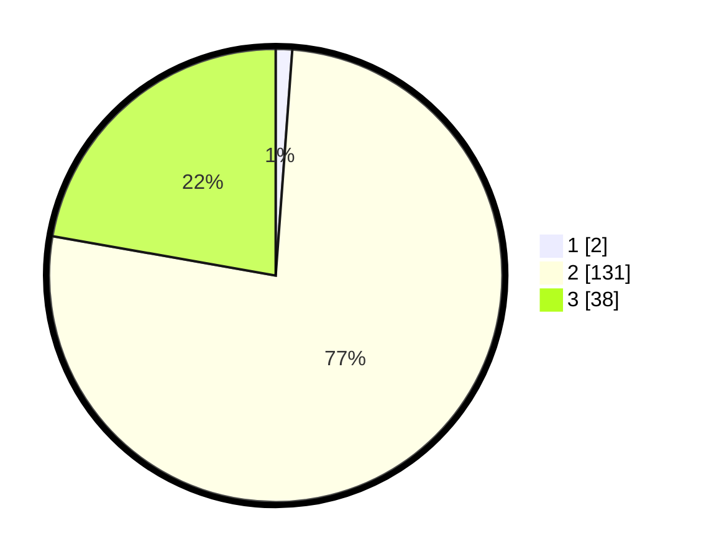

# Hasil

## Grafik

## Tabel

| No. | Nama Paslon    | Suara | Suara (raw) | Persentase |
|:--- |:-------------- | -----:| -----------:| ----------:|
| 1   | ANIES MUHAIMIN | 2     | [2][p-1]    | 1,17       |
| 2   | PRABOWO GIBRAN | 131   | [131][p-2]  | 76,61      |
| 3   | GANJAR MAHFUD  | 38    | [38][p-3]   | 22,22      |

[p-1]: https://github.com/gigit-pemilu/pemilu-2024/blob/main/pilpres/hitung-suara/sub/72-sulawesi-tengah/sub/02-poso/sub/04-pamona-puselemba/sub/1006-pamona/sub/002-tps/sub/paslon-1.txt
[p-2]: https://github.com/gigit-pemilu/pemilu-2024/blob/main/pilpres/hitung-suara/sub/72-sulawesi-tengah/sub/02-poso/sub/04-pamona-puselemba/sub/1006-pamona/sub/002-tps/sub/paslon-2.txt
[p-3]: https://github.com/gigit-pemilu/pemilu-2024/blob/main/pilpres/hitung-suara/sub/72-sulawesi-tengah/sub/02-poso/sub/04-pamona-puselemba/sub/1006-pamona/sub/002-tps/sub/paslon-3.txt

## Foto C Plano

https://sirekap-obj-formc.kpu.go.id/a737/pemilu/ppwp/72/02/04/10/06/7202041006002-20240214-190316--5ca2a9fe-891b-4d02-9382-ac48cc56b826.jpg

https://sirekap-obj-formc.kpu.go.id/a737/pemilu/ppwp/72/02/04/10/06/7202041006002-20240214-185923--370b922a-70ca-48d4-baa8-5d738d325d03.jpg

https://sirekap-obj-formc.kpu.go.id/a737/pemilu/ppwp/72/02/04/10/06/7202041006002-20240214-190243--6b9ec48c-e76a-4386-b5b8-c9ec237c3803.jpg

## Metadata

| Key        | Value               |
| ---------- | ------------------- |
| Time Stamp | 2024-02-16 21:01:00 |

