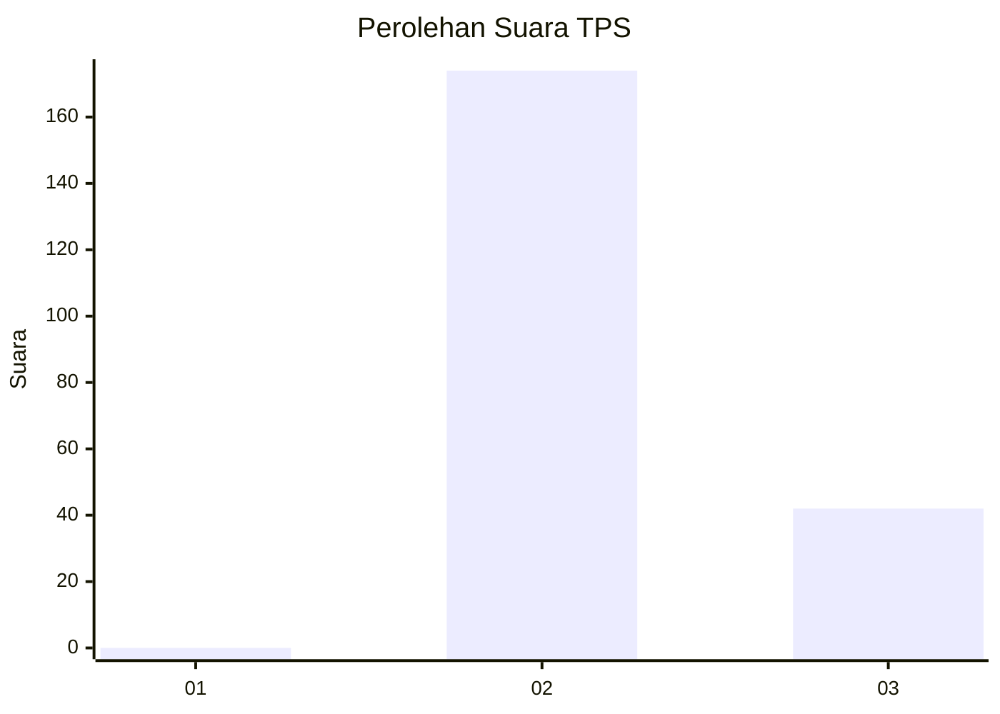
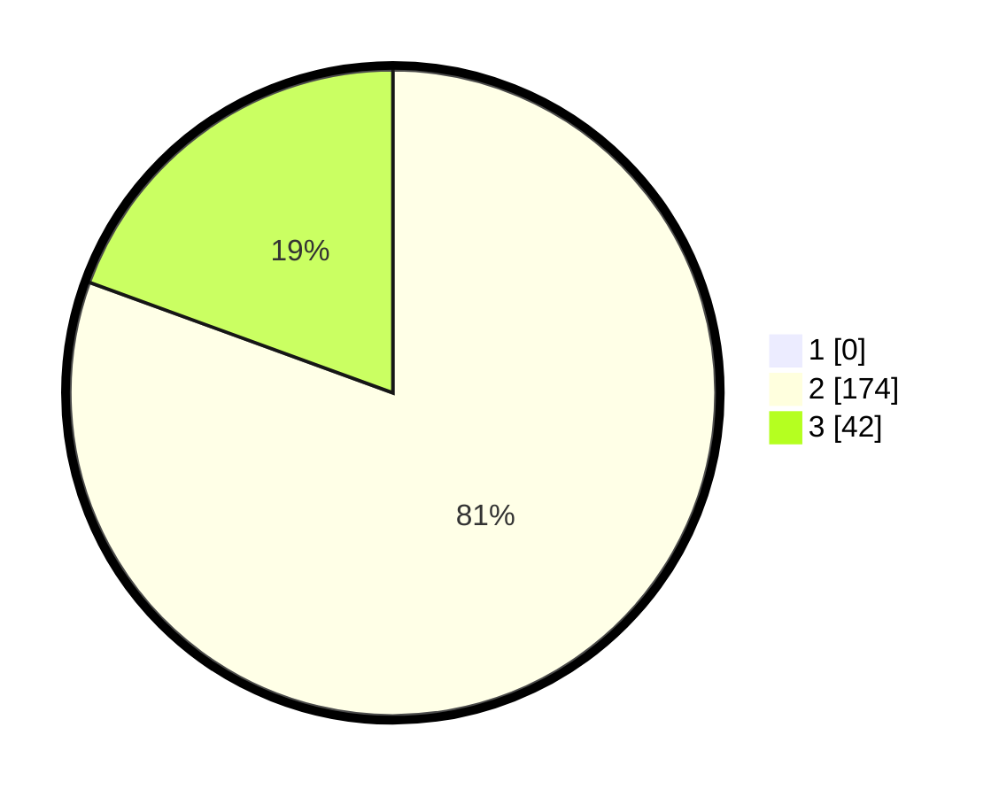

# Hasil

## Grafik

## Tabel

| No. | Nama Paslon    | Suara | Suara (raw) | Persentase |
|:--- |:-------------- | -----:| -----------:| ----------:|
| 1   | ANIES MUHAIMIN | 0     | [0][p-1]    | 0,00       |
| 2   | PRABOWO GIBRAN | 174   | [174][p-2]  | 80,56      |
| 3   | GANJAR MAHFUD  | 42    | [42][p-3]   | 19,44      |

[p-1]: https://github.com/gigit-pemilu/pemilu-2024-72-sulawesi-tengah/blob/main/pilpres/hitung-suara/sub/72-sulawesi-tengah/sub/02-poso/sub/05-pamona-timur/sub/2001-taripa/sub/003-tps/sub/paslon-1.txt
[p-2]: https://github.com/gigit-pemilu/pemilu-2024-72-sulawesi-tengah/blob/main/pilpres/hitung-suara/sub/72-sulawesi-tengah/sub/02-poso/sub/05-pamona-timur/sub/2001-taripa/sub/003-tps/sub/paslon-2.txt
[p-3]: https://github.com/gigit-pemilu/pemilu-2024-72-sulawesi-tengah/blob/main/pilpres/hitung-suara/sub/72-sulawesi-tengah/sub/02-poso/sub/05-pamona-timur/sub/2001-taripa/sub/003-tps/sub/paslon-3.txt

## Foto C Plano

https://sirekap-obj-formc.kpu.go.id/5a25/pemilu/ppwp/72/02/05/20/01/7202052001003-20240215-060245--f20adf52-e535-44a3-839f-77e5c86fa511.jpg

https://sirekap-obj-formc.kpu.go.id/5a25/pemilu/ppwp/72/02/05/20/01/7202052001003-20240215-060523--13584c25-ba96-4a25-9120-43dc8d86e7fa.jpg

https://sirekap-obj-formc.kpu.go.id/5a25/pemilu/ppwp/72/02/05/20/01/7202052001003-20240215-060737--689a132d-fdfb-4adc-8bb0-7dae9b5150d6.jpg

## Metadata

| Key        | Value               |
| ---------- | ------------------- |
| Time Stamp | 2024-02-17 13:37:34 |

