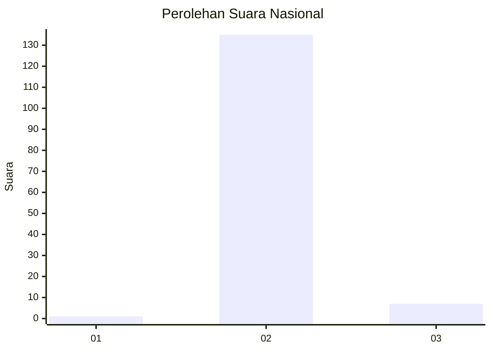
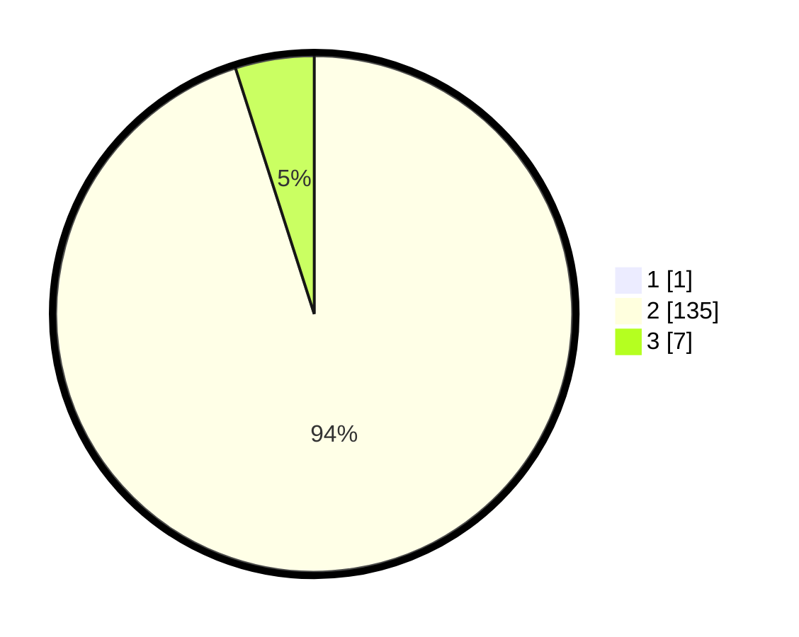

# Hasil

## Grafik

## Tabel

| No. | Nama Paslon    | Suara | Suara (raw) | Persentase |
|:--- |:-------------- | -----:| -----------:| ----------:|
| 1   | ANIES MUHAIMIN | 1     | [1][p-1]    | 0,70       |
| 2   | PRABOWO GIBRAN | 135   | [135][p-2]  | 94,41      |
| 3   | GANJAR MAHFUD  | 7     | [7][p-3]    | 4,90       |

[p-1]: https://github.com/gigit-pemilu/pemilu-2024/blob/main/pilpres/hitung-suara/sub/72-sulawesi-tengah/sub/02-poso/sub/05-pamona-timur/sub/2009-poleganyara/sub/003-tps/sub/paslon-1.txt
[p-2]: https://github.com/gigit-pemilu/pemilu-2024/blob/main/pilpres/hitung-suara/sub/72-sulawesi-tengah/sub/02-poso/sub/05-pamona-timur/sub/2009-poleganyara/sub/003-tps/sub/paslon-2.txt
[p-3]: https://github.com/gigit-pemilu/pemilu-2024/blob/main/pilpres/hitung-suara/sub/72-sulawesi-tengah/sub/02-poso/sub/05-pamona-timur/sub/2009-poleganyara/sub/003-tps/sub/paslon-3.txt

## Foto C Plano

https://sirekap-obj-formc.kpu.go.id/5f97/pemilu/ppwp/72/02/05/20/09/7202052009003-20240215-112934--c5b82391-2064-4b94-b2e7-13aeae6fa8ab.jpg

https://sirekap-obj-formc.kpu.go.id/5f97/pemilu/ppwp/72/02/05/20/09/7202052009003-20240215-105900--96cfa6b4-dd24-4fe6-96bd-cccb48e07db4.jpg

https://sirekap-obj-formc.kpu.go.id/5f97/pemilu/ppwp/72/02/05/20/09/7202052009003-20240215-113008--a5a53a09-c0f4-4acb-8853-987d3ab46db9.jpg

## Metadata

| Key        | Value               |
| ---------- | ------------------- |
| Time Stamp | 2024-02-17 13:37:34 |

