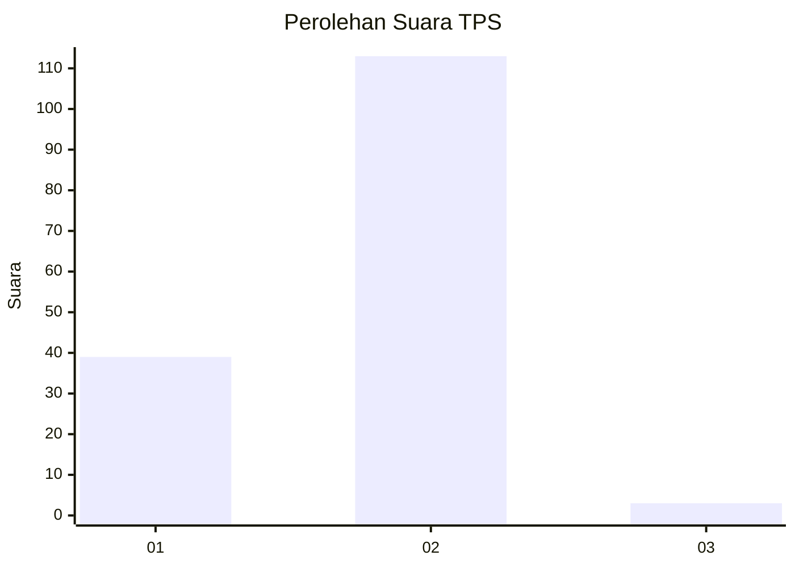
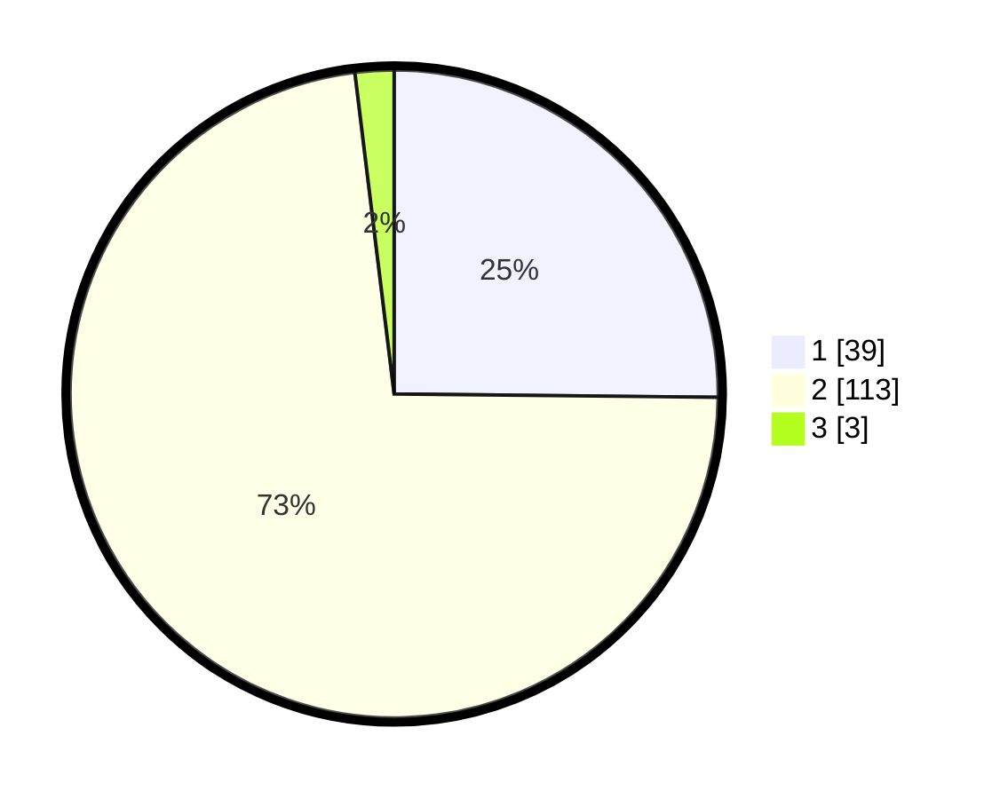

# Hasil

## Grafik

## Tabel

| No. | Nama Paslon    | Suara | Suara (raw) | Persentase |
|:--- |:-------------- | -----:| -----------:| ----------:|
| 1   | ANIES MUHAIMIN | 39    | [39][p-1]   | 25,16      |
| 2   | PRABOWO GIBRAN | 113   | [113][p-2]  | 72,90      |
| 3   | GANJAR MAHFUD  | 3     | [3][p-3]    | 1,94       |

[p-1]: https://github.com/gigit-pemilu/pemilu-2024-72-sulawesi-tengah/blob/main/pilpres/hitung-suara/sub/72-sulawesi-tengah/sub/02-poso/sub/06-pamona-selatan/sub/2019-pandajaya/sub/005-tps/sub/paslon-1.txt
[p-2]: https://github.com/gigit-pemilu/pemilu-2024-72-sulawesi-tengah/blob/main/pilpres/hitung-suara/sub/72-sulawesi-tengah/sub/02-poso/sub/06-pamona-selatan/sub/2019-pandajaya/sub/005-tps/sub/paslon-2.txt
[p-3]: https://github.com/gigit-pemilu/pemilu-2024-72-sulawesi-tengah/blob/main/pilpres/hitung-suara/sub/72-sulawesi-tengah/sub/02-poso/sub/06-pamona-selatan/sub/2019-pandajaya/sub/005-tps/sub/paslon-3.txt

## Foto C Plano

https://sirekap-obj-formc.kpu.go.id/b385/pemilu/ppwp/72/02/06/20/19/7202062019005-20240216-214336--30bd98c3-5744-4fe4-953a-b07f0d155803.jpg

https://sirekap-obj-formc.kpu.go.id/b385/pemilu/ppwp/72/02/06/20/19/7202062019005-20240216-214440--f61cf99e-0446-49a1-aee6-40e299ab0ad4.jpg

https://sirekap-obj-formc.kpu.go.id/b385/pemilu/ppwp/72/02/06/20/19/7202062019005-20240216-214627--66c11add-f733-4cbb-9009-3a2823606c19.jpg

## Metadata

| Key        | Value               |
| ---------- | ------------------- |
| Time Stamp | 2024-02-19 06:16:00 |

## DATA PEMILIH TETAP

Jumlah pemilih dalam DPT: **483**.
 * L: **844**.
 * P: **449**.

## DATA PENGGUNA HAK PILIH

Jumlah pengguna hak pilih dalam DPT: **444**.
 * L: **448**.
 * P: **879**.

Jumlah pengguna hak pilih dalam DPTb: **863**.
 * L: **7**.
 * P: **404**.

Jumlah pengguna hak pilih dalam DPK: **456**.
 * L: **88**.
 * P: **484**.

Jumlah pengguna hak pilih: **457**.
 * L: **849**.
 * P: **874**.

## JUMLAH SUARA SAH DAN TIDAK SAH

JUMLAH SELURUH SUARA SAH: **155**.

JUMLAH SUARA TIDAK SAH: **2**.

JUMLAH SELURUH SUARA SAH DAN SUARA TIDAK SAH: **157**.

