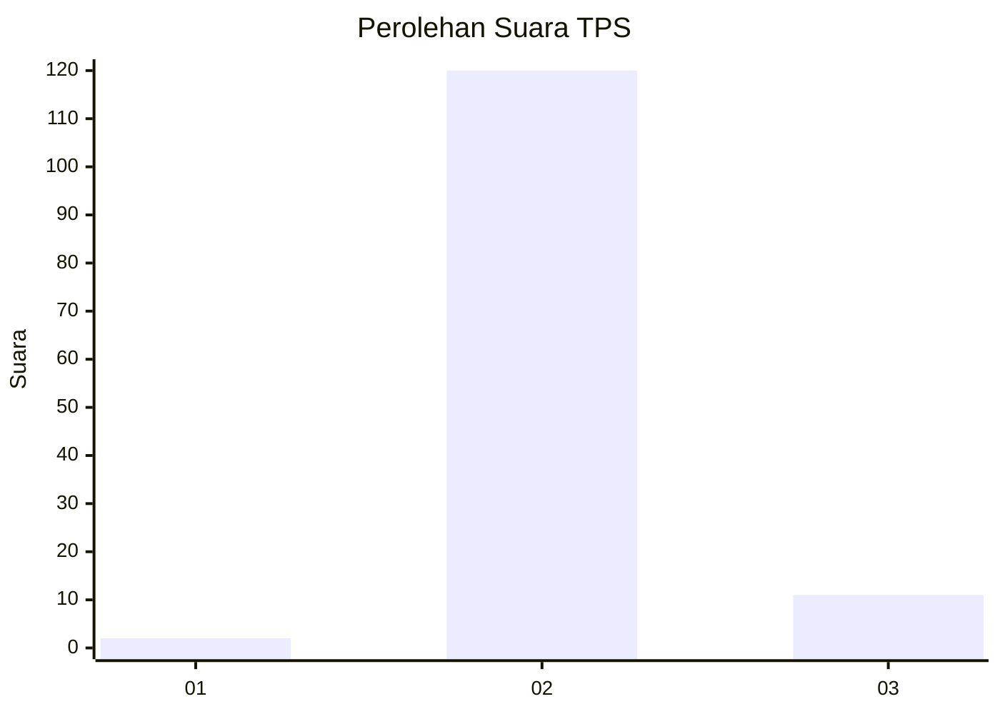
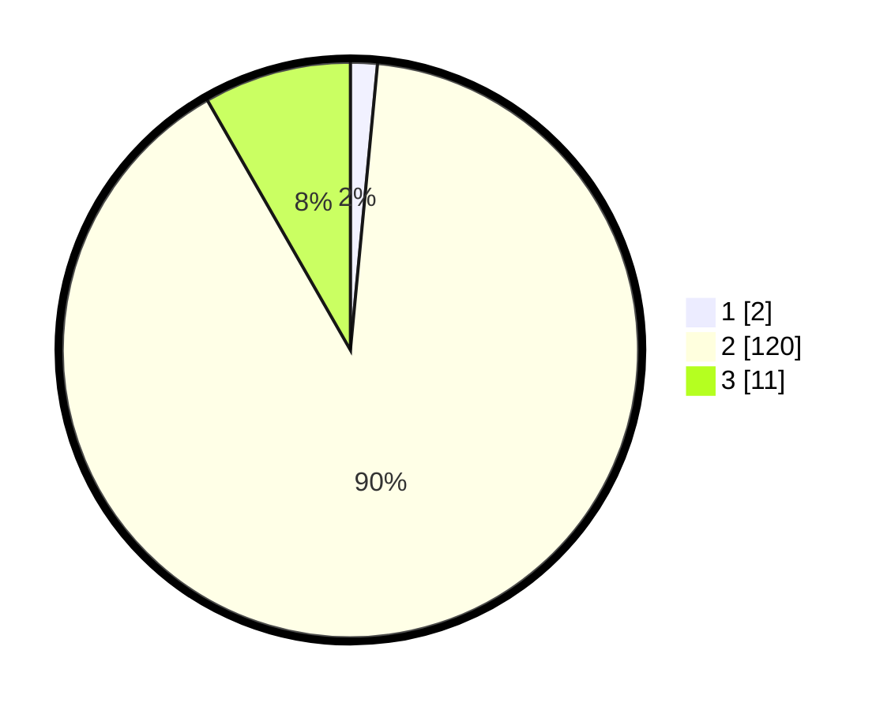

# Hasil

## Grafik

## Tabel

| No. | Nama Paslon    | Suara | Suara (raw) | Persentase |
|:--- |:-------------- | -----:| -----------:| ----------:|
| 1   | ANIES MUHAIMIN | 2     | [2][p-1]    | 1,50       |
| 2   | PRABOWO GIBRAN | 120   | [120][p-2]  | 90,23      |
| 3   | GANJAR MAHFUD  | 11    | [11][p-3]   | 8,27       |

[p-1]: https://github.com/gigit-pemilu/pemilu-2024-72-sulawesi-tengah/blob/main/pilpres/hitung-suara/sub/72-sulawesi-tengah/sub/02-poso/sub/07-lore-utara/sub/2001-dodolo/sub/001-tps/sub/paslon-1.txt
[p-2]: https://github.com/gigit-pemilu/pemilu-2024-72-sulawesi-tengah/blob/main/pilpres/hitung-suara/sub/72-sulawesi-tengah/sub/02-poso/sub/07-lore-utara/sub/2001-dodolo/sub/001-tps/sub/paslon-2.txt
[p-3]: https://github.com/gigit-pemilu/pemilu-2024-72-sulawesi-tengah/blob/main/pilpres/hitung-suara/sub/72-sulawesi-tengah/sub/02-poso/sub/07-lore-utara/sub/2001-dodolo/sub/001-tps/sub/paslon-3.txt

## Foto C Plano

https://sirekap-obj-formc.kpu.go.id/b921/pemilu/ppwp/72/02/07/20/01/7202072001001-20240214-140937--d157e2c7-2392-41d7-9d47-2103c7071be7.jpg

https://sirekap-obj-formc.kpu.go.id/b921/pemilu/ppwp/72/02/07/20/01/7202072001001-20240214-141047--91be2020-7621-412f-817c-844e6f00ada3.jpg

https://sirekap-obj-formc.kpu.go.id/b921/pemilu/ppwp/72/02/07/20/01/7202072001001-20240214-141223--f798e7a8-8986-469a-9e08-8c1f5241d9f1.jpg

## Metadata

| Key        | Value               |
| ---------- | ------------------- |
| Time Stamp | 2024-02-16 14:30:33 |

