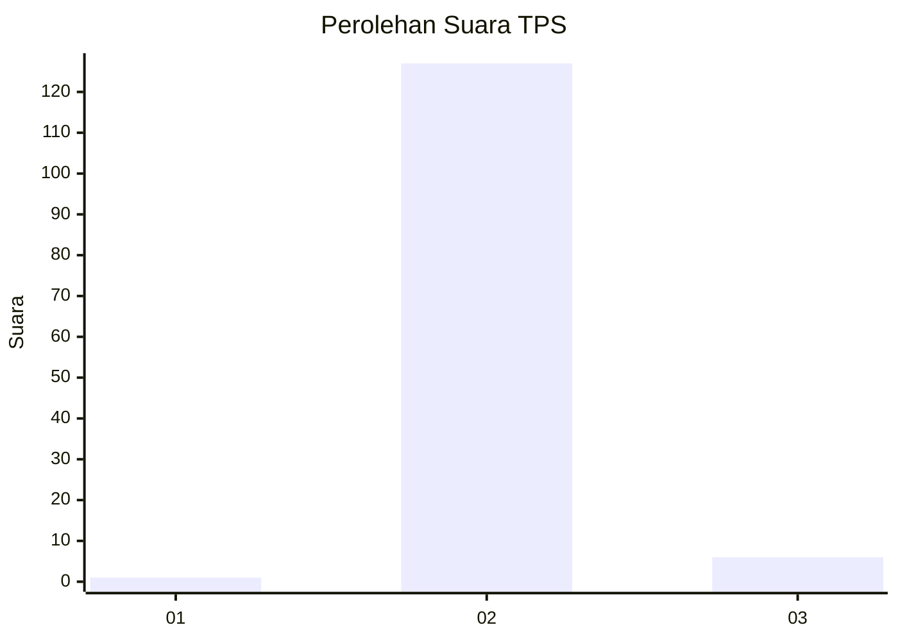
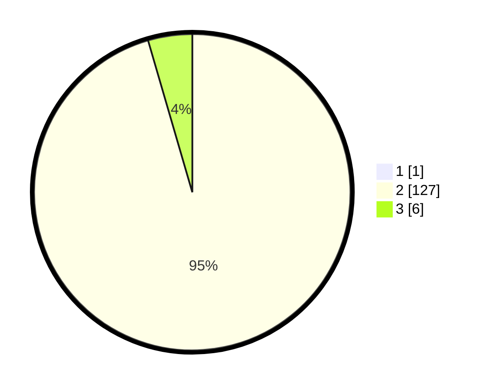

# Hasil

## Grafik

## Tabel

| No. | Nama Paslon    | Suara | Suara (raw) | Persentase |
|:--- |:-------------- | -----:| -----------:| ----------:|
| 1   | ANIES MUHAIMIN | 1     | [1][p-1]    | 0,75       |
| 2   | PRABOWO GIBRAN | 127   | [127][p-2]  | 94,78      |
| 3   | GANJAR MAHFUD  | 6     | [6][p-3]    | 4,48       |

[p-1]: https://github.com/gigit-pemilu/pemilu-2024-72-sulawesi-tengah/blob/main/pilpres/hitung-suara/sub/72-sulawesi-tengah/sub/02-poso/sub/19-poso-pesisir-selatan/sub/2001-dewua/sub/001-tps/sub/paslon-1.txt
[p-2]: https://github.com/gigit-pemilu/pemilu-2024-72-sulawesi-tengah/blob/main/pilpres/hitung-suara/sub/72-sulawesi-tengah/sub/02-poso/sub/19-poso-pesisir-selatan/sub/2001-dewua/sub/001-tps/sub/paslon-2.txt
[p-3]: https://github.com/gigit-pemilu/pemilu-2024-72-sulawesi-tengah/blob/main/pilpres/hitung-suara/sub/72-sulawesi-tengah/sub/02-poso/sub/19-poso-pesisir-selatan/sub/2001-dewua/sub/001-tps/sub/paslon-3.txt

## Foto C Plano

https://sirekap-obj-formc.kpu.go.id/a2c1/pemilu/ppwp/72/02/19/20/01/7202192001001-20240226-164949--c28d7b0e-c9d7-4c98-8220-05cf34b46127.jpg

https://sirekap-obj-formc.kpu.go.id/a2c1/pemilu/ppwp/72/02/19/20/01/7202192001001-20240215-072527--2d154ff9-217d-4196-8772-012ec3b9a547.jpg

https://sirekap-obj-formc.kpu.go.id/a2c1/pemilu/ppwp/72/02/19/20/01/7202192001001-20240215-072651--51623c42-7c86-4e26-9d18-bf60dd3e62dc.jpg

## Metadata

| Key        | Value               |
| ---------- | ------------------- |
| Time Stamp | 2024-02-26 17:00:04 |

