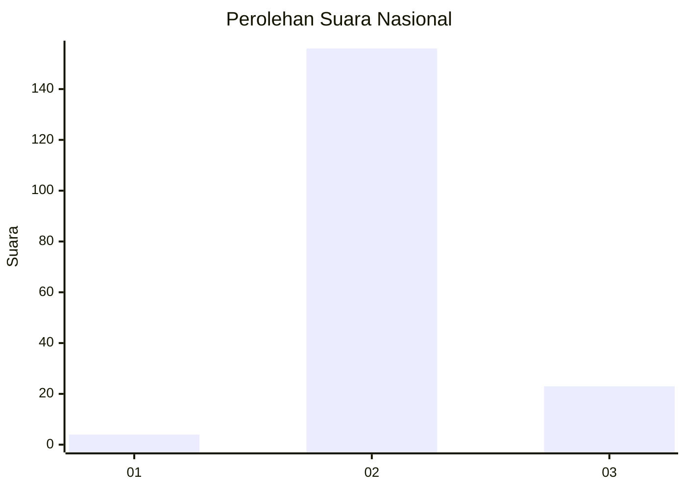
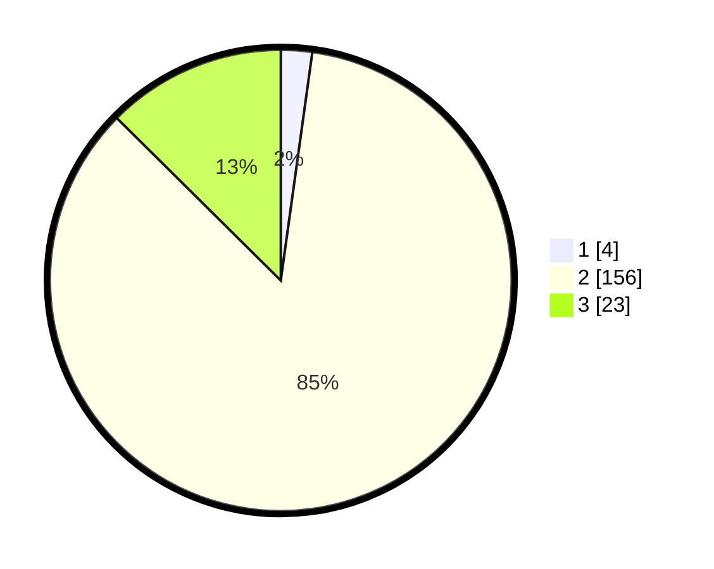

# Hasil

## Grafik

## Tabel

| No. | Nama Paslon    | Suara | Suara (raw) | Persentase |
|:--- |:-------------- | -----:| -----------:| ----------:|
| 1   | ANIES MUHAIMIN | 4     | [4][p-1]    | 2,19       |
| 2   | PRABOWO GIBRAN | 156   | [156][p-2]  | 85,25      |
| 3   | GANJAR MAHFUD  | 23    | [23][p-3]   | 12,57      |

[p-1]: https://github.com/gigit-pemilu/pemilu-2024/blob/main/pilpres/hitung-suara/sub/72-sulawesi-tengah/sub/02-poso/sub/19-poso-pesisir-selatan/sub/2003-tangkura/sub/001-tps/sub/paslon-1.txt
[p-2]: https://github.com/gigit-pemilu/pemilu-2024/blob/main/pilpres/hitung-suara/sub/72-sulawesi-tengah/sub/02-poso/sub/19-poso-pesisir-selatan/sub/2003-tangkura/sub/001-tps/sub/paslon-2.txt
[p-3]: https://github.com/gigit-pemilu/pemilu-2024/blob/main/pilpres/hitung-suara/sub/72-sulawesi-tengah/sub/02-poso/sub/19-poso-pesisir-selatan/sub/2003-tangkura/sub/001-tps/sub/paslon-3.txt

## Foto C Plano

https://sirekap-obj-formc.kpu.go.id/0823/pemilu/ppwp/72/02/19/20/03/7202192003001-20240226-143441--c9ca4498-4d8e-41b8-b264-122c60fb46d8.jpg

https://sirekap-obj-formc.kpu.go.id/0823/pemilu/ppwp/72/02/19/20/03/7202192003001-20240226-143606--cb496b5c-3fff-4904-ad9e-e3e77f896559.jpg

https://sirekap-obj-formc.kpu.go.id/0823/pemilu/ppwp/72/02/19/20/03/7202192003001-20240226-145231--e43fe693-cee3-4c8b-baf9-ddb820c87abc.jpg

## Metadata

| Key        | Value               |
| ---------- | ------------------- |
| Time Stamp | 2024-02-26 19:00:00 |

## DATA PEMILIH TETAP

Jumlah pemilih dalam DPT: **232**.
 * L: **823**.
 * P: **502**.

## DATA PENGGUNA HAK PILIH

Jumlah pengguna hak pilih dalam DPT: **290**.
 * L: **92**.
 * P: **809**.

Jumlah pengguna hak pilih dalam DPTb: **822**.
 * L: **82**.
 * P: **820**.

Jumlah pengguna hak pilih dalam DPK: **2**.
 * L: **882**.
 * P: **820**.

Jumlah pengguna hak pilih: **180**.
 * L: **888**.
 * P: **28**.

## JUMLAH SUARA SAH DAN TIDAK SAH

JUMLAH SELURUH SUARA SAH: **183**.

JUMLAH SUARA TIDAK SAH: **1**.

JUMLAH SELURUH SUARA SAH DAN SUARA TIDAK SAH: **184**.

