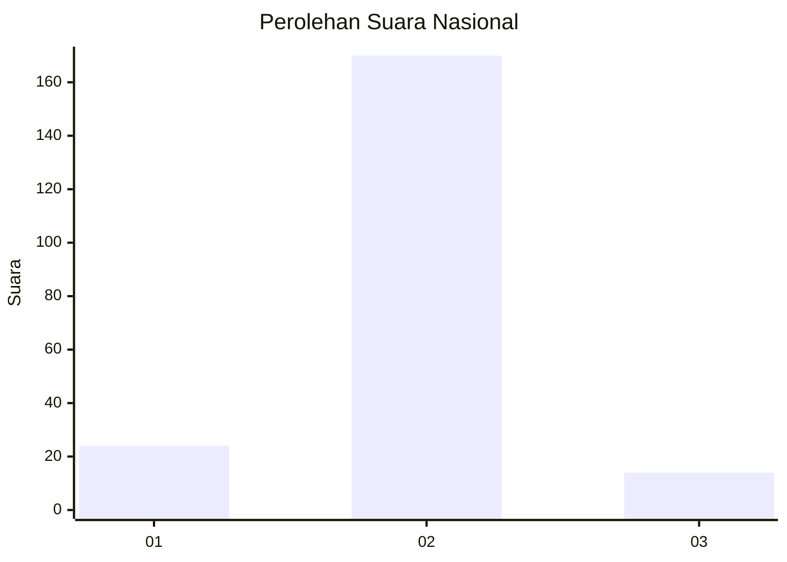
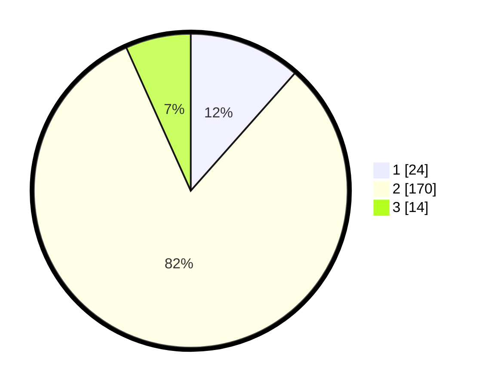

# Hasil

## Grafik

## Tabel

| No. | Nama Paslon    | Suara | Suara (raw) | Persentase |
|:--- |:-------------- | -----:| -----------:| ----------:|
| 1   | ANIES MUHAIMIN | 24    | [24][p-1]   | 11,54      |
| 2   | PRABOWO GIBRAN | 170   | [170][p-2]  | 81,73      |
| 3   | GANJAR MAHFUD  | 14    | [14][p-3]   | 6,73       |

[p-1]: https://github.com/gigit-pemilu/pemilu-2024/blob/main/pilpres/hitung-suara/sub/72-sulawesi-tengah/sub/02-poso/sub/24-lore-timur/sub/2001-winowanga/sub/001-tps/sub/paslon-1.txt
[p-2]: https://github.com/gigit-pemilu/pemilu-2024/blob/main/pilpres/hitung-suara/sub/72-sulawesi-tengah/sub/02-poso/sub/24-lore-timur/sub/2001-winowanga/sub/001-tps/sub/paslon-2.txt
[p-3]: https://github.com/gigit-pemilu/pemilu-2024/blob/main/pilpres/hitung-suara/sub/72-sulawesi-tengah/sub/02-poso/sub/24-lore-timur/sub/2001-winowanga/sub/001-tps/sub/paslon-3.txt

## Foto C Plano

https://sirekap-obj-formc.kpu.go.id/6b81/pemilu/ppwp/72/02/24/20/01/7202242001001-20240216-085954--3a723cbe-597b-40fd-8ec1-3caa55f25b23.jpg

https://sirekap-obj-formc.kpu.go.id/6b81/pemilu/ppwp/72/02/24/20/01/7202242001001-20240216-213032--4774ec10-5e73-4406-8577-86720c347b3c.jpg

https://sirekap-obj-formc.kpu.go.id/6b81/pemilu/ppwp/72/02/24/20/01/7202242001001-20240216-213031--64560e7e-cca0-4aca-92ac-9668b4f72a3f.jpg

## Metadata

| Key        | Value               |
| ---------- | ------------------- |
| Time Stamp | 2024-02-17 10:00:02 |

