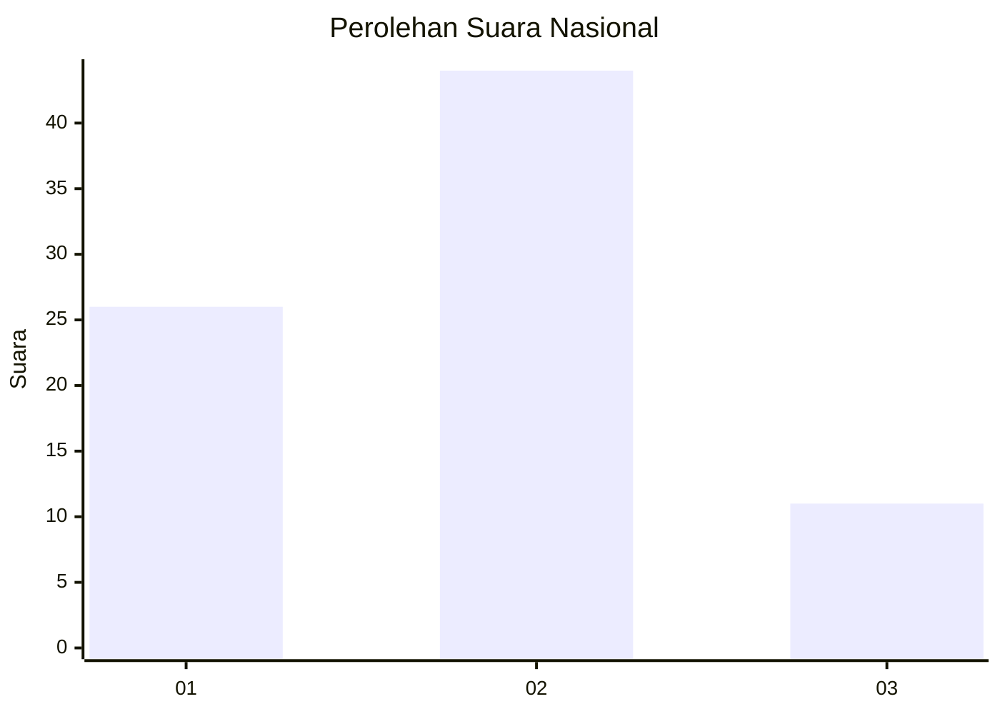
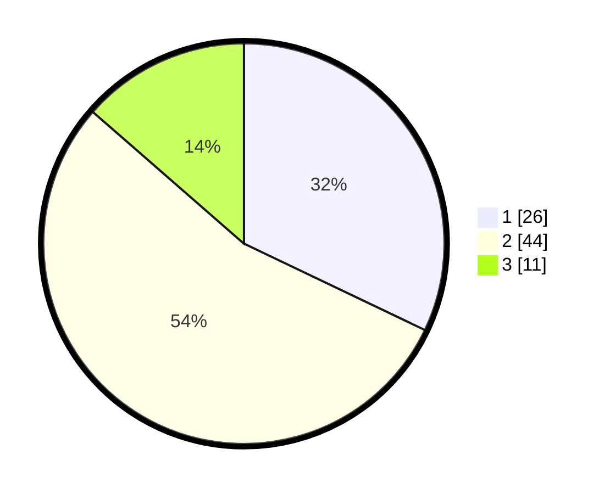

# Hasil

## Grafik

## Tabel

| No. | Nama Paslon    | Suara | Suara (raw) | Persentase |
|:--- |:-------------- | -----:| -----------:| ----------:|
| 1   | ANIES MUHAIMIN | 26    | [26][p-1]   | 32,10      |
| 2   | PRABOWO GIBRAN | 44    | [44][p-2]   | 54,32      |
| 3   | GANJAR MAHFUD  | 11    | [11][p-3]   | 13,58      |

[p-1]: https://github.com/gigit-pemilu/pemilu-2024/blob/main/pilpres/hitung-suara/sub/72-sulawesi-tengah/sub/03-donggala/sub/04-rio-pakava/sub/2001-pantolobete/sub/004-tps/sub/paslon-1.txt
[p-2]: https://github.com/gigit-pemilu/pemilu-2024/blob/main/pilpres/hitung-suara/sub/72-sulawesi-tengah/sub/03-donggala/sub/04-rio-pakava/sub/2001-pantolobete/sub/004-tps/sub/paslon-2.txt
[p-3]: https://github.com/gigit-pemilu/pemilu-2024/blob/main/pilpres/hitung-suara/sub/72-sulawesi-tengah/sub/03-donggala/sub/04-rio-pakava/sub/2001-pantolobete/sub/004-tps/sub/paslon-3.txt

## Foto C Plano

https://sirekap-obj-formc.kpu.go.id/0ee5/pemilu/ppwp/72/03/04/20/01/7203042001004-20240218-174949--58e9915b-968c-4b15-a9df-0ede6db2ad74.jpg

https://sirekap-obj-formc.kpu.go.id/0ee5/pemilu/ppwp/72/03/04/20/01/7203042001004-20240218-174951--3847caa0-b71c-4674-890d-b728fddfc76f.jpg

https://sirekap-obj-formc.kpu.go.id/0ee5/pemilu/ppwp/72/03/04/20/01/7203042001004-20240218-174950--aa3bac75-a60d-4118-9c6f-6070fbaf66dc.jpg

## Metadata

| Key        | Value               |
| ---------- | ------------------- |
| Time Stamp | 2024-02-19 06:16:00 |

## DATA PEMILIH TETAP

Jumlah pemilih dalam DPT: **106**.
 * L: **54**.
 * P: **52**.

## DATA PENGGUNA HAK PILIH

Jumlah pengguna hak pilih dalam DPT: **80**.
 * L: **44**.
 * P: **36**.

Jumlah pengguna hak pilih dalam DPTb: **4**.
 * L: **3**.
 * P: **1**.

Jumlah pengguna hak pilih dalam DPK: **2**.
 * L: **0**.
 * P: **2**.

Jumlah pengguna hak pilih: **86**.
 * L: **47**.
 * P: **39**.

## JUMLAH SUARA SAH DAN TIDAK SAH

JUMLAH SELURUH SUARA SAH: **81**.

JUMLAH SUARA TIDAK SAH: **5**.

JUMLAH SELURUH SUARA SAH DAN SUARA TIDAK SAH: **86**.

