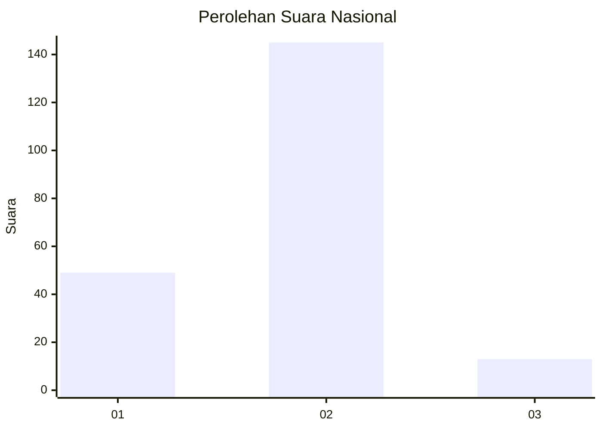

# Hasil

## Grafik

## Tabel

| No. | Nama Paslon    | Suara | Suara (raw) | Persentase |
|:--- |:-------------- | -----:| -----------:| ----------:|
| 1   | ANIES MUHAIMIN | 49    | [49][p-1]   | 23,67      |
| 2   | PRABOWO GIBRAN | 145   | [145][p-2]  | 70,05      |
| 3   | GANJAR MAHFUD  | 13    | [13][p-3]   | 6,28       |

[p-1]: https://github.com/gigit-pemilu/pemilu-2024/blob/main/pilpres/hitung-suara/sub/72-sulawesi-tengah/sub/03-donggala/sub/11-sirenja/sub/2008-sibado/sub/004-tps/sub/paslon-1.txt
[p-2]: https://github.com/gigit-pemilu/pemilu-2024/blob/main/pilpres/hitung-suara/sub/72-sulawesi-tengah/sub/03-donggala/sub/11-sirenja/sub/2008-sibado/sub/004-tps/sub/paslon-2.txt
[p-3]: https://github.com/gigit-pemilu/pemilu-2024/blob/main/pilpres/hitung-suara/sub/72-sulawesi-tengah/sub/03-donggala/sub/11-sirenja/sub/2008-sibado/sub/004-tps/sub/paslon-3.txt

## Foto C Plano

https://sirekap-obj-formc.kpu.go.id/ae2a/pemilu/ppwp/72/03/11/20/08/7203112008004-20240219-094452--eb46a389-32f0-4755-8e5a-03df011269ad.jpg

https://sirekap-obj-formc.kpu.go.id/ae2a/pemilu/ppwp/72/03/11/20/08/7203112008004-20240219-095032--8c705dc8-4155-4d1b-a3df-d6ca768ad02b.jpg

https://sirekap-obj-formc.kpu.go.id/ae2a/pemilu/ppwp/72/03/11/20/08/7203112008004-20240219-095031--3fdf0902-aeb8-4f12-9274-166fe76a5ae9.jpg

## Metadata

| Key        | Value               |
| ---------- | ------------------- |
| Time Stamp | 2024-02-19 11:00:00 |

## DATA PEMILIH TETAP

Jumlah pemilih dalam DPT: **397**.
 * L: **537**.
 * P: **450**.

## DATA PENGGUNA HAK PILIH

Jumlah pengguna hak pilih dalam DPT: **352**.
 * L: **762**.
 * P: **885**.

Jumlah pengguna hak pilih dalam DPTb: **38**.
 * L: **652**.
 * P: **888**.

Jumlah pengguna hak pilih dalam DPK: **288**.
 * L: **800**.
 * P: **384**.

Jumlah pengguna hak pilih: **41**.
 * L: **289**.
 * P: **442**.

## JUMLAH SUARA SAH DAN TIDAK SAH

JUMLAH SELURUH SUARA SAH: **207**.

JUMLAH SUARA TIDAK SAH: **4**.

JUMLAH SELURUH SUARA SAH DAN SUARA TIDAK SAH: **211**.

