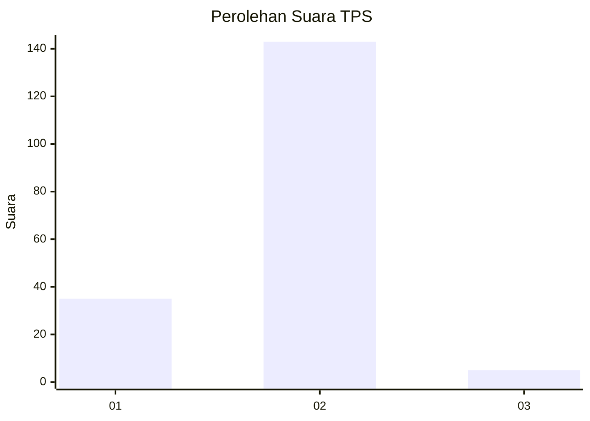
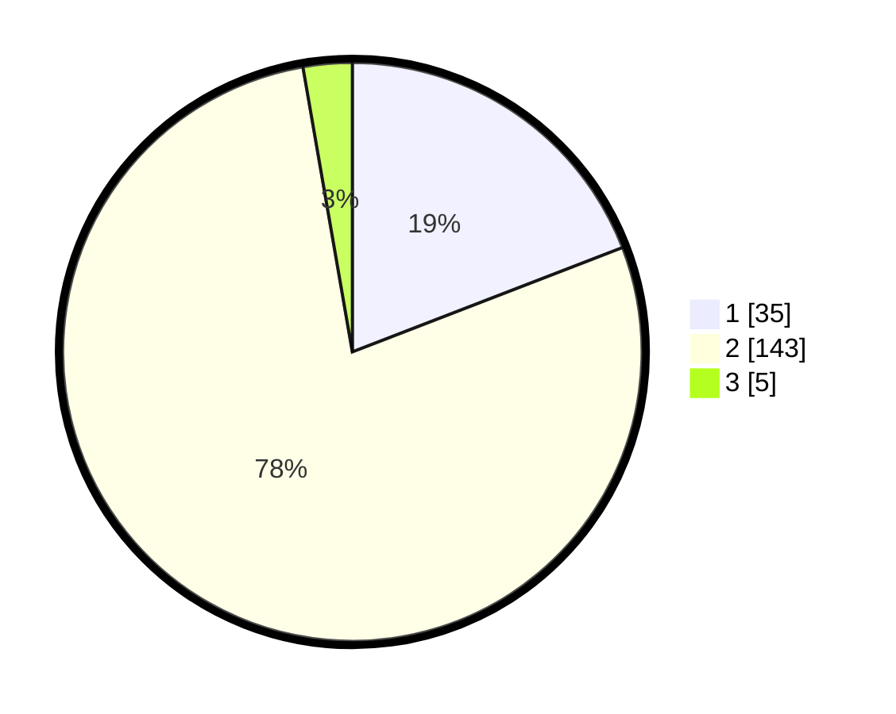

# Hasil

## Grafik

## Tabel

| No. | Nama Paslon    | Suara | Suara (raw) | Persentase |
|:--- |:-------------- | -----:| -----------:| ----------:|
| 1   | ANIES MUHAIMIN | 35    | [35][p-1]   | 19,13      |
| 2   | PRABOWO GIBRAN | 143   | [143][p-2]  | 78,14      |
| 3   | GANJAR MAHFUD  | 5     | [5][p-3]    | 2,73       |

[p-1]: https://github.com/gigit-pemilu/pemilu-2024-72-sulawesi-tengah/blob/main/pilpres/hitung-suara/sub/72-sulawesi-tengah/sub/03-donggala/sub/18-banawa-selatan/sub/2001-mbuwu/sub/001-tps/sub/paslon-1.txt
[p-2]: https://github.com/gigit-pemilu/pemilu-2024-72-sulawesi-tengah/blob/main/pilpres/hitung-suara/sub/72-sulawesi-tengah/sub/03-donggala/sub/18-banawa-selatan/sub/2001-mbuwu/sub/001-tps/sub/paslon-2.txt
[p-3]: https://github.com/gigit-pemilu/pemilu-2024-72-sulawesi-tengah/blob/main/pilpres/hitung-suara/sub/72-sulawesi-tengah/sub/03-donggala/sub/18-banawa-selatan/sub/2001-mbuwu/sub/001-tps/sub/paslon-3.txt

## Foto C Plano

https://sirekap-obj-formc.kpu.go.id/0349/pemilu/ppwp/72/03/18/20/01/7203182001001-20240219-184654--0d188a8c-6dac-4276-87a1-25559ad4fd3d.jpg

https://sirekap-obj-formc.kpu.go.id/0349/pemilu/ppwp/72/03/18/20/01/7203182001001-20240219-185029--f942c4b6-b90d-4883-9c51-ce18b270c58d.jpg

https://sirekap-obj-formc.kpu.go.id/0349/pemilu/ppwp/72/03/18/20/01/7203182001001-20240219-184905--0337cc49-7d24-44d9-a038-bdd052a54032.jpg

## Metadata

| Key        | Value               |
| ---------- | ------------------- |
| Time Stamp | 2024-02-22 14:00:00 |

