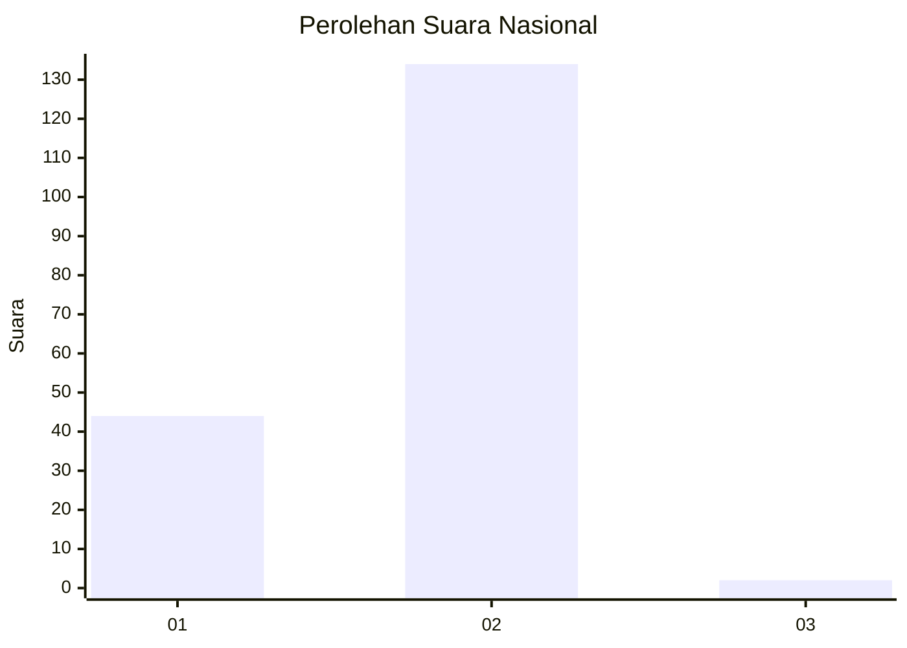
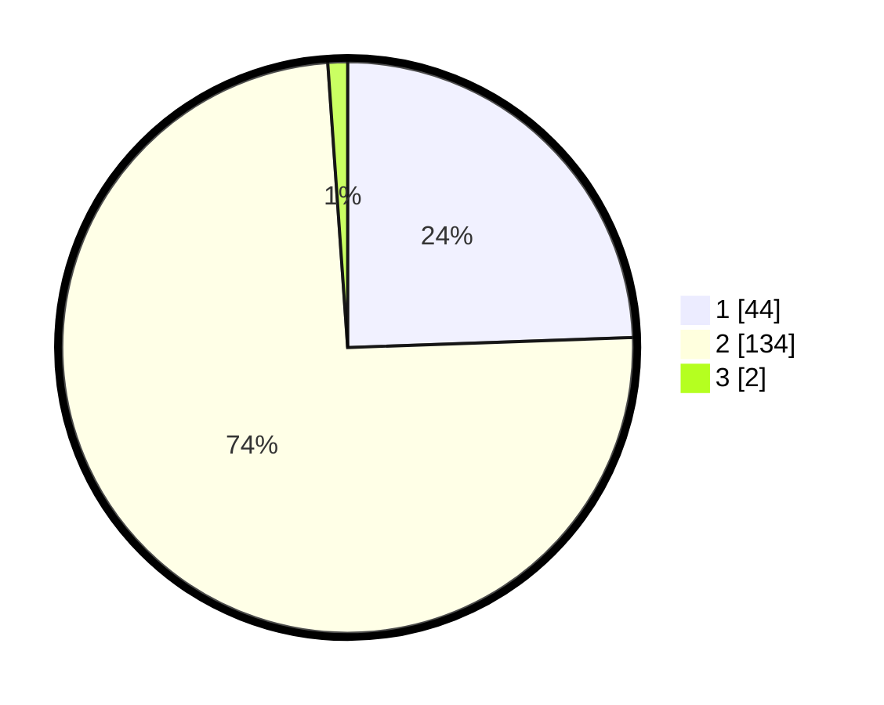

# Hasil

## Grafik

## Tabel

| No. | Nama Paslon    | Suara | Suara (raw) | Persentase |
|:--- |:-------------- | -----:| -----------:| ----------:|
| 1   | ANIES MUHAIMIN | 44    | [44][p-1]   | 24,44      |
| 2   | PRABOWO GIBRAN | 134   | [134][p-2]  | 74,44      |
| 3   | GANJAR MAHFUD  | 2     | [2][p-3]    | 1,11       |

[p-1]: https://github.com/gigit-pemilu/pemilu-2024/blob/main/pilpres/hitung-suara/sub/72-sulawesi-tengah/sub/03-donggala/sub/19-tanantovea/sub/2010-wani-lumbumpetigo/sub/002-tps/sub/paslon-1.txt
[p-2]: https://github.com/gigit-pemilu/pemilu-2024/blob/main/pilpres/hitung-suara/sub/72-sulawesi-tengah/sub/03-donggala/sub/19-tanantovea/sub/2010-wani-lumbumpetigo/sub/002-tps/sub/paslon-2.txt
[p-3]: https://github.com/gigit-pemilu/pemilu-2024/blob/main/pilpres/hitung-suara/sub/72-sulawesi-tengah/sub/03-donggala/sub/19-tanantovea/sub/2010-wani-lumbumpetigo/sub/002-tps/sub/paslon-3.txt

## Foto C Plano

https://sirekap-obj-formc.kpu.go.id/eb63/pemilu/ppwp/72/03/19/20/10/7203192010002-20240215-120918--dcaf5e56-cae9-4ef9-9231-43ad9b9255ba.jpg

https://sirekap-obj-formc.kpu.go.id/eb63/pemilu/ppwp/72/03/19/20/10/7203192010002-20240215-121523--ddf87d67-4e3c-4bbf-ae60-547732829d96.jpg

https://sirekap-obj-formc.kpu.go.id/eb63/pemilu/ppwp/72/03/19/20/10/7203192010002-20240215-121939--c28c3b05-6522-4613-ab9c-6b64324d3869.jpg

## Metadata

| Key        | Value               |
| ---------- | ------------------- |
| Time Stamp | 2024-02-19 06:16:00 |

