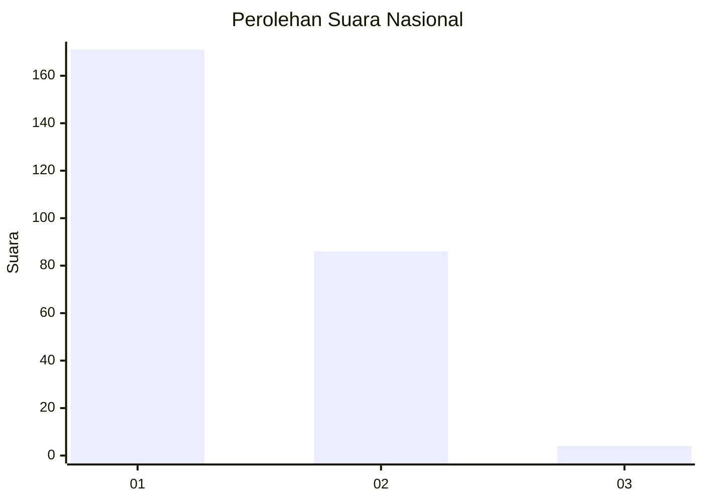
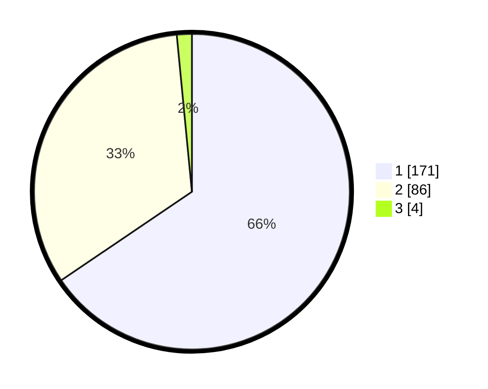

# Hasil

## Grafik

## Tabel

| No. | Nama Paslon    | Suara | Suara (raw) | Persentase |
|:--- |:-------------- | -----:| -----------:| ----------:|
| 1   | ANIES MUHAIMIN | 171   | [171][p-1]  | 65,52      |
| 2   | PRABOWO GIBRAN | 86    | [86][p-2]   | 32,95      |
| 3   | GANJAR MAHFUD  | 4     | [4][p-3]    | 1,53       |

[p-1]: https://github.com/gigit-pemilu/pemilu-2024/blob/main/pilpres/hitung-suara/sub/72-sulawesi-tengah/sub/04-toli-toli/sub/01-dampal-selatan/sub/2001-kombo/sub/005-tps/sub/paslon-1.txt
[p-2]: https://github.com/gigit-pemilu/pemilu-2024/blob/main/pilpres/hitung-suara/sub/72-sulawesi-tengah/sub/04-toli-toli/sub/01-dampal-selatan/sub/2001-kombo/sub/005-tps/sub/paslon-2.txt
[p-3]: https://github.com/gigit-pemilu/pemilu-2024/blob/main/pilpres/hitung-suara/sub/72-sulawesi-tengah/sub/04-toli-toli/sub/01-dampal-selatan/sub/2001-kombo/sub/005-tps/sub/paslon-3.txt

## Foto C Plano

https://sirekap-obj-formc.kpu.go.id/8097/pemilu/ppwp/72/04/01/20/01/7204012001005-20240215-083400--5b000a8e-6902-4eb1-af34-de8ceab3757a.jpg

https://sirekap-obj-formc.kpu.go.id/8097/pemilu/ppwp/72/04/01/20/01/7204012001005-20240215-083445--58b40065-3e5f-407c-b1de-9140dd033216.jpg

https://sirekap-obj-formc.kpu.go.id/8097/pemilu/ppwp/72/04/01/20/01/7204012001005-20240215-083525--37a93a89-bf31-4c36-9da8-30486099636f.jpg

## Metadata

| Key        | Value               |
| ---------- | ------------------- |
| Time Stamp | 2024-02-24 22:31:28 |

