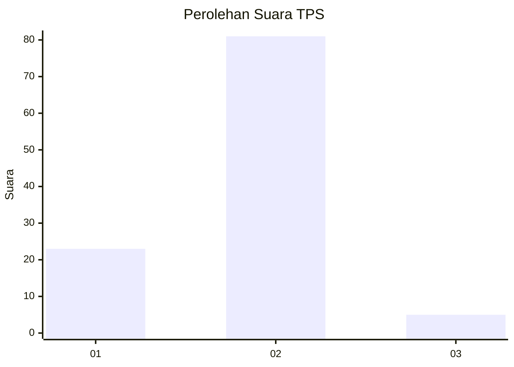
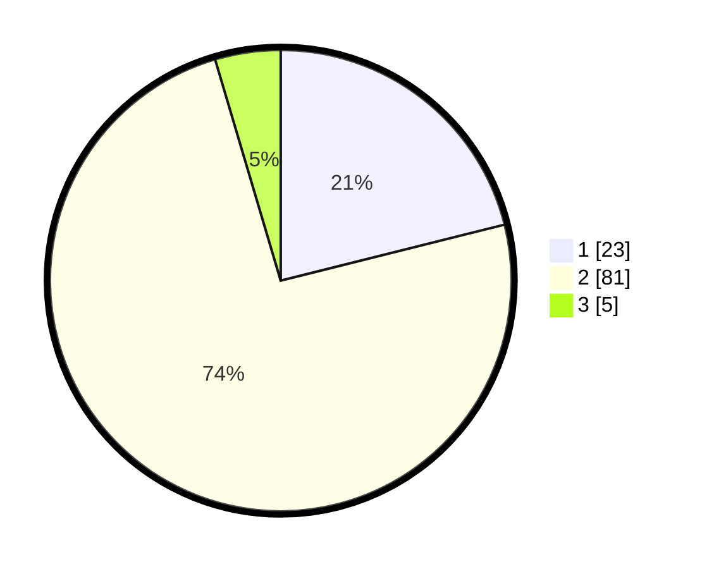

# Hasil

## Grafik

## Tabel

| No. | Nama Paslon    | Suara | Suara (raw) | Persentase |
|:--- |:-------------- | -----:| -----------:| ----------:|
| 1   | ANIES MUHAIMIN | 23    | [23][p-1]   | 21,10      |
| 2   | PRABOWO GIBRAN | 81    | [81][p-2]   | 74,31      |
| 3   | GANJAR MAHFUD  | 5     | [5][p-3]    | 4,59       |

[p-1]: https://github.com/gigit-pemilu/pemilu-2024-72-sulawesi-tengah/blob/main/pilpres/hitung-suara/sub/72-sulawesi-tengah/sub/04-toli-toli/sub/02-dampal-utara/sub/2011-balaroa/sub/001-tps/sub/paslon-1.txt
[p-2]: https://github.com/gigit-pemilu/pemilu-2024-72-sulawesi-tengah/blob/main/pilpres/hitung-suara/sub/72-sulawesi-tengah/sub/04-toli-toli/sub/02-dampal-utara/sub/2011-balaroa/sub/001-tps/sub/paslon-2.txt
[p-3]: https://github.com/gigit-pemilu/pemilu-2024-72-sulawesi-tengah/blob/main/pilpres/hitung-suara/sub/72-sulawesi-tengah/sub/04-toli-toli/sub/02-dampal-utara/sub/2011-balaroa/sub/001-tps/sub/paslon-3.txt

## Foto C Plano

https://sirekap-obj-formc.kpu.go.id/ec48/pemilu/ppwp/72/04/02/20/11/7204022011001-20240227-133446--8951245b-7f0a-4561-9b27-ddf11c276028.jpg

https://sirekap-obj-formc.kpu.go.id/ec48/pemilu/ppwp/72/04/02/20/11/7204022011001-20240227-133633--c31527fb-29ef-4a21-9008-0dd71e3eb796.jpg

https://sirekap-obj-formc.kpu.go.id/ec48/pemilu/ppwp/72/04/02/20/11/7204022011001-20240227-133751--a0fa2911-4572-4a55-9e35-e48e33199025.jpg

## Metadata

| Key        | Value               |
| ---------- | ------------------- |
| Time Stamp | 2024-02-27 22:00:00 |

