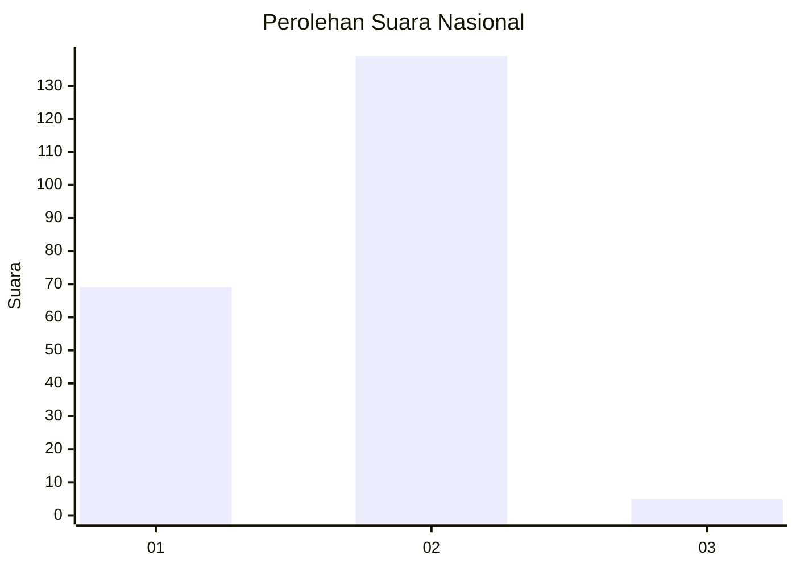
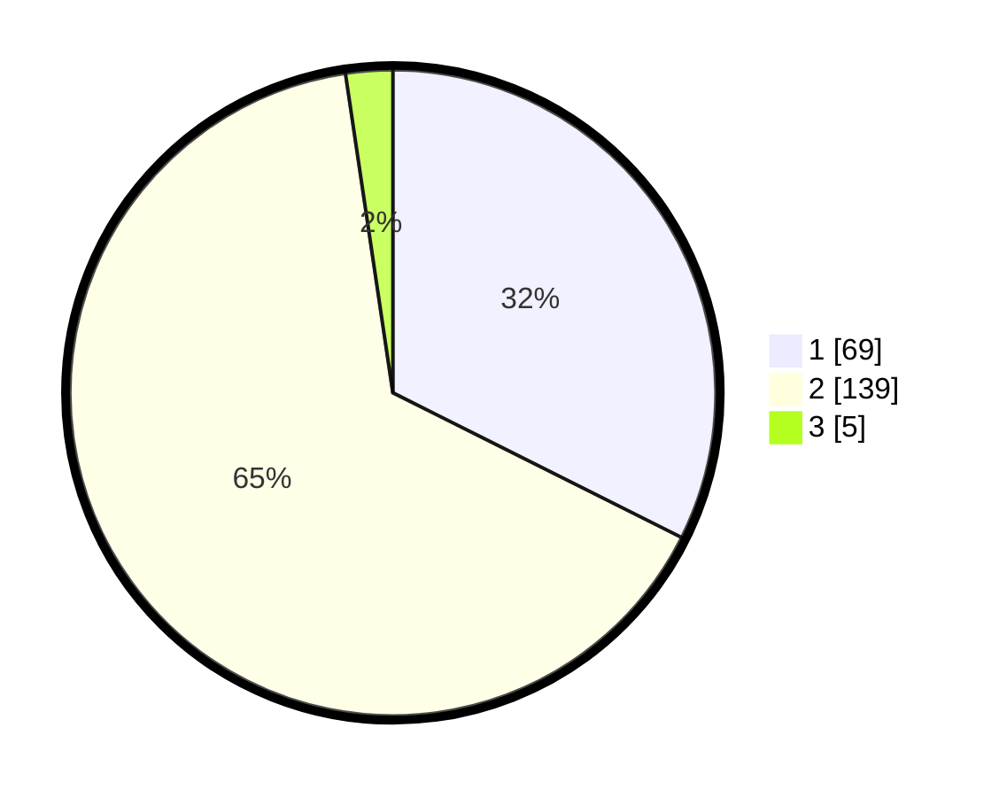

# Hasil

## Grafik

## Tabel

| No. | Nama Paslon    | Suara | Suara (raw) | Persentase |
|:--- |:-------------- | -----:| -----------:| ----------:|
| 1   | ANIES MUHAIMIN | 69    | [69][p-1]   | 32,39      |
| 2   | PRABOWO GIBRAN | 139   | [139][p-2]  | 65,26      |
| 3   | GANJAR MAHFUD  | 5     | [5][p-3]    | 2,35       |

[p-1]: https://github.com/gigit-pemilu/pemilu-2024/blob/main/pilpres/hitung-suara/sub/72-sulawesi-tengah/sub/05-buol/sub/02-lakea/sub/2010-lakea-ii/sub/002-tps/sub/paslon-1.txt
[p-2]: https://github.com/gigit-pemilu/pemilu-2024/blob/main/pilpres/hitung-suara/sub/72-sulawesi-tengah/sub/05-buol/sub/02-lakea/sub/2010-lakea-ii/sub/002-tps/sub/paslon-2.txt
[p-3]: https://github.com/gigit-pemilu/pemilu-2024/blob/main/pilpres/hitung-suara/sub/72-sulawesi-tengah/sub/05-buol/sub/02-lakea/sub/2010-lakea-ii/sub/002-tps/sub/paslon-3.txt

## Foto C Plano

https://sirekap-obj-formc.kpu.go.id/796d/pemilu/ppwp/72/05/02/20/10/7205022010002-20240215-071947--ee5717f1-7655-404e-a57f-52151aaf1088.jpg

https://sirekap-obj-formc.kpu.go.id/796d/pemilu/ppwp/72/05/02/20/10/7205022010002-20240215-072553--a1760f3e-c8e8-4247-86ba-c892bb26745c.jpg

https://sirekap-obj-formc.kpu.go.id/796d/pemilu/ppwp/72/05/02/20/10/7205022010002-20240215-073045--b032f544-70ec-4e1a-b2d6-9aa725a819b7.jpg

## Metadata

| Key        | Value               |
| ---------- | ------------------- |
| Time Stamp | 2024-02-15 21:01:18 |

