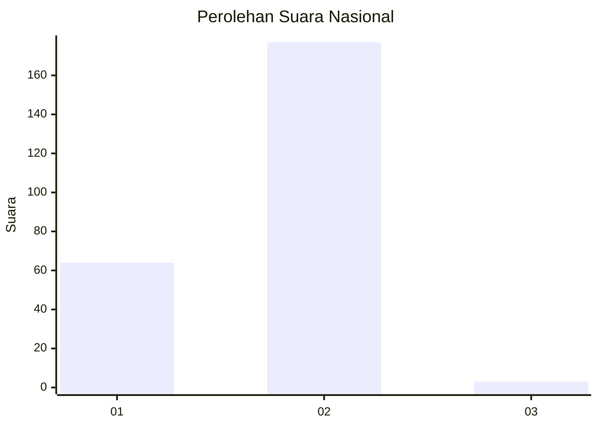
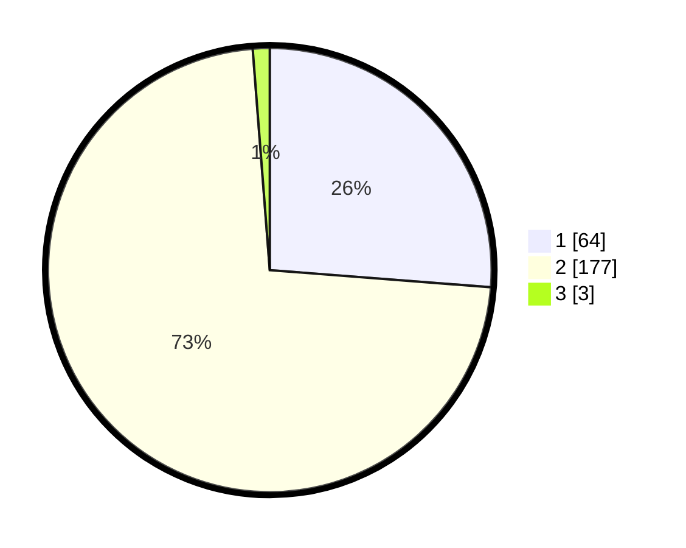

# Hasil

## Grafik

## Tabel

| No. | Nama Paslon    | Suara | Suara (raw) | Persentase |
|:--- |:-------------- | -----:| -----------:| ----------:|
| 1   | ANIES MUHAIMIN | 64    | [64][p-1]   | 26,23      |
| 2   | PRABOWO GIBRAN | 177   | [177][p-2]  | 72,54      |
| 3   | GANJAR MAHFUD  | 3     | [3][p-3]    | 1,23       |

[p-1]: https://github.com/gigit-pemilu/pemilu-2024/blob/main/pilpres/hitung-suara/sub/72-sulawesi-tengah/sub/05-buol/sub/04-bunobogu/sub/2003-botugolu/sub/002-tps/sub/paslon-1.txt
[p-2]: https://github.com/gigit-pemilu/pemilu-2024/blob/main/pilpres/hitung-suara/sub/72-sulawesi-tengah/sub/05-buol/sub/04-bunobogu/sub/2003-botugolu/sub/002-tps/sub/paslon-2.txt
[p-3]: https://github.com/gigit-pemilu/pemilu-2024/blob/main/pilpres/hitung-suara/sub/72-sulawesi-tengah/sub/05-buol/sub/04-bunobogu/sub/2003-botugolu/sub/002-tps/sub/paslon-3.txt

## Foto C Plano

https://sirekap-obj-formc.kpu.go.id/1a05/pemilu/ppwp/72/05/04/20/03/7205042003002-20240214-200203--4b4a4b18-ea1d-4945-a691-9d6162ea6f47.jpg

https://sirekap-obj-formc.kpu.go.id/1a05/pemilu/ppwp/72/05/04/20/03/7205042003002-20240214-200547--3d6c63b2-784b-4539-af00-96d848815384.jpg

https://sirekap-obj-formc.kpu.go.id/1a05/pemilu/ppwp/72/05/04/20/03/7205042003002-20240214-200748--02f6c509-fc57-4167-9b3c-e6a69b4c3829.jpg

## Metadata

| Key        | Value               |
| ---------- | ------------------- |
| Time Stamp | 2024-02-15 22:00:27 |

