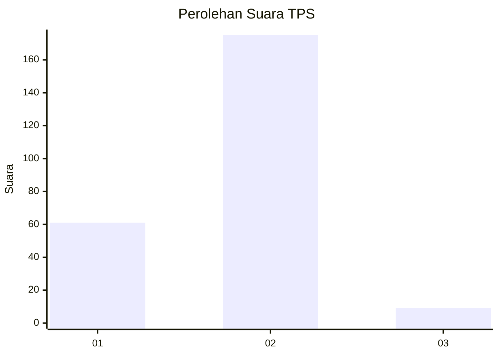
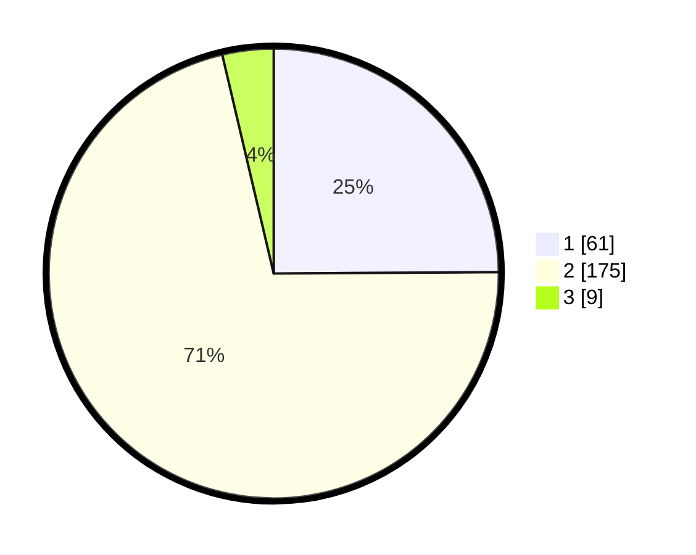

# Hasil

## Grafik

## Tabel

| No. | Nama Paslon    | Suara | Suara (raw) | Persentase |
|:--- |:-------------- | -----:| -----------:| ----------:|
| 1   | ANIES MUHAIMIN | 61    | [61][p-1]   | 24,90      |
| 2   | PRABOWO GIBRAN | 175   | [175][p-2]  | 71,43      |
| 3   | GANJAR MAHFUD  | 9     | [9][p-3]    | 3,67       |

[p-1]: https://github.com/gigit-pemilu/pemilu-2024-72-sulawesi-tengah/blob/main/pilpres/hitung-suara/sub/72-sulawesi-tengah/sub/05-buol/sub/06-biau/sub/1001-buol/sub/004-tps/sub/paslon-1.txt
[p-2]: https://github.com/gigit-pemilu/pemilu-2024-72-sulawesi-tengah/blob/main/pilpres/hitung-suara/sub/72-sulawesi-tengah/sub/05-buol/sub/06-biau/sub/1001-buol/sub/004-tps/sub/paslon-2.txt
[p-3]: https://github.com/gigit-pemilu/pemilu-2024-72-sulawesi-tengah/blob/main/pilpres/hitung-suara/sub/72-sulawesi-tengah/sub/05-buol/sub/06-biau/sub/1001-buol/sub/004-tps/sub/paslon-3.txt

## Foto C Plano

https://sirekap-obj-formc.kpu.go.id/ab70/pemilu/ppwp/72/05/06/10/01/7205061001004-20240217-225939--28b8ae64-8f27-466b-a35d-80d1ec35f9b7.jpg

https://sirekap-obj-formc.kpu.go.id/ab70/pemilu/ppwp/72/05/06/10/01/7205061001004-20240217-230000--324f5c1e-d3ae-4eb1-be9e-1c39bcc74512.jpg

https://sirekap-obj-formc.kpu.go.id/ab70/pemilu/ppwp/72/05/06/10/01/7205061001004-20240217-230015--658bb2da-1b10-4c15-8cc3-b122c1ff234d.jpg

## Metadata

| Key        | Value               |
| ---------- | ------------------- |
| Time Stamp | 2024-02-19 06:16:00 |

