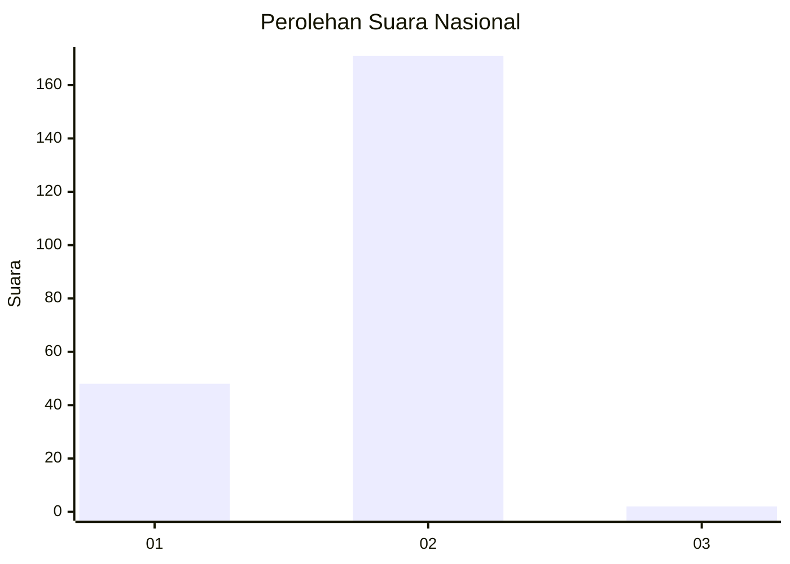
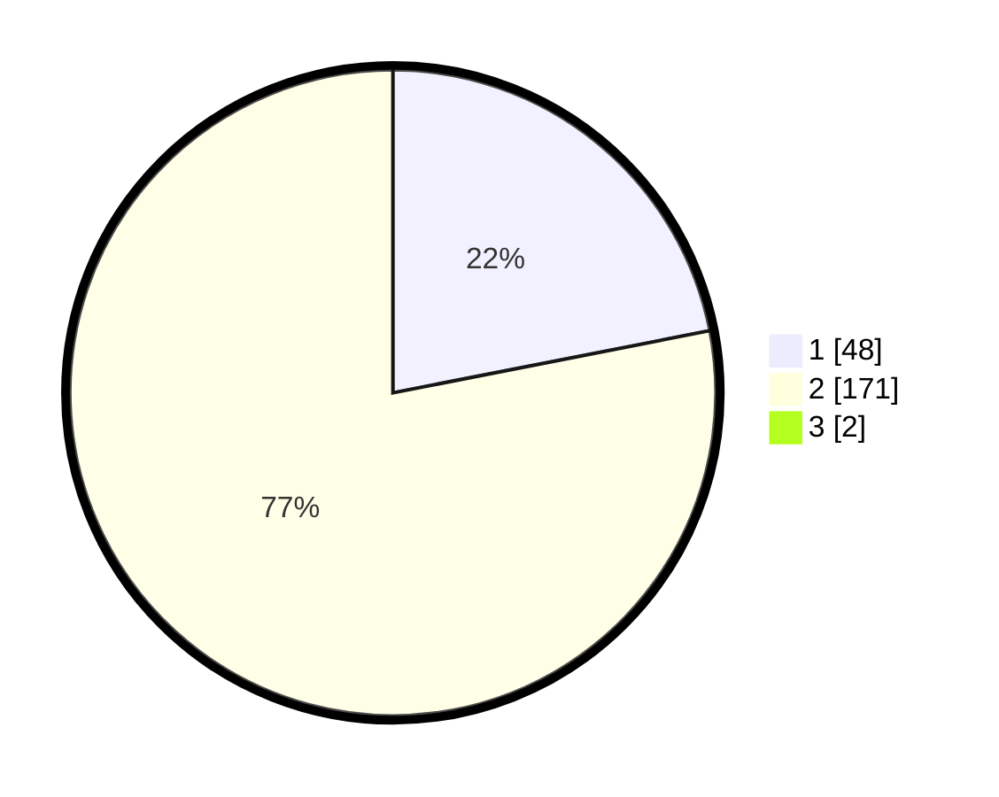

# Hasil

## Grafik

## Tabel

| No. | Nama Paslon    | Suara | Suara (raw) | Persentase |
|:--- |:-------------- | -----:| -----------:| ----------:|
| 1   | ANIES MUHAIMIN | 48    | [48][p-1]   | 21,72      |
| 2   | PRABOWO GIBRAN | 171   | [171][p-2]  | 77,38      |
| 3   | GANJAR MAHFUD  | 2     | [2][p-3]    | 0,90       |

[p-1]: https://github.com/gigit-pemilu/pemilu-2024/blob/main/pilpres/hitung-suara/sub/72-sulawesi-tengah/sub/06-morowali/sub/10-bahodopi/sub/2001-bete-bete/sub/003-tps/sub/paslon-1.txt
[p-2]: https://github.com/gigit-pemilu/pemilu-2024/blob/main/pilpres/hitung-suara/sub/72-sulawesi-tengah/sub/06-morowali/sub/10-bahodopi/sub/2001-bete-bete/sub/003-tps/sub/paslon-2.txt
[p-3]: https://github.com/gigit-pemilu/pemilu-2024/blob/main/pilpres/hitung-suara/sub/72-sulawesi-tengah/sub/06-morowali/sub/10-bahodopi/sub/2001-bete-bete/sub/003-tps/sub/paslon-3.txt

## Foto C Plano

https://sirekap-obj-formc.kpu.go.id/07e0/pemilu/ppwp/72/06/10/20/01/7206102001003-20240215-092154--251785d2-e26c-4896-b115-8d3087887082.jpg

https://sirekap-obj-formc.kpu.go.id/07e0/pemilu/ppwp/72/06/10/20/01/7206102001003-20240215-094705--6fa54296-a2e3-4532-9bd2-07d950455a86.jpg

https://sirekap-obj-formc.kpu.go.id/07e0/pemilu/ppwp/72/06/10/20/01/7206102001003-20240215-092501--e548fe7c-1b05-466a-b7d8-17a09b37c7da.jpg

## Metadata

| Key        | Value               |
| ---------- | ------------------- |
| Time Stamp | 2024-02-15 20:30:46 |

