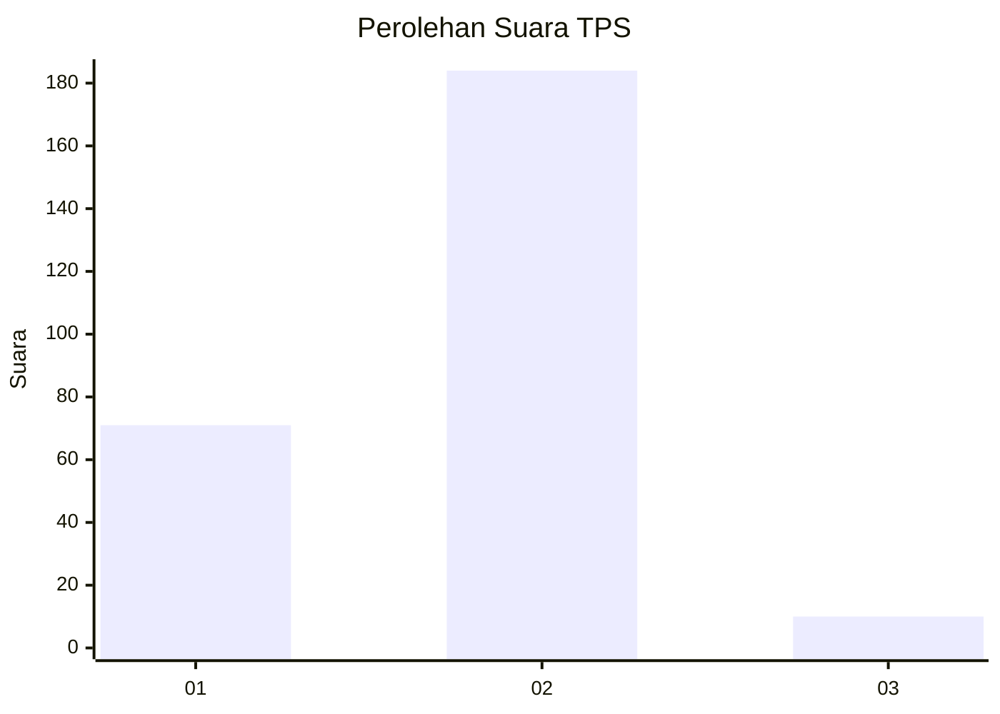
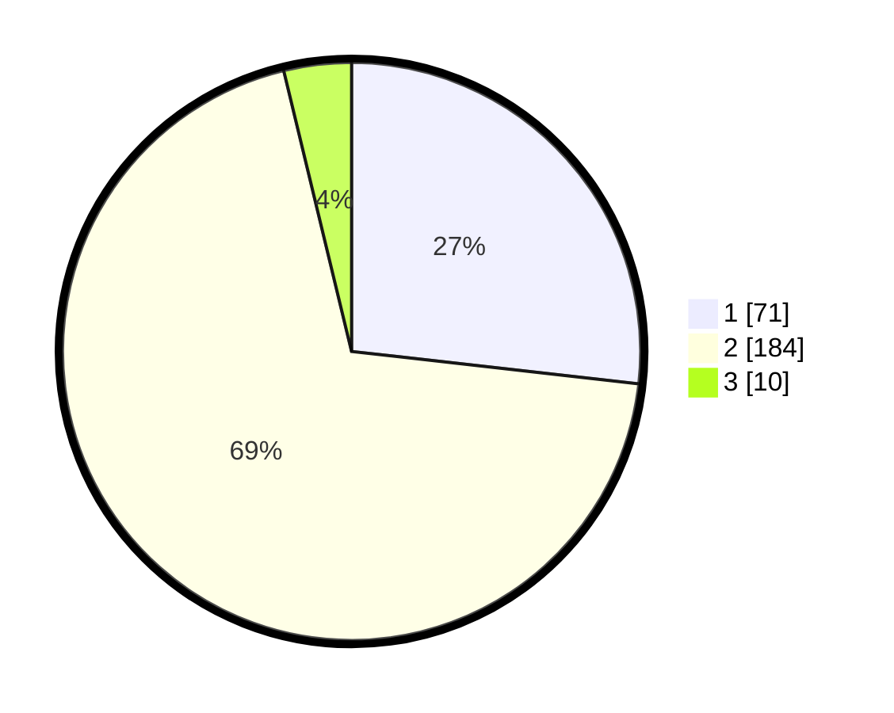

# Hasil

## Grafik

## Tabel

| No. | Nama Paslon    | Suara | Suara (raw) | Persentase |
|:--- |:-------------- | -----:| -----------:| ----------:|
| 1   | ANIES MUHAIMIN | 71    | [71][p-1]   | 26,79      |
| 2   | PRABOWO GIBRAN | 184   | [184][p-2]  | 69,43      |
| 3   | GANJAR MAHFUD  | 10    | [10][p-3]   | 3,77       |

[p-1]: https://github.com/gigit-pemilu/pemilu-2024-72-sulawesi-tengah/blob/main/pilpres/hitung-suara/sub/72-sulawesi-tengah/sub/06-morowali/sub/10-bahodopi/sub/2002-padabahao/sub/001-tps/sub/paslon-1.txt
[p-2]: https://github.com/gigit-pemilu/pemilu-2024-72-sulawesi-tengah/blob/main/pilpres/hitung-suara/sub/72-sulawesi-tengah/sub/06-morowali/sub/10-bahodopi/sub/2002-padabahao/sub/001-tps/sub/paslon-2.txt
[p-3]: https://github.com/gigit-pemilu/pemilu-2024-72-sulawesi-tengah/blob/main/pilpres/hitung-suara/sub/72-sulawesi-tengah/sub/06-morowali/sub/10-bahodopi/sub/2002-padabahao/sub/001-tps/sub/paslon-3.txt

## Foto C Plano

https://sirekap-obj-formc.kpu.go.id/ca33/pemilu/ppwp/72/06/10/20/02/7206102002001-20240214-195404--03fecada-1938-4233-ba0d-2e55ca8e5796.jpg

https://sirekap-obj-formc.kpu.go.id/ca33/pemilu/ppwp/72/06/10/20/02/7206102002001-20240214-195526--e62c5de7-b4ce-4de1-bc9e-09a024ce2e7b.jpg

https://sirekap-obj-formc.kpu.go.id/ca33/pemilu/ppwp/72/06/10/20/02/7206102002001-20240214-195716--e237d930-0875-4dfd-871d-ee96b41ba901.jpg

## Metadata

| Key        | Value               |
| ---------- | ------------------- |
| Time Stamp | 2024-02-15 20:30:46 |

