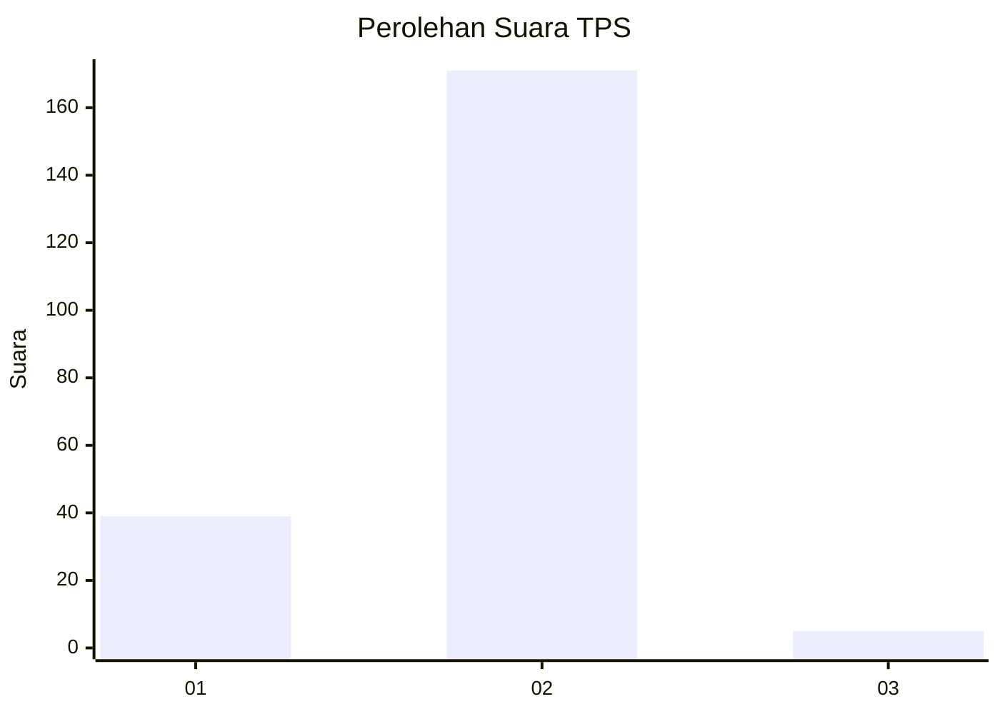
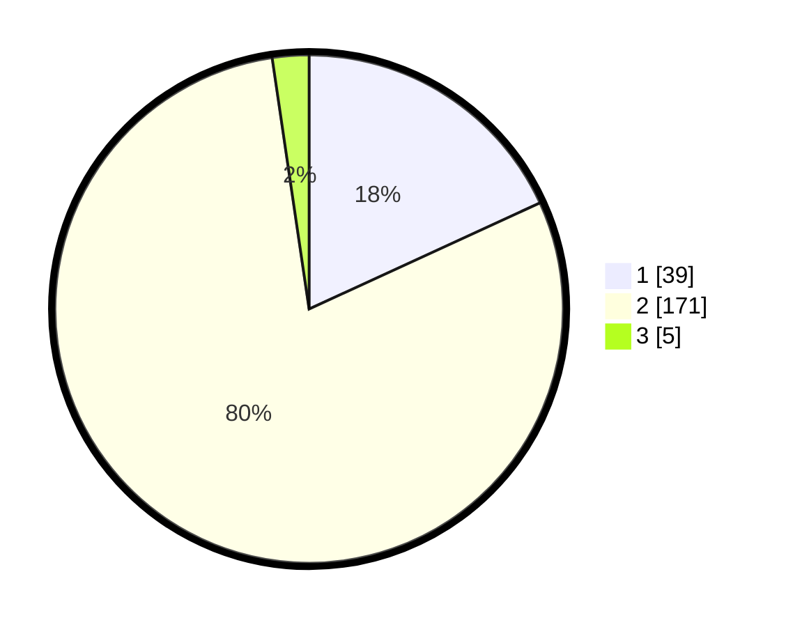

# Hasil

## Grafik

## Tabel

| No. | Nama Paslon    | Suara | Suara (raw) | Persentase |
|:--- |:-------------- | -----:| -----------:| ----------:|
| 1   | ANIES MUHAIMIN | 39    | [39][p-1]   | 18,14      |
| 2   | PRABOWO GIBRAN | 171   | [171][p-2]  | 79,53      |
| 3   | GANJAR MAHFUD  | 5     | [5][p-3]    | 2,33       |

[p-1]: https://github.com/gigit-pemilu/pemilu-2024-72-sulawesi-tengah/blob/main/pilpres/hitung-suara/sub/72-sulawesi-tengah/sub/06-morowali/sub/15-bungku-pesisir/sub/2002-tangofa/sub/002-tps/sub/paslon-1.txt
[p-2]: https://github.com/gigit-pemilu/pemilu-2024-72-sulawesi-tengah/blob/main/pilpres/hitung-suara/sub/72-sulawesi-tengah/sub/06-morowali/sub/15-bungku-pesisir/sub/2002-tangofa/sub/002-tps/sub/paslon-2.txt
[p-3]: https://github.com/gigit-pemilu/pemilu-2024-72-sulawesi-tengah/blob/main/pilpres/hitung-suara/sub/72-sulawesi-tengah/sub/06-morowali/sub/15-bungku-pesisir/sub/2002-tangofa/sub/002-tps/sub/paslon-3.txt

## Foto C Plano

https://sirekap-obj-formc.kpu.go.id/7373/pemilu/ppwp/72/06/15/20/02/7206152002002-20240215-162818--a4b2c34c-08b4-44ef-9062-369a461b74c6.jpg

https://sirekap-obj-formc.kpu.go.id/7373/pemilu/ppwp/72/06/15/20/02/7206152002002-20240215-162922--04be97f2-66f9-4a6e-9ed0-1f729d867449.jpg

https://sirekap-obj-formc.kpu.go.id/7373/pemilu/ppwp/72/06/15/20/02/7206152002002-20240215-163020--b51d2ed7-7746-4a27-92be-c1f39141b987.jpg

## Metadata

| Key        | Value               |
| ---------- | ------------------- |
| Time Stamp | 2024-02-15 22:00:27 |

