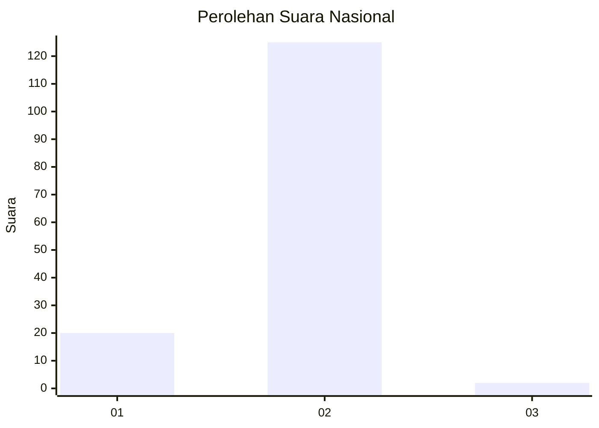
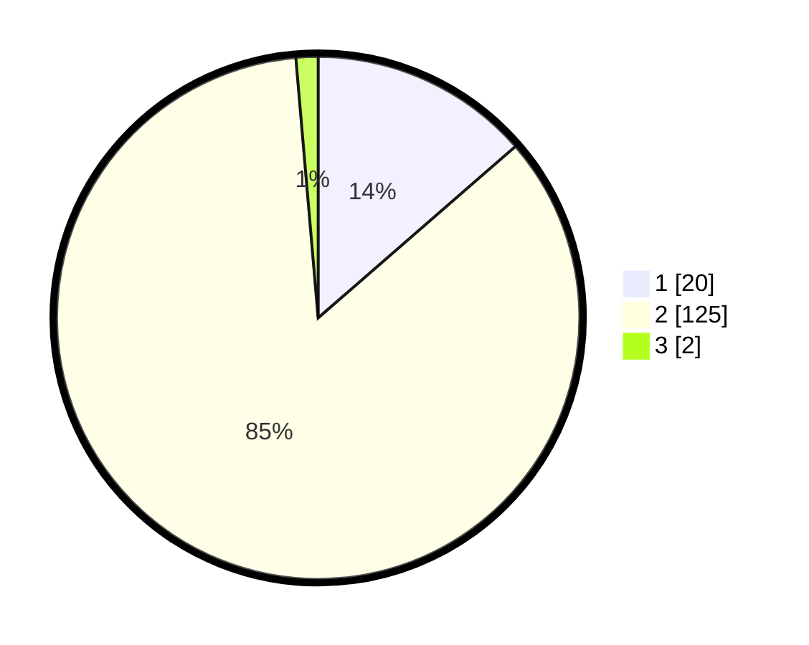

# Hasil

## Grafik

## Tabel

| No. | Nama Paslon    | Suara | Suara (raw) | Persentase |
|:--- |:-------------- | -----:| -----------:| ----------:|
| 1   | ANIES MUHAIMIN | 20    | [20][p-1]   | 13,61      |
| 2   | PRABOWO GIBRAN | 125   | [125][p-2]  | 85,03      |
| 3   | GANJAR MAHFUD  | 2     | [2][p-3]    | 1,36       |

[p-1]: https://github.com/gigit-pemilu/pemilu-2024/blob/main/pilpres/hitung-suara/sub/72-sulawesi-tengah/sub/06-morowali/sub/15-bungku-pesisir/sub/2008-laroenai/sub/001-tps/sub/paslon-1.txt
[p-2]: https://github.com/gigit-pemilu/pemilu-2024/blob/main/pilpres/hitung-suara/sub/72-sulawesi-tengah/sub/06-morowali/sub/15-bungku-pesisir/sub/2008-laroenai/sub/001-tps/sub/paslon-2.txt
[p-3]: https://github.com/gigit-pemilu/pemilu-2024/blob/main/pilpres/hitung-suara/sub/72-sulawesi-tengah/sub/06-morowali/sub/15-bungku-pesisir/sub/2008-laroenai/sub/001-tps/sub/paslon-3.txt

## Foto C Plano

https://sirekap-obj-formc.kpu.go.id/fd98/pemilu/ppwp/72/06/15/20/08/7206152008001-20240215-191913--191adada-c49d-4207-876f-71474720fd01.jpg

https://sirekap-obj-formc.kpu.go.id/fd98/pemilu/ppwp/72/06/15/20/08/7206152008001-20240215-191925--9db93613-9836-4dbf-ba77-323e3aa12850.jpg

https://sirekap-obj-formc.kpu.go.id/fd98/pemilu/ppwp/72/06/15/20/08/7206152008001-20240215-191936--d4b84833-0ba5-41f1-b8ad-1a57fad737fc.jpg

## Metadata

| Key        | Value               |
| ---------- | ------------------- |
| Time Stamp | 2024-02-15 23:29:50 |

