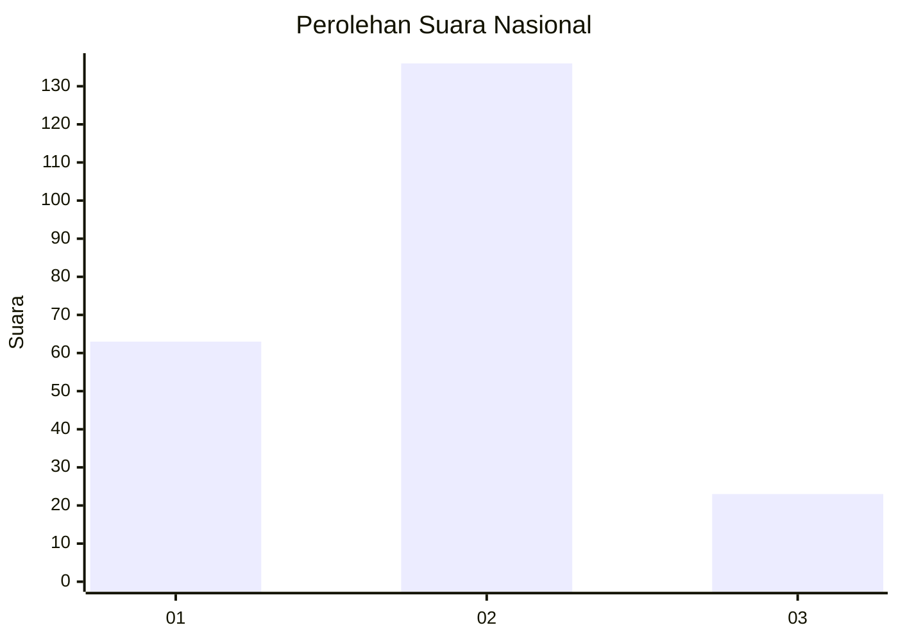
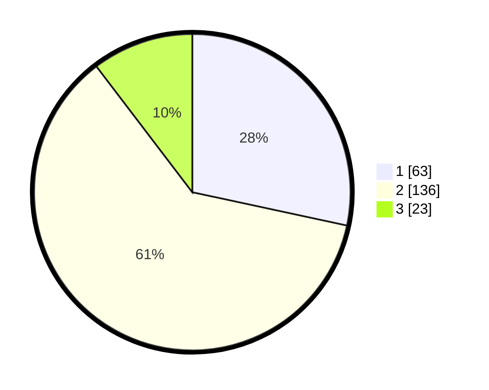

# Hasil

## Grafik

## Tabel

| No. | Nama Paslon    | Suara | Suara (raw) | Persentase |
|:--- |:-------------- | -----:| -----------:| ----------:|
| 1   | ANIES MUHAIMIN | 63    | [63][p-1]   | 28,38      |
| 2   | PRABOWO GIBRAN | 136   | [136][p-2]  | 61,26      |
| 3   | GANJAR MAHFUD  | 23    | [23][p-3]   | 10,36      |

[p-1]: https://github.com/gigit-pemilu/pemilu-2024/blob/main/pilpres/hitung-suara/sub/72-sulawesi-tengah/sub/06-morowali/sub/18-bungku-timur/sub/2001-oneputeh-jaya/sub/002-tps/sub/paslon-1.txt
[p-2]: https://github.com/gigit-pemilu/pemilu-2024/blob/main/pilpres/hitung-suara/sub/72-sulawesi-tengah/sub/06-morowali/sub/18-bungku-timur/sub/2001-oneputeh-jaya/sub/002-tps/sub/paslon-2.txt
[p-3]: https://github.com/gigit-pemilu/pemilu-2024/blob/main/pilpres/hitung-suara/sub/72-sulawesi-tengah/sub/06-morowali/sub/18-bungku-timur/sub/2001-oneputeh-jaya/sub/002-tps/sub/paslon-3.txt

## Foto C Plano

https://sirekap-obj-formc.kpu.go.id/5b95/pemilu/ppwp/72/06/18/20/01/7206182001002-20240215-023105--e1e4774c-9755-4430-be2b-82629ae5e1d5.jpg

https://sirekap-obj-formc.kpu.go.id/5b95/pemilu/ppwp/72/06/18/20/01/7206182001002-20240215-023202--1ea6b595-ea2e-411f-bfbd-cd8c16e4962a.jpg

https://sirekap-obj-formc.kpu.go.id/5b95/pemilu/ppwp/72/06/18/20/01/7206182001002-20240215-023252--0174544b-b07e-4385-9856-637eec28e6cc.jpg

## Metadata

| Key        | Value               |
| ---------- | ------------------- |
| Time Stamp | 2024-02-15 21:01:18 |

