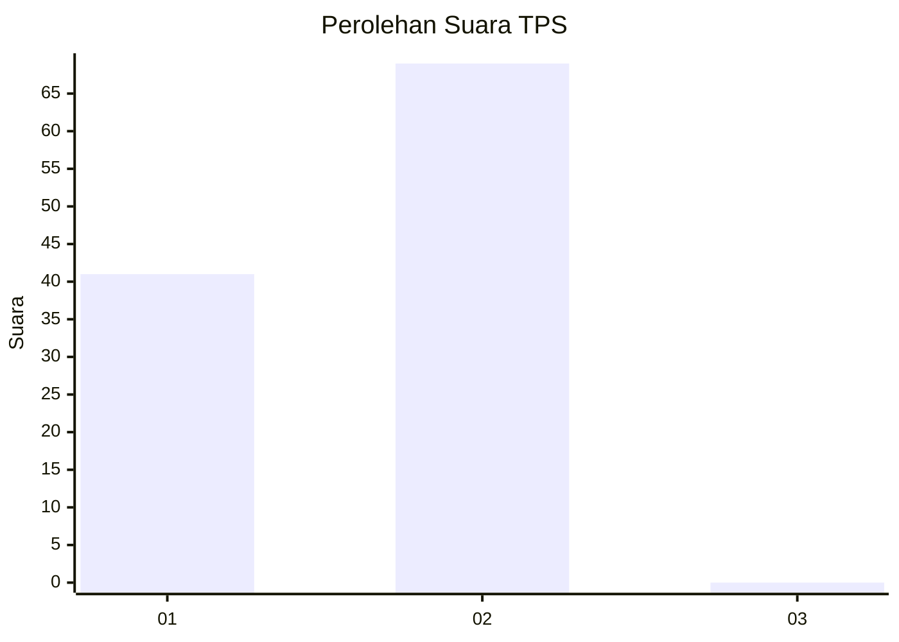
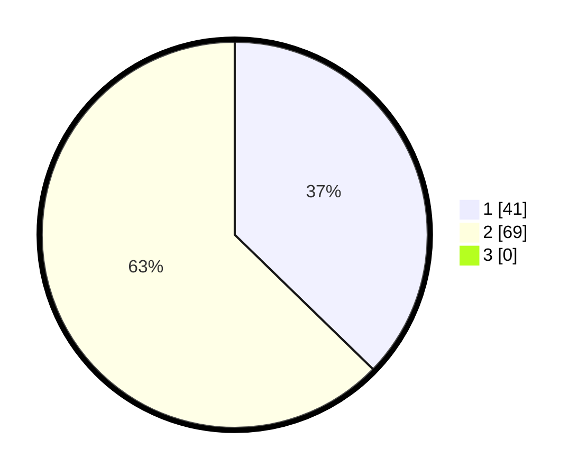

# Hasil

## Grafik

## Tabel

| No. | Nama Paslon    | Suara | Suara (raw) | Persentase |
|:--- |:-------------- | -----:| -----------:| ----------:|
| 1   | ANIES MUHAIMIN | 41    | [41][p-1]   | 37,27      |
| 2   | PRABOWO GIBRAN | 69    | [69][p-2]   | 62,73      |
| 3   | GANJAR MAHFUD  | 0     | [0][p-3]    | 0,00       |

[p-1]: https://github.com/gigit-pemilu/pemilu-2024-72-sulawesi-tengah/blob/main/pilpres/hitung-suara/sub/72-sulawesi-tengah/sub/08-parigi-moutong/sub/08-kasimbar/sub/2001-kasimbar/sub/002-tps/sub/paslon-1.txt
[p-2]: https://github.com/gigit-pemilu/pemilu-2024-72-sulawesi-tengah/blob/main/pilpres/hitung-suara/sub/72-sulawesi-tengah/sub/08-parigi-moutong/sub/08-kasimbar/sub/2001-kasimbar/sub/002-tps/sub/paslon-2.txt
[p-3]: https://github.com/gigit-pemilu/pemilu-2024-72-sulawesi-tengah/blob/main/pilpres/hitung-suara/sub/72-sulawesi-tengah/sub/08-parigi-moutong/sub/08-kasimbar/sub/2001-kasimbar/sub/002-tps/sub/paslon-3.txt

## Foto C Plano

https://sirekap-obj-formc.kpu.go.id/56a2/pemilu/ppwp/72/08/08/20/01/7208082001002-20240217-153527--e3381883-c5e7-43e3-ba2e-23f135c8e7a3.jpg

https://sirekap-obj-formc.kpu.go.id/56a2/pemilu/ppwp/72/08/08/20/01/7208082001002-20240217-153753--81ec4f32-2641-48a9-bcc0-d7d3406ec6f9.jpg

https://sirekap-obj-formc.kpu.go.id/56a2/pemilu/ppwp/72/08/08/20/01/7208082001002-20240217-154156--6d4b64ea-7d00-40b6-b58f-ef710a271672.jpg

## Metadata

| Key        | Value               |
| ---------- | ------------------- |
| Time Stamp | 2024-02-20 18:00:00 |

