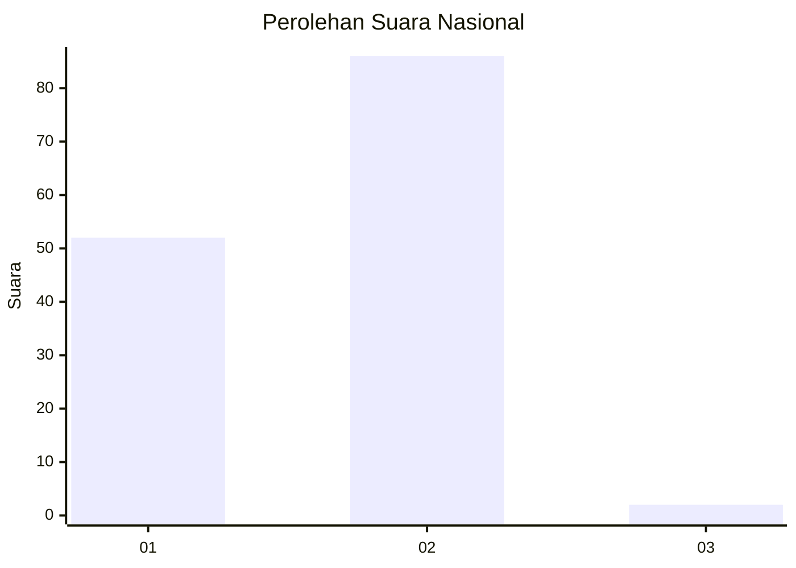
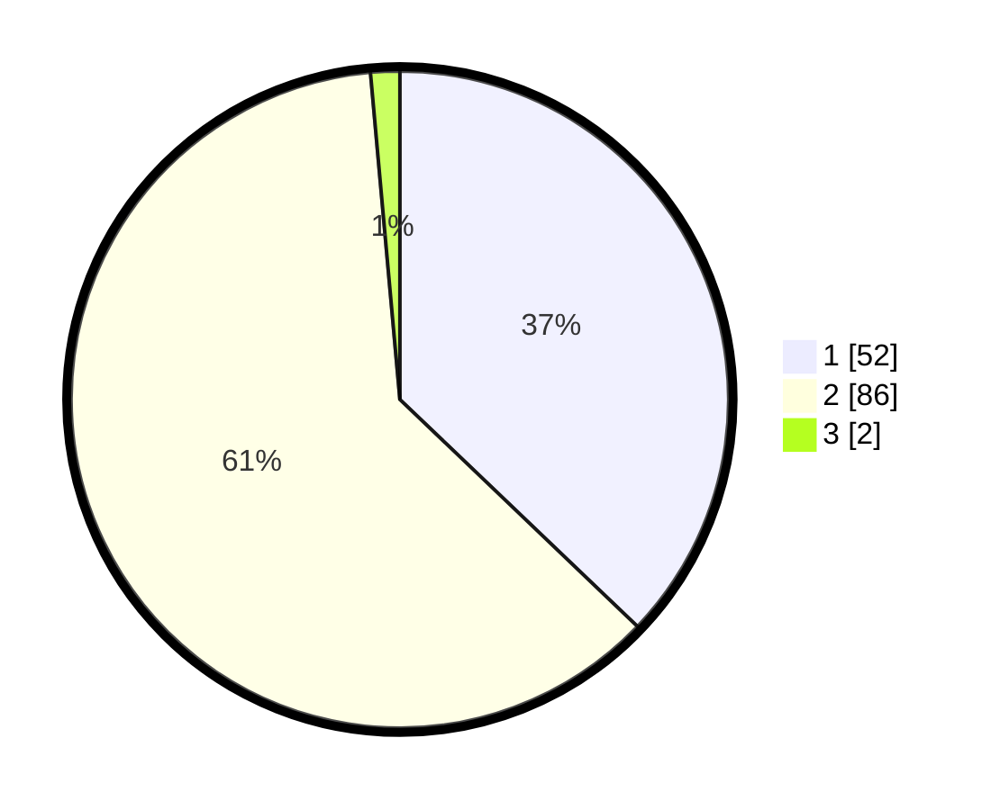

# Hasil

## Grafik

## Tabel

| No. | Nama Paslon    | Suara | Suara (raw) | Persentase |
|:--- |:-------------- | -----:| -----------:| ----------:|
| 1   | ANIES MUHAIMIN | 52    | [52][p-1]   | 37,14      |
| 2   | PRABOWO GIBRAN | 86    | [86][p-2]   | 61,43      |
| 3   | GANJAR MAHFUD  | 2     | [2][p-3]    | 1,43       |

[p-1]: https://github.com/gigit-pemilu/pemilu-2024/blob/main/pilpres/hitung-suara/sub/72-sulawesi-tengah/sub/08-parigi-moutong/sub/08-kasimbar/sub/2001-kasimbar/sub/005-tps/sub/paslon-1.txt
[p-2]: https://github.com/gigit-pemilu/pemilu-2024/blob/main/pilpres/hitung-suara/sub/72-sulawesi-tengah/sub/08-parigi-moutong/sub/08-kasimbar/sub/2001-kasimbar/sub/005-tps/sub/paslon-2.txt
[p-3]: https://github.com/gigit-pemilu/pemilu-2024/blob/main/pilpres/hitung-suara/sub/72-sulawesi-tengah/sub/08-parigi-moutong/sub/08-kasimbar/sub/2001-kasimbar/sub/005-tps/sub/paslon-3.txt

## Foto C Plano

https://sirekap-obj-formc.kpu.go.id/b0b7/pemilu/ppwp/72/08/08/20/01/7208082001005-20240227-163307--a154e6c5-4c23-4ffd-b755-6d092d2f9571.jpg

https://sirekap-obj-formc.kpu.go.id/b0b7/pemilu/ppwp/72/08/08/20/01/7208082001005-20240215-144204--fd5f5acc-57ee-41a4-8c12-914bede3e78e.jpg

https://sirekap-obj-formc.kpu.go.id/b0b7/pemilu/ppwp/72/08/08/20/01/7208082001005-20240215-144612--cda7c0f1-dda8-4c2b-a0c5-45fabcdbea51.jpg

## Metadata

| Key        | Value               |
| ---------- | ------------------- |
| Time Stamp | 2024-02-27 17:00:00 |

