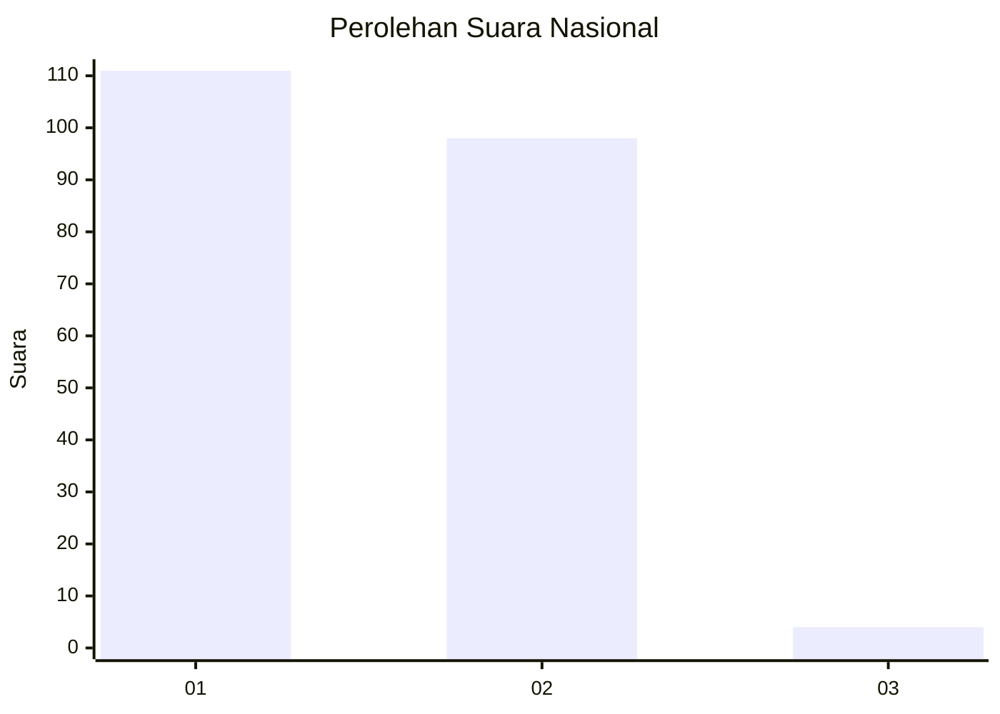
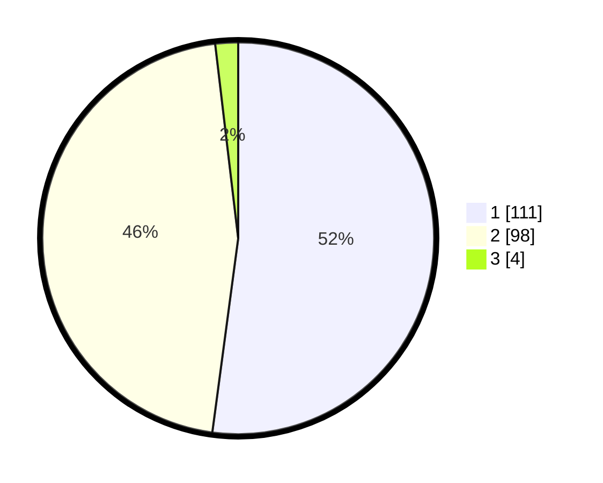

# Hasil

## Grafik

## Tabel

| No. | Nama Paslon    | Suara | Suara (raw) | Persentase |
|:--- |:-------------- | -----:| -----------:| ----------:|
| 1   | ANIES MUHAIMIN | 111   | [111][p-1]  | 52,11      |
| 2   | PRABOWO GIBRAN | 98    | [98][p-2]   | 46,01      |
| 3   | GANJAR MAHFUD  | 4     | [4][p-3]    | 1,88       |

[p-1]: https://github.com/gigit-pemilu/pemilu-2024/blob/main/pilpres/hitung-suara/sub/72-sulawesi-tengah/sub/08-parigi-moutong/sub/10-tinombo-selatan/sub/2001-tada/sub/001-tps/sub/paslon-1.txt
[p-2]: https://github.com/gigit-pemilu/pemilu-2024/blob/main/pilpres/hitung-suara/sub/72-sulawesi-tengah/sub/08-parigi-moutong/sub/10-tinombo-selatan/sub/2001-tada/sub/001-tps/sub/paslon-2.txt
[p-3]: https://github.com/gigit-pemilu/pemilu-2024/blob/main/pilpres/hitung-suara/sub/72-sulawesi-tengah/sub/08-parigi-moutong/sub/10-tinombo-selatan/sub/2001-tada/sub/001-tps/sub/paslon-3.txt

## Foto C Plano

https://sirekap-obj-formc.kpu.go.id/4f38/pemilu/ppwp/72/08/10/20/01/7208102001001-20240215-110839--71392757-2e92-4acf-9cd1-117abb59ff87.jpg

https://sirekap-obj-formc.kpu.go.id/4f38/pemilu/ppwp/72/08/10/20/01/7208102001001-20240215-111010--97bc9219-a661-4bbe-969b-0041853cdc95.jpg

https://sirekap-obj-formc.kpu.go.id/4f38/pemilu/ppwp/72/08/10/20/01/7208102001001-20240215-111145--dda613a4-638a-4078-b8c8-ae42787cacaa.jpg

## Metadata

| Key        | Value               |
| ---------- | ------------------- |
| Time Stamp | 2024-02-15 22:00:27 |

