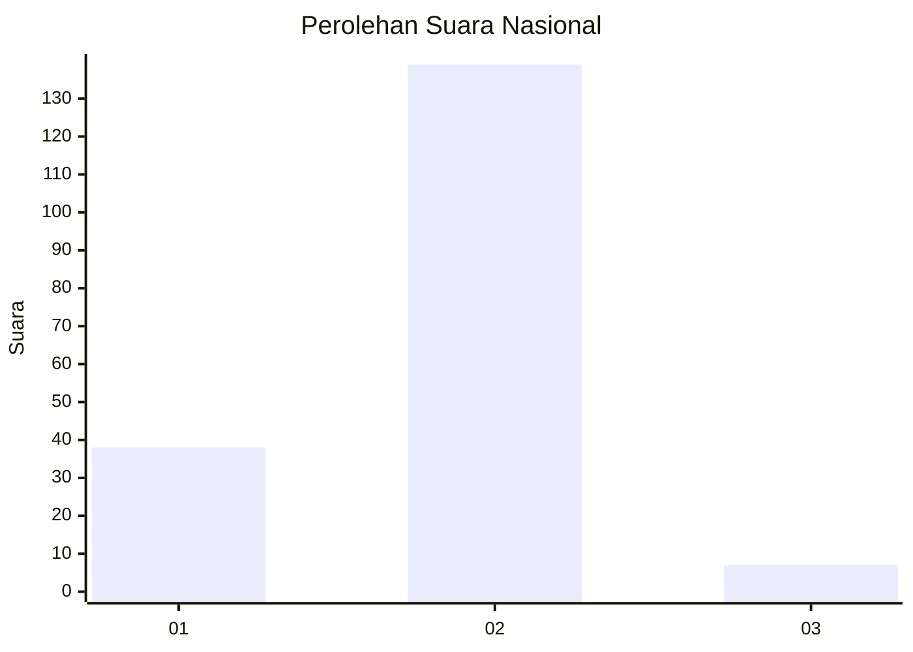

# Hasil

## Grafik

## Tabel

| No. | Nama Paslon    | Suara | Suara (raw) | Persentase |
|:--- |:-------------- | -----:| -----------:| ----------:|
| 1   | ANIES MUHAIMIN | 38    | [38][p-1]   | 20,65      |
| 2   | PRABOWO GIBRAN | 139   | [139][p-2]  | 75,54      |
| 3   | GANJAR MAHFUD  | 7     | [7][p-3]    | 3,80       |

[p-1]: https://github.com/gigit-pemilu/pemilu-2024/blob/main/pilpres/hitung-suara/sub/72-sulawesi-tengah/sub/08-parigi-moutong/sub/14-taopa/sub/2005-tuladenggi-sibatang/sub/002-tps/sub/paslon-1.txt
[p-2]: https://github.com/gigit-pemilu/pemilu-2024/blob/main/pilpres/hitung-suara/sub/72-sulawesi-tengah/sub/08-parigi-moutong/sub/14-taopa/sub/2005-tuladenggi-sibatang/sub/002-tps/sub/paslon-2.txt
[p-3]: https://github.com/gigit-pemilu/pemilu-2024/blob/main/pilpres/hitung-suara/sub/72-sulawesi-tengah/sub/08-parigi-moutong/sub/14-taopa/sub/2005-tuladenggi-sibatang/sub/002-tps/sub/paslon-3.txt

## Foto C Plano

https://sirekap-obj-formc.kpu.go.id/686f/pemilu/ppwp/72/08/14/20/05/7208142005002-20240215-084633--e5d6b4c8-91c5-4eac-acdb-fd7ba8020a54.jpg

https://sirekap-obj-formc.kpu.go.id/686f/pemilu/ppwp/72/08/14/20/05/7208142005002-20240215-091929--bcd49eae-89b7-4415-b4a7-fb71f220ff04.jpg

https://sirekap-obj-formc.kpu.go.id/686f/pemilu/ppwp/72/08/14/20/05/7208142005002-20240215-091949--77564cbb-bfc8-44e1-a334-5a75e5e44fa3.jpg

## Metadata

| Key        | Value               |
| ---------- | ------------------- |
| Time Stamp | 2024-02-16 10:00:28 |

