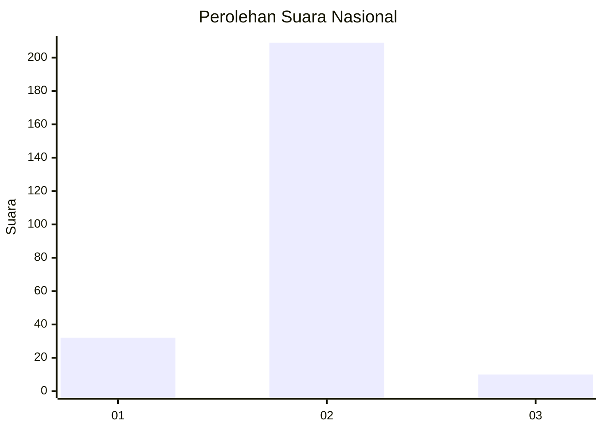
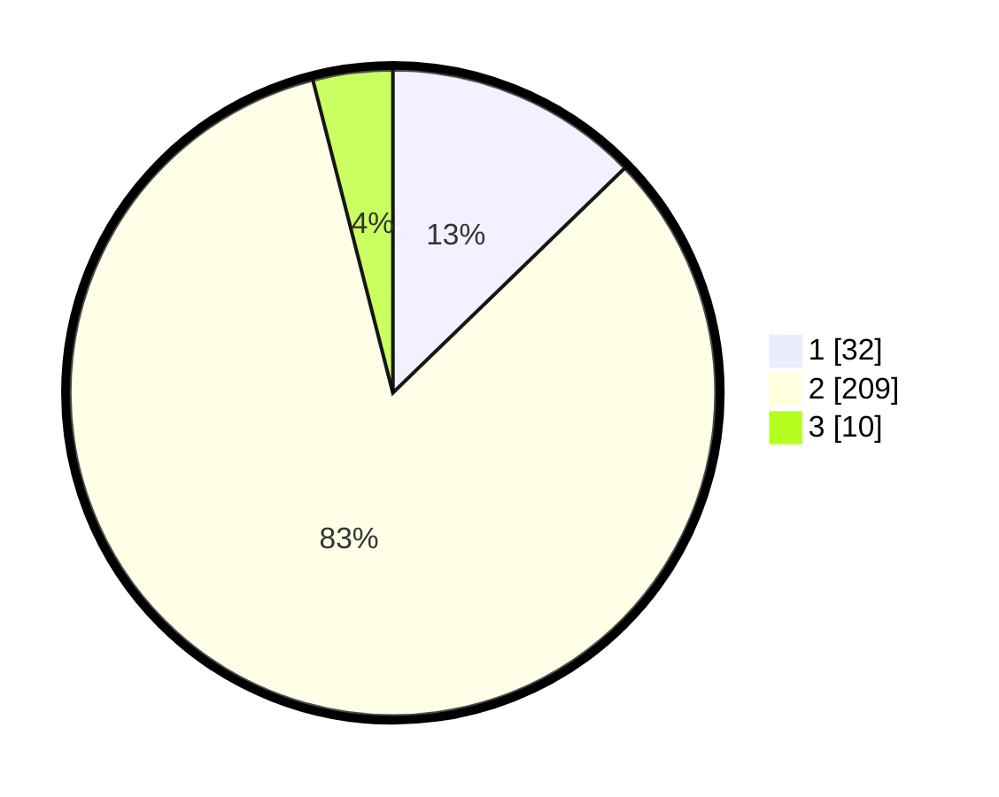

# Hasil

## Grafik

## Tabel

| No. | Nama Paslon    | Suara | Suara (raw) | Persentase |
|:--- |:-------------- | -----:| -----------:| ----------:|
| 1   | ANIES MUHAIMIN | 32    | [32][p-1]   | 12,75      |
| 2   | PRABOWO GIBRAN | 209   | [209][p-2]  | 83,27      |
| 3   | GANJAR MAHFUD  | 10    | [10][p-3]   | 3,98       |

[p-1]: https://github.com/gigit-pemilu/pemilu-2024/blob/main/pilpres/hitung-suara/sub/72-sulawesi-tengah/sub/08-parigi-moutong/sub/17-siniu/sub/2001-marantale/sub/003-tps/sub/paslon-1.txt
[p-2]: https://github.com/gigit-pemilu/pemilu-2024/blob/main/pilpres/hitung-suara/sub/72-sulawesi-tengah/sub/08-parigi-moutong/sub/17-siniu/sub/2001-marantale/sub/003-tps/sub/paslon-2.txt
[p-3]: https://github.com/gigit-pemilu/pemilu-2024/blob/main/pilpres/hitung-suara/sub/72-sulawesi-tengah/sub/08-parigi-moutong/sub/17-siniu/sub/2001-marantale/sub/003-tps/sub/paslon-3.txt

## Foto C Plano

https://sirekap-obj-formc.kpu.go.id/eafa/pemilu/ppwp/72/08/17/20/01/7208172001003-20240215-221024--1361cc4f-2cc5-4afa-9677-278d50aa10c1.jpg

https://sirekap-obj-formc.kpu.go.id/eafa/pemilu/ppwp/72/08/17/20/01/7208172001003-20240215-221210--55c2014d-8c06-4941-a37c-be897f78b49e.jpg

https://sirekap-obj-formc.kpu.go.id/eafa/pemilu/ppwp/72/08/17/20/01/7208172001003-20240215-221940--8baf119a-e722-4e65-9cd4-3a0b1d3a14bb.jpg

## Metadata

| Key        | Value               |
| ---------- | ------------------- |
| Time Stamp | 2024-02-16 21:01:00 |

