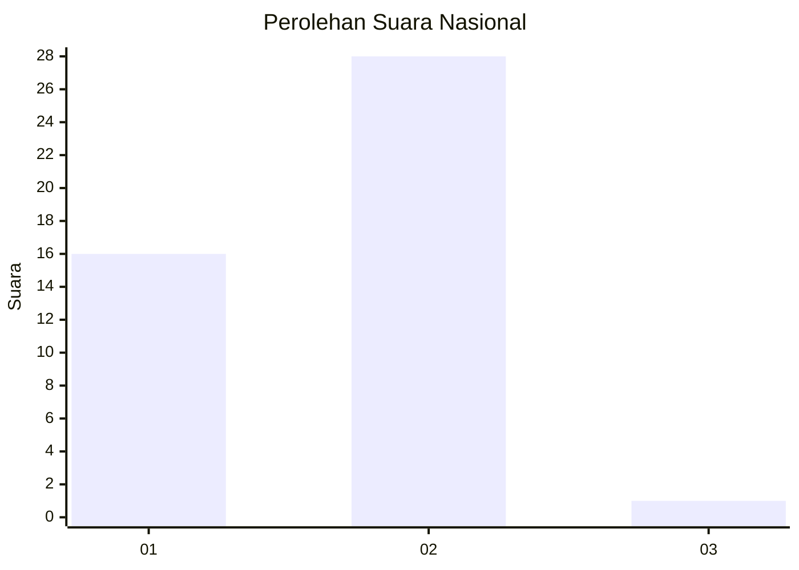
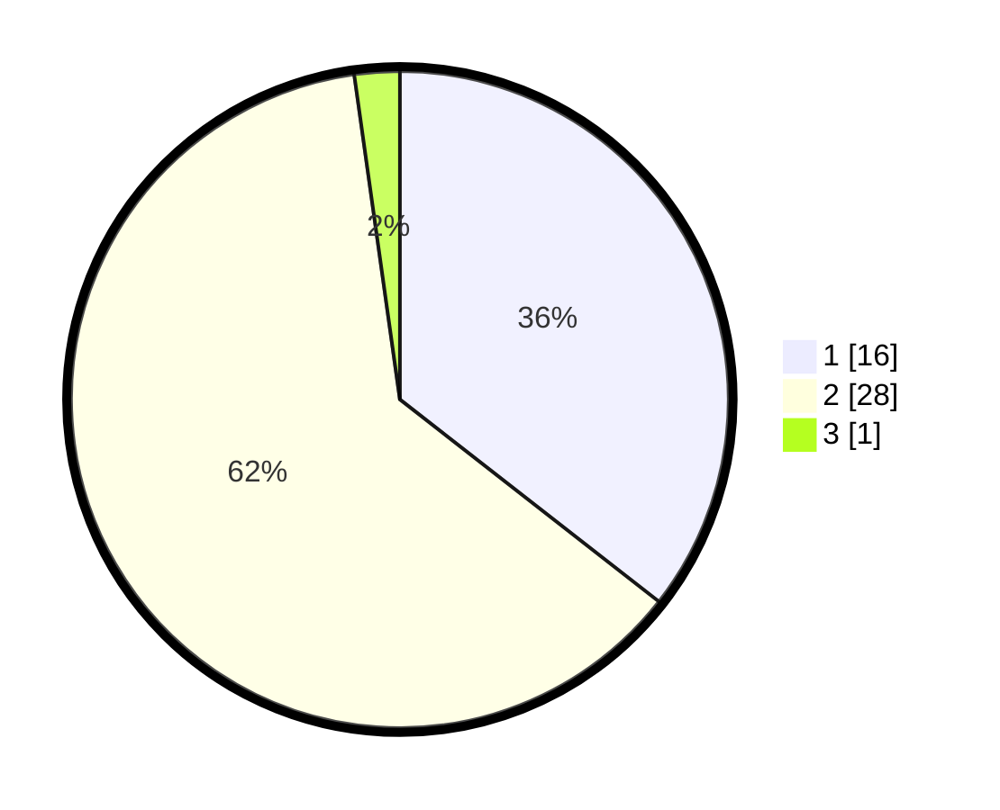

# Hasil

## Grafik

## Tabel

| No. | Nama Paslon    | Suara | Suara (raw) | Persentase |
|:--- |:-------------- | -----:| -----------:| ----------:|
| 1   | ANIES MUHAIMIN | 16    | [16][p-1]   | 35,56      |
| 2   | PRABOWO GIBRAN | 28    | [28][p-2]   | 62,22      |
| 3   | GANJAR MAHFUD  | 1     | [1][p-3]    | 2,22       |

[p-1]: https://github.com/gigit-pemilu/pemilu-2024/blob/main/pilpres/hitung-suara/sub/72-sulawesi-tengah/sub/08-parigi-moutong/sub/21-bolano/sub/2001-bolano/sub/006-tps/sub/paslon-1.txt
[p-2]: https://github.com/gigit-pemilu/pemilu-2024/blob/main/pilpres/hitung-suara/sub/72-sulawesi-tengah/sub/08-parigi-moutong/sub/21-bolano/sub/2001-bolano/sub/006-tps/sub/paslon-2.txt
[p-3]: https://github.com/gigit-pemilu/pemilu-2024/blob/main/pilpres/hitung-suara/sub/72-sulawesi-tengah/sub/08-parigi-moutong/sub/21-bolano/sub/2001-bolano/sub/006-tps/sub/paslon-3.txt

## Foto C Plano

https://sirekap-obj-formc.kpu.go.id/982d/pemilu/ppwp/72/08/21/20/01/7208212001006-20240215-091103--e3eb4061-443a-43fa-93c1-e3ad23180bf8.jpg

https://sirekap-obj-formc.kpu.go.id/982d/pemilu/ppwp/72/08/21/20/01/7208212001006-20240215-091928--be9bd6d8-dc62-4099-b856-917a8795cf45.jpg

https://sirekap-obj-formc.kpu.go.id/982d/pemilu/ppwp/72/08/21/20/01/7208212001006-20240215-092259--5b44d3a0-2405-4776-a75c-6910216720af.jpg

## Metadata

| Key        | Value               |
| ---------- | ------------------- |
| Time Stamp | 2024-02-15 20:30:46 |

## DATA PEMILIH TETAP

Jumlah pemilih dalam DPT: **40**.
 * L: **47**.
 * P: **43**.

## DATA PENGGUNA HAK PILIH

Jumlah pengguna hak pilih dalam DPT: **36**.
 * L: **20**.
 * P: **16**.

Jumlah pengguna hak pilih dalam DPTb: **7**.
 * L: **3**.
 * P: **4**.

Jumlah pengguna hak pilih dalam DPK: **2**.
 * L: **1**.
 * P: **1**.

Jumlah pengguna hak pilih: **45**.
 * L: **24**.
 * P: **21**.

## JUMLAH SUARA SAH DAN TIDAK SAH

JUMLAH SELURUH SUARA SAH: **45**.

JUMLAH SUARA TIDAK SAH: **0**.

JUMLAH SELURUH SUARA SAH DAN SUARA TIDAK SAH: **45**.

