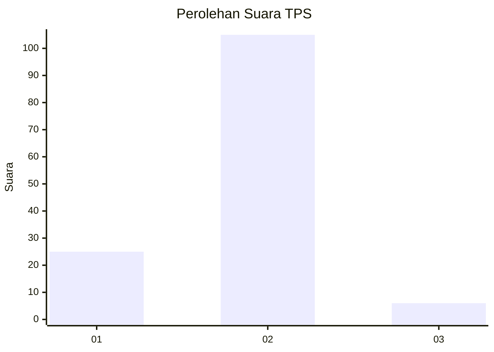
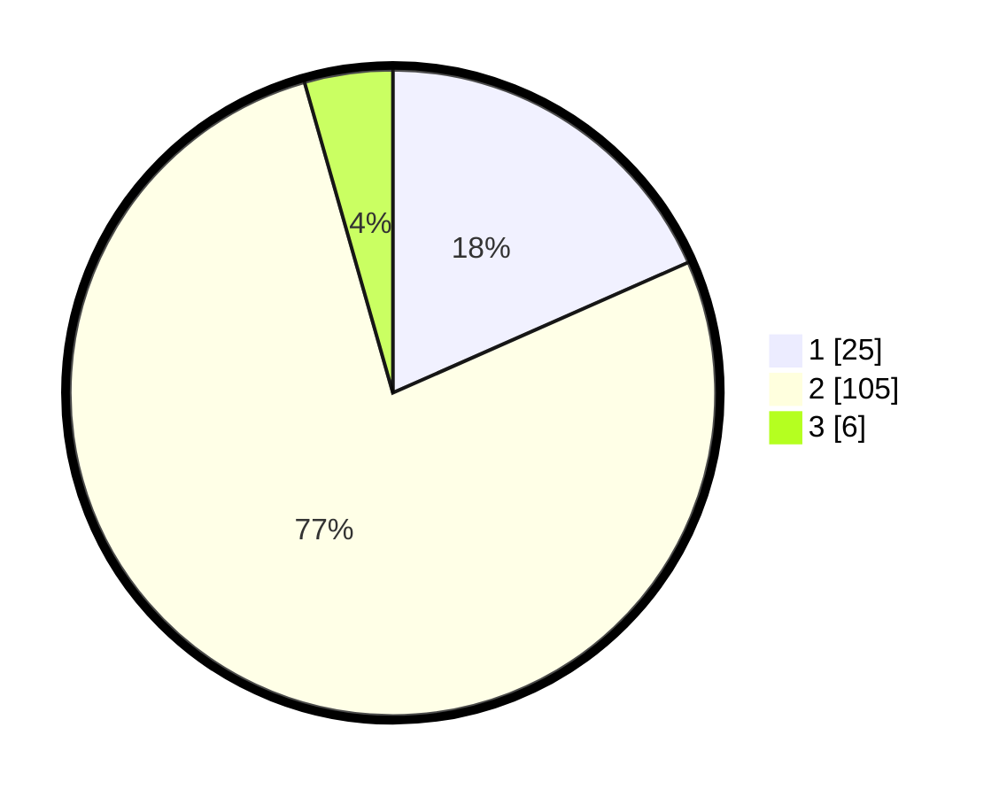

# Hasil

## Grafik

## Tabel

| No. | Nama Paslon    | Suara | Suara (raw) | Persentase |
|:--- |:-------------- | -----:| -----------:| ----------:|
| 1   | ANIES MUHAIMIN | 25    | [25][p-1]   | 18,38      |
| 2   | PRABOWO GIBRAN | 105   | [105][p-2]  | 77,21      |
| 3   | GANJAR MAHFUD  | 6     | [6][p-3]    | 4,41       |

[p-1]: https://github.com/gigit-pemilu/pemilu-2024-72-sulawesi-tengah/blob/main/pilpres/hitung-suara/sub/72-sulawesi-tengah/sub/08-parigi-moutong/sub/22-ongka-malino/sub/2001-ongka/sub/005-tps/sub/paslon-1.txt
[p-2]: https://github.com/gigit-pemilu/pemilu-2024-72-sulawesi-tengah/blob/main/pilpres/hitung-suara/sub/72-sulawesi-tengah/sub/08-parigi-moutong/sub/22-ongka-malino/sub/2001-ongka/sub/005-tps/sub/paslon-2.txt
[p-3]: https://github.com/gigit-pemilu/pemilu-2024-72-sulawesi-tengah/blob/main/pilpres/hitung-suara/sub/72-sulawesi-tengah/sub/08-parigi-moutong/sub/22-ongka-malino/sub/2001-ongka/sub/005-tps/sub/paslon-3.txt

## Foto C Plano

https://sirekap-obj-formc.kpu.go.id/8fcb/pemilu/ppwp/72/08/22/20/01/7208222001005-20240302-191507--bafaddf3-d9c2-41bc-98fd-b99aedbadb38.jpg

https://sirekap-obj-formc.kpu.go.id/8fcb/pemilu/ppwp/72/08/22/20/01/7208222001005-20240215-101527--fd0319ab-50ce-4afa-b193-4ce34bdb578b.jpg

https://sirekap-obj-formc.kpu.go.id/8fcb/pemilu/ppwp/72/08/22/20/01/7208222001005-20240215-101335--48ca2370-1b7c-4f07-bb12-2627e62b4794.jpg

## Metadata

| Key        | Value               |
| ---------- | ------------------- |
| Time Stamp | 2024-03-02 20:00:00 |

