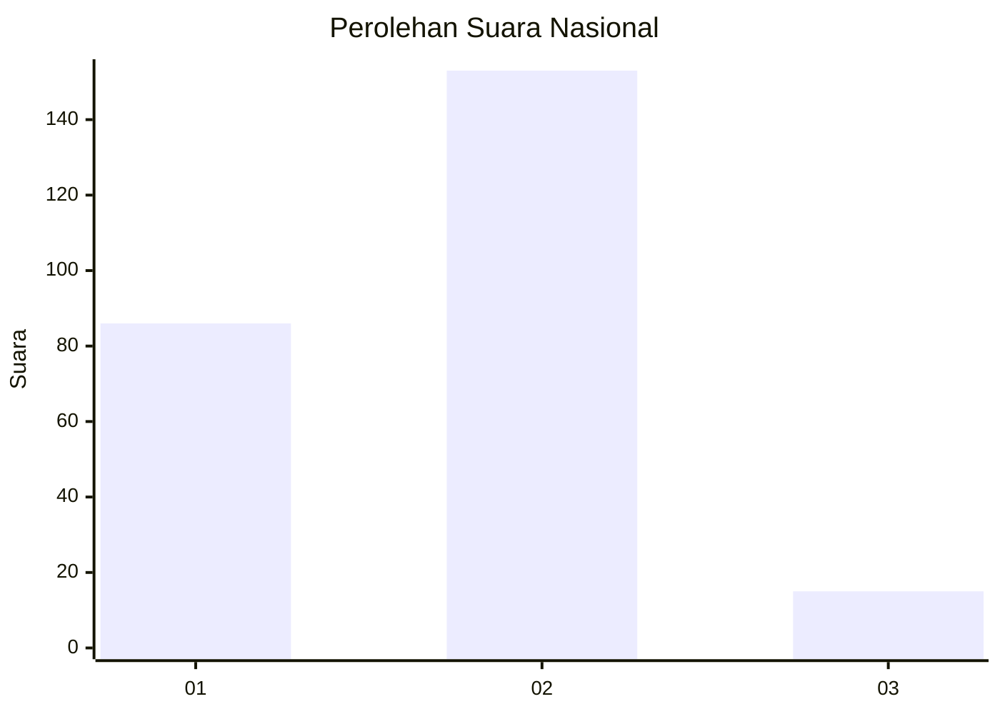
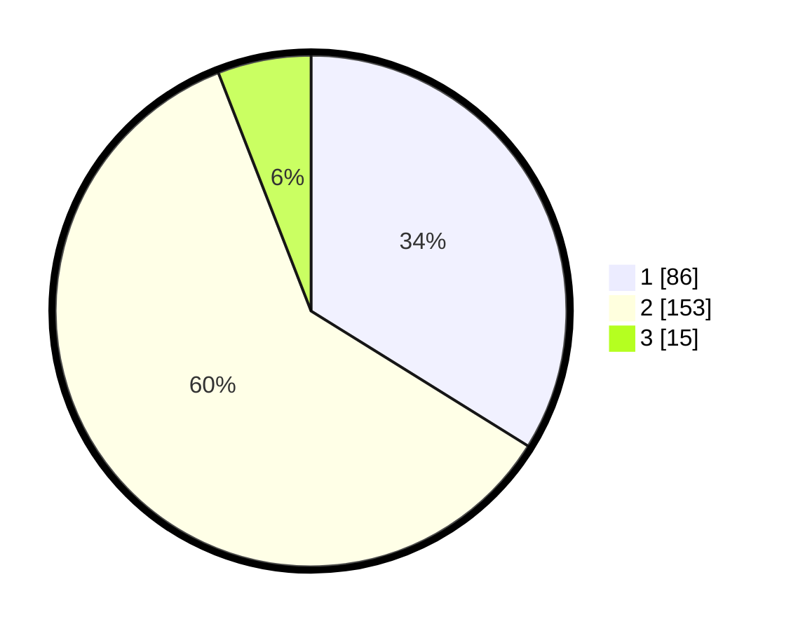

# Hasil

## Grafik

## Tabel

| No. | Nama Paslon    | Suara | Suara (raw) | Persentase |
|:--- |:-------------- | -----:| -----------:| ----------:|
| 1   | ANIES MUHAIMIN | 86    | [86][p-1]   | 33,86      |
| 2   | PRABOWO GIBRAN | 153   | [153][p-2]  | 60,24      |
| 3   | GANJAR MAHFUD  | 15    | [15][p-3]   | 5,91       |

[p-1]: https://github.com/gigit-pemilu/pemilu-2024/blob/main/pilpres/hitung-suara/sub/72-sulawesi-tengah/sub/08-parigi-moutong/sub/23-sidoan/sub/2001-lado/sub/002-tps/sub/paslon-1.txt
[p-2]: https://github.com/gigit-pemilu/pemilu-2024/blob/main/pilpres/hitung-suara/sub/72-sulawesi-tengah/sub/08-parigi-moutong/sub/23-sidoan/sub/2001-lado/sub/002-tps/sub/paslon-2.txt
[p-3]: https://github.com/gigit-pemilu/pemilu-2024/blob/main/pilpres/hitung-suara/sub/72-sulawesi-tengah/sub/08-parigi-moutong/sub/23-sidoan/sub/2001-lado/sub/002-tps/sub/paslon-3.txt

## Foto C Plano

https://sirekap-obj-formc.kpu.go.id/f6b7/pemilu/ppwp/72/08/23/20/01/7208232001002-20240216-112519--599e0b2c-2728-4f32-8644-6df1c5e03726.jpg

https://sirekap-obj-formc.kpu.go.id/f6b7/pemilu/ppwp/72/08/23/20/01/7208232001002-20240216-113256--fdc5fbbe-170b-4bee-b180-ec45f315ca06.jpg

https://sirekap-obj-formc.kpu.go.id/f6b7/pemilu/ppwp/72/08/23/20/01/7208232001002-20240216-113513--3548e2ee-843e-47c6-bd8b-4e451c6dc385.jpg

## Metadata

| Key        | Value               |
| ---------- | ------------------- |
| Time Stamp | 2024-02-20 18:00:00 |

