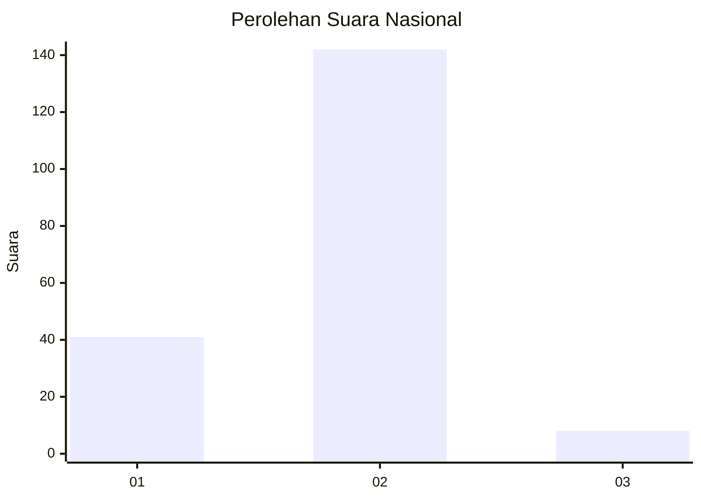
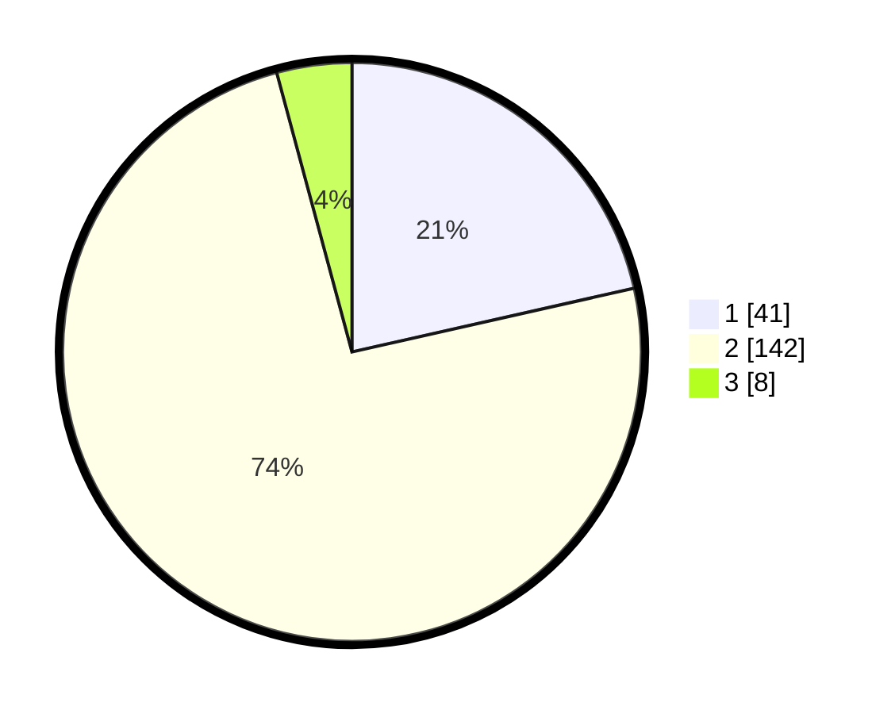

# Hasil

## Grafik

## Tabel

| No. | Nama Paslon    | Suara | Suara (raw) | Persentase |
|:--- |:-------------- | -----:| -----------:| ----------:|
| 1   | ANIES MUHAIMIN | 41    | [41][p-1]   | 21,47      |
| 2   | PRABOWO GIBRAN | 142   | [142][p-2]  | 74,35      |
| 3   | GANJAR MAHFUD  | 8     | [8][p-3]    | 4,19       |

[p-1]: https://github.com/gigit-pemilu/pemilu-2024/blob/main/pilpres/hitung-suara/sub/72-sulawesi-tengah/sub/09-tojo-una-una/sub/08-tojo/sub/2001-lemoro/sub/002-tps/sub/paslon-1.txt
[p-2]: https://github.com/gigit-pemilu/pemilu-2024/blob/main/pilpres/hitung-suara/sub/72-sulawesi-tengah/sub/09-tojo-una-una/sub/08-tojo/sub/2001-lemoro/sub/002-tps/sub/paslon-2.txt
[p-3]: https://github.com/gigit-pemilu/pemilu-2024/blob/main/pilpres/hitung-suara/sub/72-sulawesi-tengah/sub/09-tojo-una-una/sub/08-tojo/sub/2001-lemoro/sub/002-tps/sub/paslon-3.txt

## Foto C Plano

https://sirekap-obj-formc.kpu.go.id/39f4/pemilu/ppwp/72/09/08/20/01/7209082001002-20240215-081043--b67e034e-b4b4-4529-9773-f17445128435.jpg

https://sirekap-obj-formc.kpu.go.id/39f4/pemilu/ppwp/72/09/08/20/01/7209082001002-20240214-234844--538f9e8e-f880-415f-abed-a6843433b5e8.jpg

https://sirekap-obj-formc.kpu.go.id/39f4/pemilu/ppwp/72/09/08/20/01/7209082001002-20240215-082408--47f4d60e-3a4c-41bb-82b0-57de244c2604.jpg

## Metadata

| Key        | Value               |
| ---------- | ------------------- |
| Time Stamp | 2024-02-25 00:00:00 |

