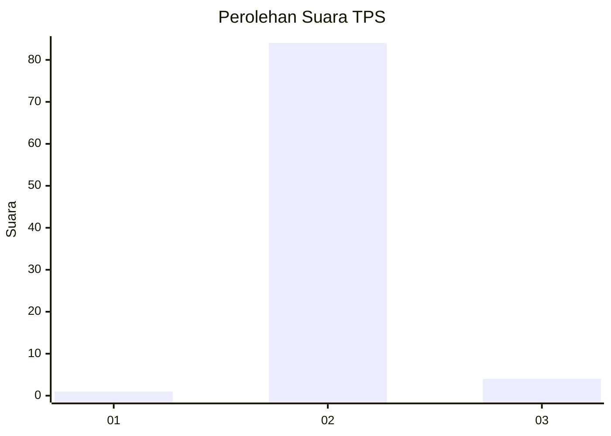
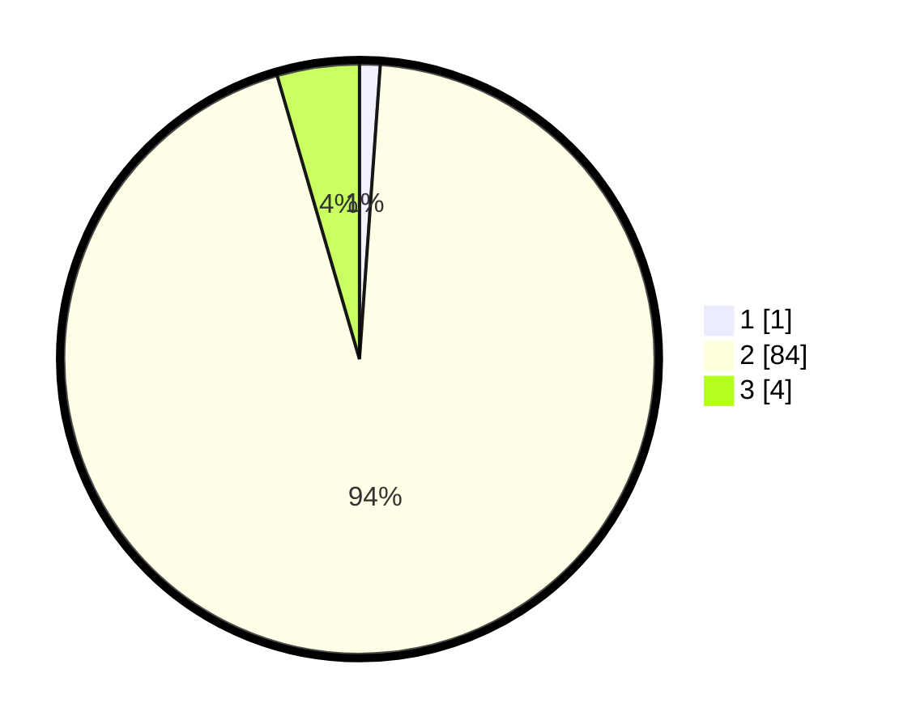

# Hasil

## Grafik

## Tabel

| No. | Nama Paslon    | Suara | Suara (raw) | Persentase |
|:--- |:-------------- | -----:| -----------:| ----------:|
| 1   | ANIES MUHAIMIN | 1     | [1][p-1]    | 1,12       |
| 2   | PRABOWO GIBRAN | 84    | [84][p-2]   | 94,38      |
| 3   | GANJAR MAHFUD  | 4     | [4][p-3]    | 4,49       |

[p-1]: https://github.com/gigit-pemilu/pemilu-2024-72-sulawesi-tengah/blob/main/pilpres/hitung-suara/sub/72-sulawesi-tengah/sub/09-tojo-una-una/sub/08-tojo/sub/2002-korondoda/sub/001-tps/sub/paslon-1.txt
[p-2]: https://github.com/gigit-pemilu/pemilu-2024-72-sulawesi-tengah/blob/main/pilpres/hitung-suara/sub/72-sulawesi-tengah/sub/09-tojo-una-una/sub/08-tojo/sub/2002-korondoda/sub/001-tps/sub/paslon-2.txt
[p-3]: https://github.com/gigit-pemilu/pemilu-2024-72-sulawesi-tengah/blob/main/pilpres/hitung-suara/sub/72-sulawesi-tengah/sub/09-tojo-una-una/sub/08-tojo/sub/2002-korondoda/sub/001-tps/sub/paslon-3.txt

## Foto C Plano

https://sirekap-obj-formc.kpu.go.id/f163/pemilu/ppwp/72/09/08/20/02/7209082002001-20240215-043215--03753e5a-1b65-4672-b59c-8b7bd9cdcb76.jpg

https://sirekap-obj-formc.kpu.go.id/f163/pemilu/ppwp/72/09/08/20/02/7209082002001-20240215-000013--1fa169fc-0a6d-4d26-bba5-9f06178539ee.jpg

https://sirekap-obj-formc.kpu.go.id/f163/pemilu/ppwp/72/09/08/20/02/7209082002001-20240215-003529--ad0252ce-0709-474e-8b43-c8fef67a422b.jpg

## Metadata

| Key        | Value               |
| ---------- | ------------------- |
| Time Stamp | 2024-02-25 16:00:00 |

