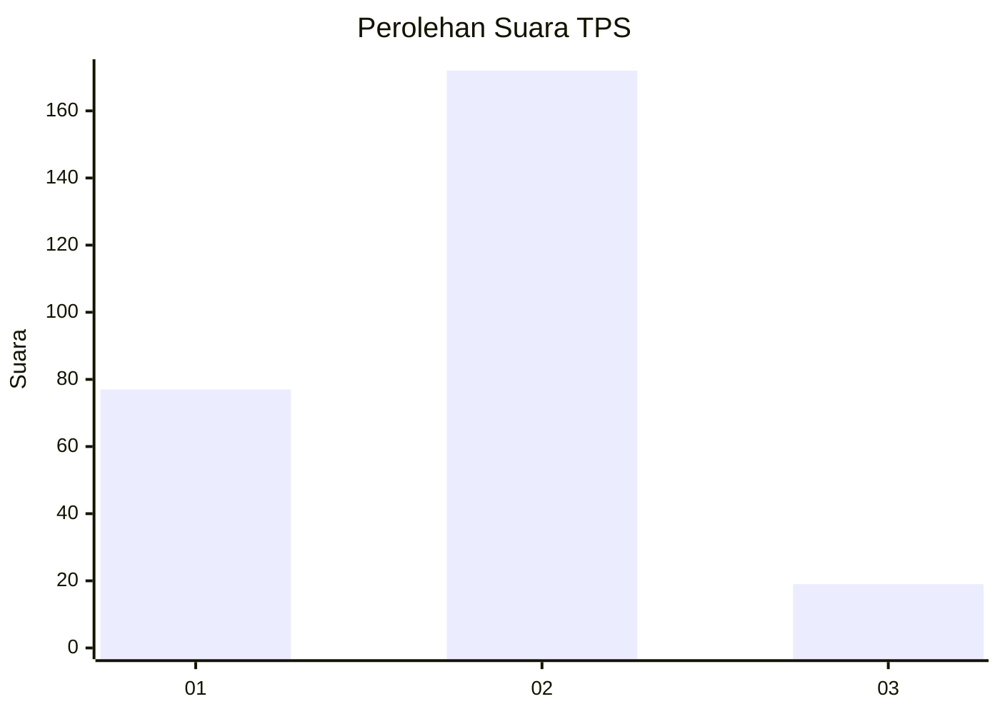
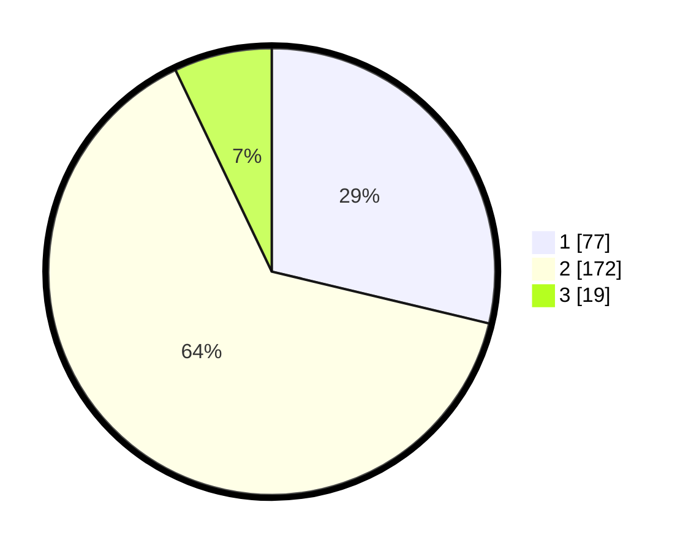

# Hasil

## Grafik

## Tabel

| No. | Nama Paslon    | Suara | Suara (raw) | Persentase |
|:--- |:-------------- | -----:| -----------:| ----------:|
| 1   | ANIES MUHAIMIN | 77    | [77][p-1]   | 28,73      |
| 2   | PRABOWO GIBRAN | 172   | [172][p-2]  | 64,18      |
| 3   | GANJAR MAHFUD  | 19    | [19][p-3]   | 7,09       |

[p-1]: https://github.com/gigit-pemilu/pemilu-2024-72-sulawesi-tengah/blob/main/pilpres/hitung-suara/sub/72-sulawesi-tengah/sub/09-tojo-una-una/sub/10-ratolindo/sub/1003-dondo/sub/004-tps/sub/paslon-1.txt
[p-2]: https://github.com/gigit-pemilu/pemilu-2024-72-sulawesi-tengah/blob/main/pilpres/hitung-suara/sub/72-sulawesi-tengah/sub/09-tojo-una-una/sub/10-ratolindo/sub/1003-dondo/sub/004-tps/sub/paslon-2.txt
[p-3]: https://github.com/gigit-pemilu/pemilu-2024-72-sulawesi-tengah/blob/main/pilpres/hitung-suara/sub/72-sulawesi-tengah/sub/09-tojo-una-una/sub/10-ratolindo/sub/1003-dondo/sub/004-tps/sub/paslon-3.txt

## Foto C Plano

https://sirekap-obj-formc.kpu.go.id/756a/pemilu/ppwp/72/09/10/10/03/7209101003004-20240216-105851--6fc4b165-221a-4102-8354-d61b1f2c9935.jpg

https://sirekap-obj-formc.kpu.go.id/756a/pemilu/ppwp/72/09/10/10/03/7209101003004-20240216-105929--26282dbc-78ef-4e85-bce2-a017ebfe5ff9.jpg

https://sirekap-obj-formc.kpu.go.id/756a/pemilu/ppwp/72/09/10/10/03/7209101003004-20240216-105946--3140c591-41ac-474b-8161-55ad169a137a.jpg

## Metadata

| Key        | Value               |
| ---------- | ------------------- |
| Time Stamp | 2024-02-16 16:25:10 |

