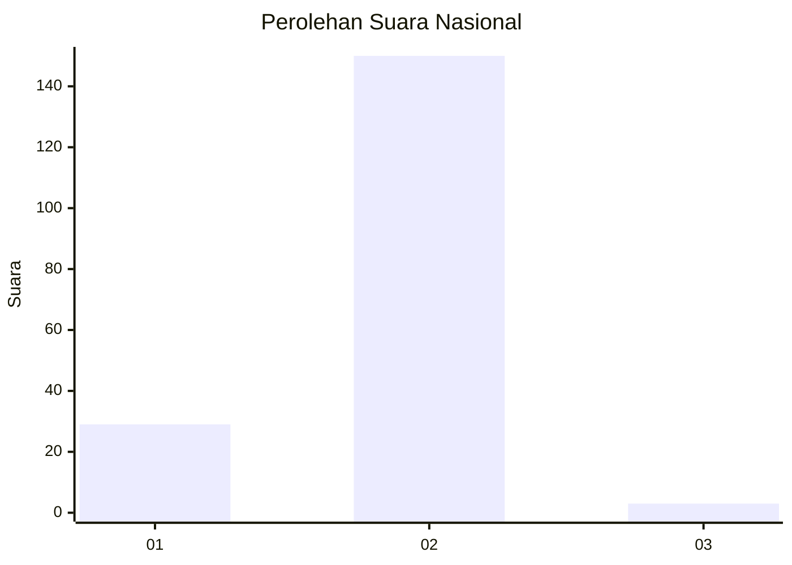
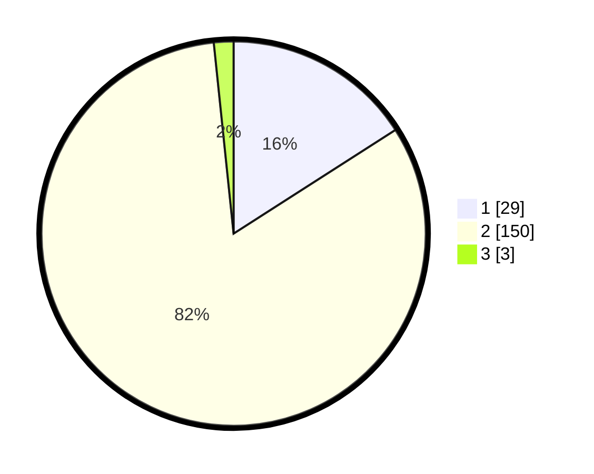

# Hasil

## Grafik

## Tabel

| No. | Nama Paslon    | Suara | Suara (raw) | Persentase |
|:--- |:-------------- | -----:| -----------:| ----------:|
| 1   | ANIES MUHAIMIN | 29    | [29][p-1]   | 15,93      |
| 2   | PRABOWO GIBRAN | 150   | [150][p-2]  | 82,42      |
| 3   | GANJAR MAHFUD  | 3     | [3][p-3]    | 1,65       |

[p-1]: https://github.com/gigit-pemilu/pemilu-2024/blob/main/pilpres/hitung-suara/sub/72-sulawesi-tengah/sub/10-sigi/sub/01-sigi-biromaru/sub/2002-sidondo-i/sub/002-tps/sub/paslon-1.txt
[p-2]: https://github.com/gigit-pemilu/pemilu-2024/blob/main/pilpres/hitung-suara/sub/72-sulawesi-tengah/sub/10-sigi/sub/01-sigi-biromaru/sub/2002-sidondo-i/sub/002-tps/sub/paslon-2.txt
[p-3]: https://github.com/gigit-pemilu/pemilu-2024/blob/main/pilpres/hitung-suara/sub/72-sulawesi-tengah/sub/10-sigi/sub/01-sigi-biromaru/sub/2002-sidondo-i/sub/002-tps/sub/paslon-3.txt

## Foto C Plano

https://sirekap-obj-formc.kpu.go.id/94e3/pemilu/ppwp/72/10/01/20/02/7210012002002-20240215-134711--8868deca-8927-4ab1-9b80-382e39b99a7d.jpg

https://sirekap-obj-formc.kpu.go.id/94e3/pemilu/ppwp/72/10/01/20/02/7210012002002-20240215-135015--682bfa5a-f058-4761-99d3-e0c40f13d4e9.jpg

https://sirekap-obj-formc.kpu.go.id/94e3/pemilu/ppwp/72/10/01/20/02/7210012002002-20240215-135326--fcb76b0d-fa4e-4076-aa8d-fa660ff54c8a.jpg

## Metadata

| Key        | Value               |
| ---------- | ------------------- |
| Time Stamp | 2024-02-15 22:00:27 |

