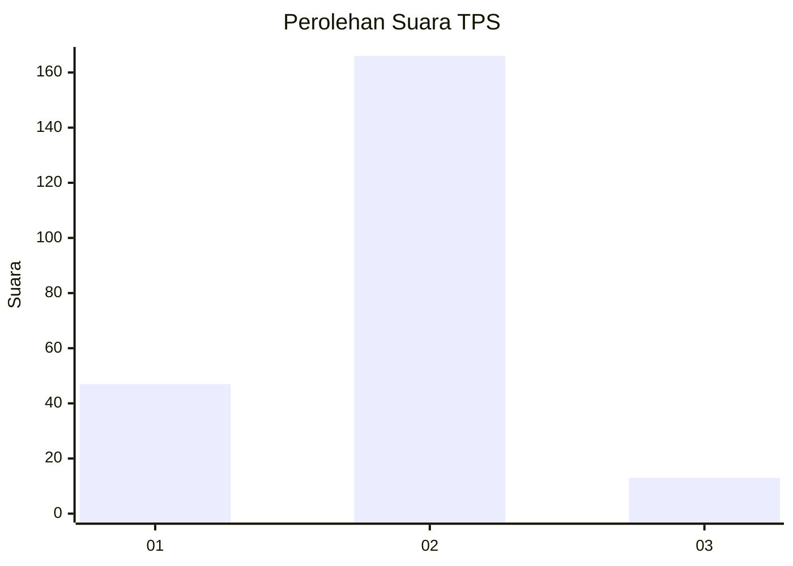

# Hasil

## Grafik

## Tabel

| No. | Nama Paslon    | Suara | Suara (raw) | Persentase |
|:--- |:-------------- | -----:| -----------:| ----------:|
| 1   | ANIES MUHAIMIN | 47    | [47][p-1]   | 20,80      |
| 2   | PRABOWO GIBRAN | 166   | [166][p-2]  | 73,45      |
| 3   | GANJAR MAHFUD  | 13    | [13][p-3]   | 5,75       |

[p-1]: https://github.com/gigit-pemilu/pemilu-2024-72-sulawesi-tengah/blob/main/pilpres/hitung-suara/sub/72-sulawesi-tengah/sub/10-sigi/sub/01-sigi-biromaru/sub/2002-sidondo-i/sub/005-tps/sub/paslon-1.txt
[p-2]: https://github.com/gigit-pemilu/pemilu-2024-72-sulawesi-tengah/blob/main/pilpres/hitung-suara/sub/72-sulawesi-tengah/sub/10-sigi/sub/01-sigi-biromaru/sub/2002-sidondo-i/sub/005-tps/sub/paslon-2.txt
[p-3]: https://github.com/gigit-pemilu/pemilu-2024-72-sulawesi-tengah/blob/main/pilpres/hitung-suara/sub/72-sulawesi-tengah/sub/10-sigi/sub/01-sigi-biromaru/sub/2002-sidondo-i/sub/005-tps/sub/paslon-3.txt

## Foto C Plano

https://sirekap-obj-formc.kpu.go.id/464f/pemilu/ppwp/72/10/01/20/02/7210012002005-20240215-125733--e4a6b5a2-6ae5-4a0c-9cfb-836da83c96f3.jpg

https://sirekap-obj-formc.kpu.go.id/464f/pemilu/ppwp/72/10/01/20/02/7210012002005-20240215-125856--3968a991-fb63-4974-8de6-99e003a41c40.jpg

https://sirekap-obj-formc.kpu.go.id/464f/pemilu/ppwp/72/10/01/20/02/7210012002005-20240215-130126--63af0211-da8d-427f-95cd-34ebf5f1cfbb.jpg

## Metadata

| Key        | Value               |
| ---------- | ------------------- |
| Time Stamp | 2024-02-16 21:01:00 |

