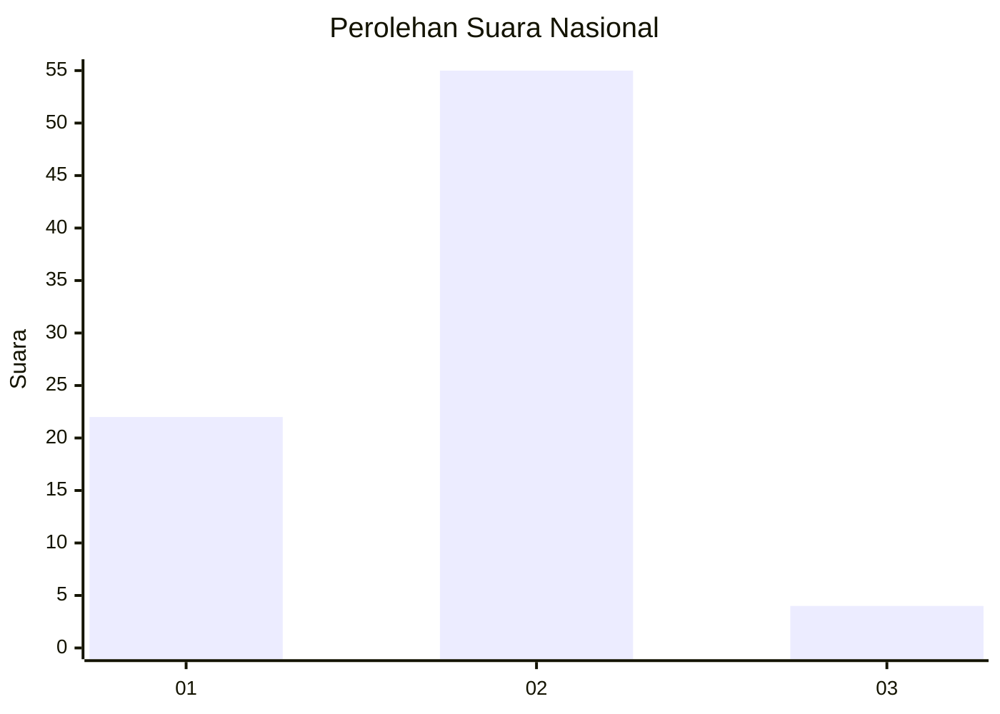
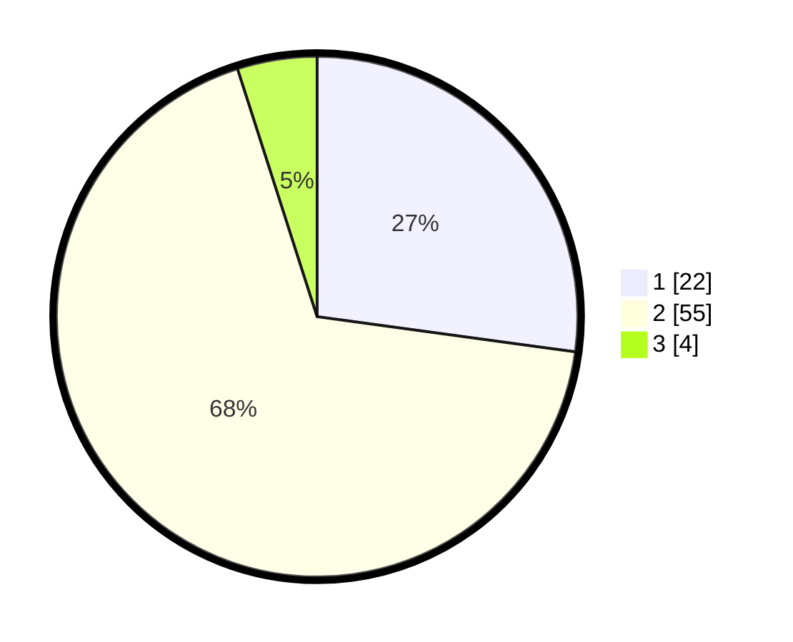

# Hasil

## Grafik

## Tabel

| No. | Nama Paslon    | Suara | Suara (raw) | Persentase |
|:--- |:-------------- | -----:| -----------:| ----------:|
| 1   | ANIES MUHAIMIN | 22    | [22][p-1]   | 27,16      |
| 2   | PRABOWO GIBRAN | 55    | [55][p-2]   | 67,90      |
| 3   | GANJAR MAHFUD  | 4     | [4][p-3]    | 4,94       |

[p-1]: https://github.com/gigit-pemilu/pemilu-2024/blob/main/pilpres/hitung-suara/sub/72-sulawesi-tengah/sub/10-sigi/sub/01-sigi-biromaru/sub/2010-lolu/sub/016-tps/sub/paslon-1.txt
[p-2]: https://github.com/gigit-pemilu/pemilu-2024/blob/main/pilpres/hitung-suara/sub/72-sulawesi-tengah/sub/10-sigi/sub/01-sigi-biromaru/sub/2010-lolu/sub/016-tps/sub/paslon-2.txt
[p-3]: https://github.com/gigit-pemilu/pemilu-2024/blob/main/pilpres/hitung-suara/sub/72-sulawesi-tengah/sub/10-sigi/sub/01-sigi-biromaru/sub/2010-lolu/sub/016-tps/sub/paslon-3.txt

## Foto C Plano

https://sirekap-obj-formc.kpu.go.id/c733/pemilu/ppwp/72/10/01/20/10/7210012010016-20240215-114944--85d5ca9f-49a4-4168-9da0-f12468a40c13.jpg

https://sirekap-obj-formc.kpu.go.id/c733/pemilu/ppwp/72/10/01/20/10/7210012010016-20240215-115226--684ad1e7-be70-4f72-9f99-5e9562a64421.jpg

https://sirekap-obj-formc.kpu.go.id/c733/pemilu/ppwp/72/10/01/20/10/7210012010016-20240215-115332--2d493503-44d8-4c9d-837c-f07c8d5a5057.jpg

## Metadata

| Key        | Value               |
| ---------- | ------------------- |
| Time Stamp | 2024-02-24 22:31:28 |

