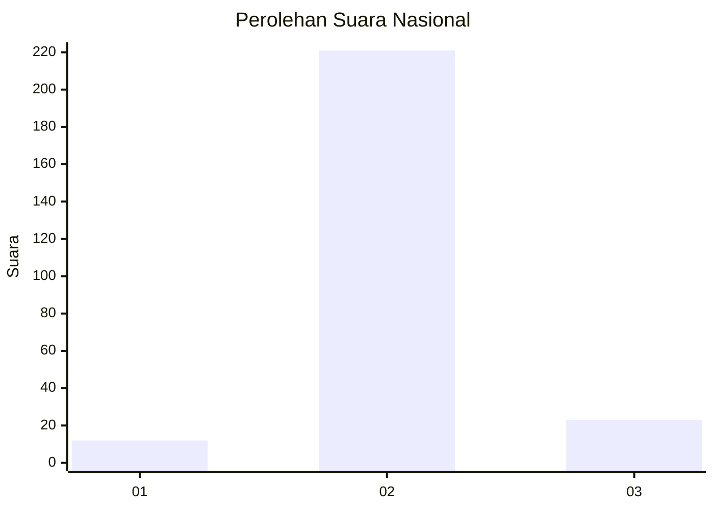
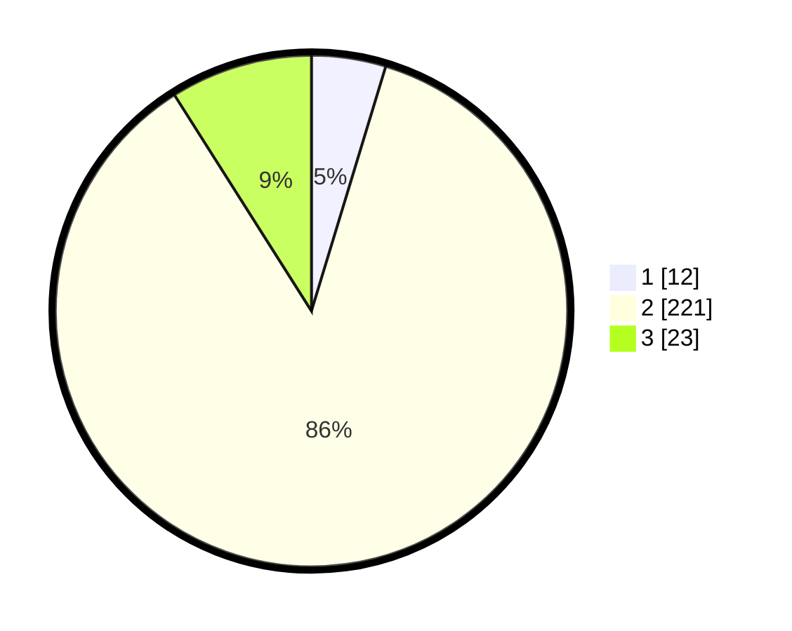

# Hasil

## Grafik

## Tabel

| No. | Nama Paslon    | Suara | Suara (raw) | Persentase |
|:--- |:-------------- | -----:| -----------:| ----------:|
| 1   | ANIES MUHAIMIN | 12    | [12][p-1]   | 4,69       |
| 2   | PRABOWO GIBRAN | 221   | [221][p-2]  | 86,33      |
| 3   | GANJAR MAHFUD  | 23    | [23][p-3]   | 8,98       |

[p-1]: https://github.com/gigit-pemilu/pemilu-2024/blob/main/pilpres/hitung-suara/sub/72-sulawesi-tengah/sub/10-sigi/sub/02-palolo/sub/2016-tongoa/sub/004-tps/sub/paslon-1.txt
[p-2]: https://github.com/gigit-pemilu/pemilu-2024/blob/main/pilpres/hitung-suara/sub/72-sulawesi-tengah/sub/10-sigi/sub/02-palolo/sub/2016-tongoa/sub/004-tps/sub/paslon-2.txt
[p-3]: https://github.com/gigit-pemilu/pemilu-2024/blob/main/pilpres/hitung-suara/sub/72-sulawesi-tengah/sub/10-sigi/sub/02-palolo/sub/2016-tongoa/sub/004-tps/sub/paslon-3.txt

## Foto C Plano

https://sirekap-obj-formc.kpu.go.id/9bf1/pemilu/ppwp/72/10/02/20/16/7210022016004-20240214-200157--53a5a0ce-8f61-4efb-82a9-fd39dad9d212.jpg

https://sirekap-obj-formc.kpu.go.id/9bf1/pemilu/ppwp/72/10/02/20/16/7210022016004-20240215-103819--5a1440fc-3f52-4771-aecc-9905f2d95c43.jpg

https://sirekap-obj-formc.kpu.go.id/9bf1/pemilu/ppwp/72/10/02/20/16/7210022016004-20240214-205601--b06698ea-7e10-4922-b1b4-72b0cd6b6b06.jpg

## Metadata

| Key        | Value               |
| ---------- | ------------------- |
| Time Stamp | 2024-02-17 16:36:25 |

