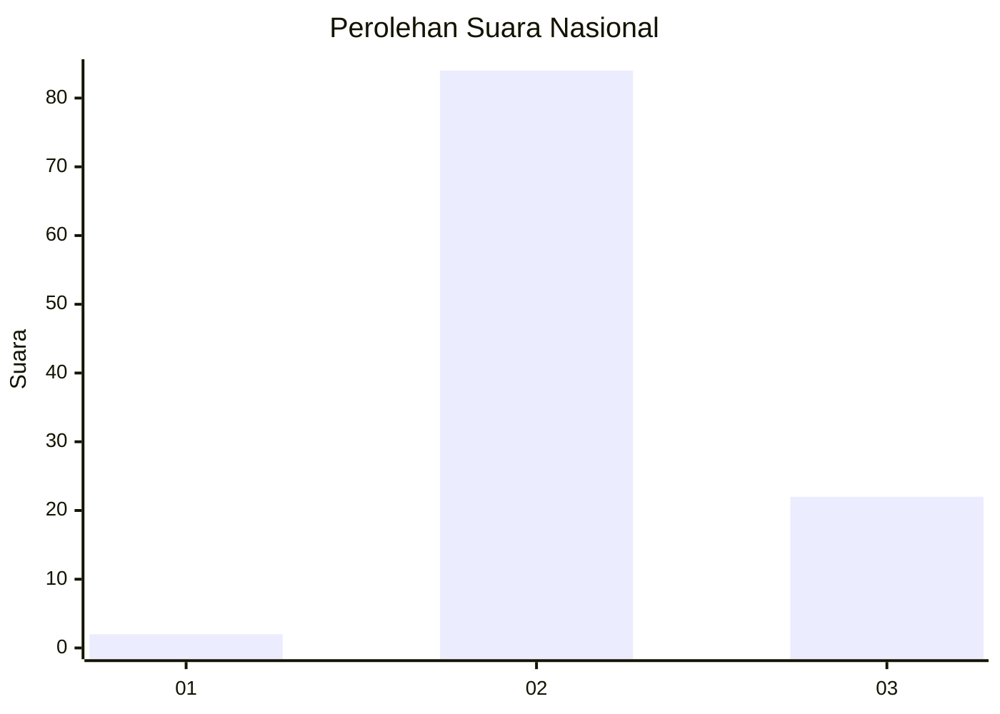

# Hasil

## Grafik

## Tabel

| No. | Nama Paslon    | Suara | Suara (raw) | Persentase |
|:--- |:-------------- | -----:| -----------:| ----------:|
| 1   | ANIES MUHAIMIN | 2     | [2][p-1]    | 1,85       |
| 2   | PRABOWO GIBRAN | 84    | [84][p-2]   | 77,78      |
| 3   | GANJAR MAHFUD  | 22    | [22][p-3]   | 20,37      |

[p-1]: https://github.com/gigit-pemilu/pemilu-2024/blob/main/pilpres/hitung-suara/sub/72-sulawesi-tengah/sub/10-sigi/sub/05-kulawi/sub/2003-tangkulowi/sub/001-tps/sub/paslon-1.txt
[p-2]: https://github.com/gigit-pemilu/pemilu-2024/blob/main/pilpres/hitung-suara/sub/72-sulawesi-tengah/sub/10-sigi/sub/05-kulawi/sub/2003-tangkulowi/sub/001-tps/sub/paslon-2.txt
[p-3]: https://github.com/gigit-pemilu/pemilu-2024/blob/main/pilpres/hitung-suara/sub/72-sulawesi-tengah/sub/10-sigi/sub/05-kulawi/sub/2003-tangkulowi/sub/001-tps/sub/paslon-3.txt

## Foto C Plano

https://sirekap-obj-formc.kpu.go.id/8864/pemilu/ppwp/72/10/05/20/03/7210052003001-20240221-203924--c189d783-160a-4c0b-a0e0-7f44b9704505.jpg

https://sirekap-obj-formc.kpu.go.id/8864/pemilu/ppwp/72/10/05/20/03/7210052003001-20240221-204445--4210eadf-39cf-4a5d-9bb6-b223c12df007.jpg

https://sirekap-obj-formc.kpu.go.id/8864/pemilu/ppwp/72/10/05/20/03/7210052003001-20240215-100457--8590b79e-53f1-4a0c-bb97-8182c6f3b54b.jpg

## Metadata

| Key        | Value               |
| ---------- | ------------------- |
| Time Stamp | 2024-02-24 22:31:28 |

