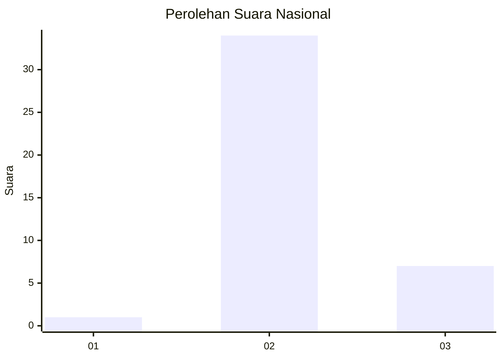
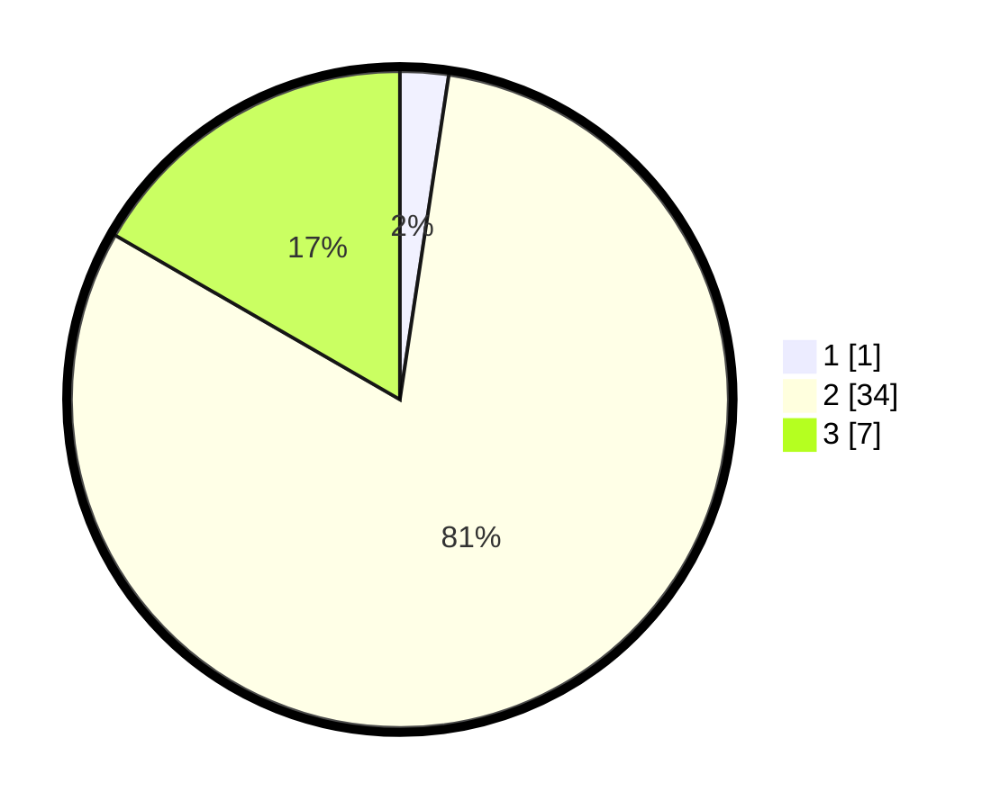

# Hasil

## Grafik

## Tabel

| No. | Nama Paslon    | Suara | Suara (raw) | Persentase |
|:--- |:-------------- | -----:| -----------:| ----------:|
| 1   | ANIES MUHAIMIN | 1     | [1][p-1]    | 2,38       |
| 2   | PRABOWO GIBRAN | 34    | [34][p-2]   | 80,95      |
| 3   | GANJAR MAHFUD  | 7     | [7][p-3]    | 16,67      |

[p-1]: https://github.com/gigit-pemilu/pemilu-2024/blob/main/pilpres/hitung-suara/sub/72-sulawesi-tengah/sub/10-sigi/sub/07-pipikoro/sub/2001-koja/sub/003-tps/sub/paslon-1.txt
[p-2]: https://github.com/gigit-pemilu/pemilu-2024/blob/main/pilpres/hitung-suara/sub/72-sulawesi-tengah/sub/10-sigi/sub/07-pipikoro/sub/2001-koja/sub/003-tps/sub/paslon-2.txt
[p-3]: https://github.com/gigit-pemilu/pemilu-2024/blob/main/pilpres/hitung-suara/sub/72-sulawesi-tengah/sub/10-sigi/sub/07-pipikoro/sub/2001-koja/sub/003-tps/sub/paslon-3.txt

## Foto C Plano

https://sirekap-obj-formc.kpu.go.id/3c59/pemilu/ppwp/72/10/07/20/01/7210072001003-20240226-112548--35c4ae01-4b6b-4858-8e33-7f405e67dc97.jpg

https://sirekap-obj-formc.kpu.go.id/3c59/pemilu/ppwp/72/10/07/20/01/7210072001003-20240226-112604--f93811b5-f7d5-43da-8dc8-36c591fb0674.jpg

https://sirekap-obj-formc.kpu.go.id/3c59/pemilu/ppwp/72/10/07/20/01/7210072001003-20240226-112614--b7bff87a-ae80-4eba-a6bd-429fc849f564.jpg

## Metadata

| Key        | Value               |
| ---------- | ------------------- |
| Time Stamp | 2024-02-26 12:00:00 |

## DATA PEMILIH TETAP

Jumlah pemilih dalam DPT: **45**.
 * L: **24**.
 * P: **21**.

## DATA PENGGUNA HAK PILIH

Jumlah pengguna hak pilih dalam DPT: **42**.
 * L: **22**.
 * P: **20**.

Jumlah pengguna hak pilih dalam DPTb: **0**.
 * L: **0**.
 * P: **0**.

Jumlah pengguna hak pilih dalam DPK: **0**.
 * L: **0**.
 * P: **0**.

Jumlah pengguna hak pilih: **42**.
 * L: **22**.
 * P: **20**.

## JUMLAH SUARA SAH DAN TIDAK SAH

JUMLAH SELURUH SUARA SAH: **42**.

JUMLAH SUARA TIDAK SAH: **0**.

JUMLAH SELURUH SUARA SAH DAN SUARA TIDAK SAH: **42**.

