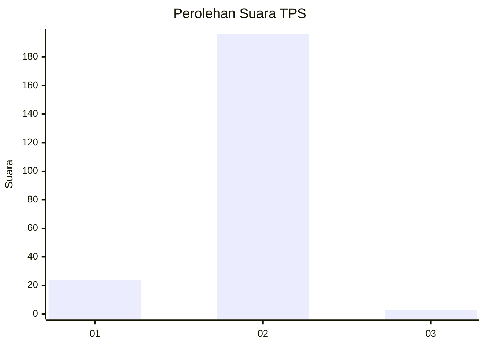
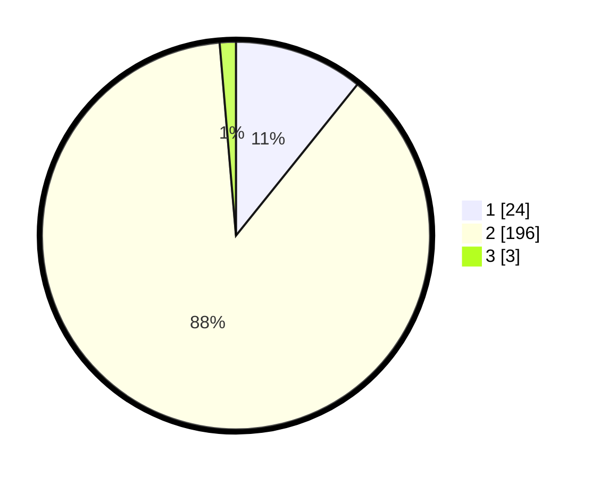

# Hasil

## Grafik

## Tabel

| No. | Nama Paslon    | Suara | Suara (raw) | Persentase |
|:--- |:-------------- | -----:| -----------:| ----------:|
| 1   | ANIES MUHAIMIN | 24    | [24][p-1]   | 10,76      |
| 2   | PRABOWO GIBRAN | 196   | [196][p-2]  | 87,89      |
| 3   | GANJAR MAHFUD  | 3     | [3][p-3]    | 1,35       |

[p-1]: https://github.com/gigit-pemilu/pemilu-2024-72-sulawesi-tengah/blob/main/pilpres/hitung-suara/sub/72-sulawesi-tengah/sub/10-sigi/sub/09-dolo-selatan/sub/2001-bangga/sub/002-tps/sub/paslon-1.txt
[p-2]: https://github.com/gigit-pemilu/pemilu-2024-72-sulawesi-tengah/blob/main/pilpres/hitung-suara/sub/72-sulawesi-tengah/sub/10-sigi/sub/09-dolo-selatan/sub/2001-bangga/sub/002-tps/sub/paslon-2.txt
[p-3]: https://github.com/gigit-pemilu/pemilu-2024-72-sulawesi-tengah/blob/main/pilpres/hitung-suara/sub/72-sulawesi-tengah/sub/10-sigi/sub/09-dolo-selatan/sub/2001-bangga/sub/002-tps/sub/paslon-3.txt

## Foto C Plano

https://sirekap-obj-formc.kpu.go.id/a6e4/pemilu/ppwp/72/10/09/20/01/7210092001002-20240215-233311--4178f823-3bf6-4a44-ad0f-6c5c79aad8f9.jpg

https://sirekap-obj-formc.kpu.go.id/a6e4/pemilu/ppwp/72/10/09/20/01/7210092001002-20240215-233116--4ec4de29-c658-475e-896a-e0bdd1aad60c.jpg

https://sirekap-obj-formc.kpu.go.id/a6e4/pemilu/ppwp/72/10/09/20/01/7210092001002-20240215-233449--7cfbbb1c-20c5-4966-8bc0-1453bbe844f0.jpg

## Metadata

| Key        | Value               |
| ---------- | ------------------- |
| Time Stamp | 2024-02-16 21:01:00 |

