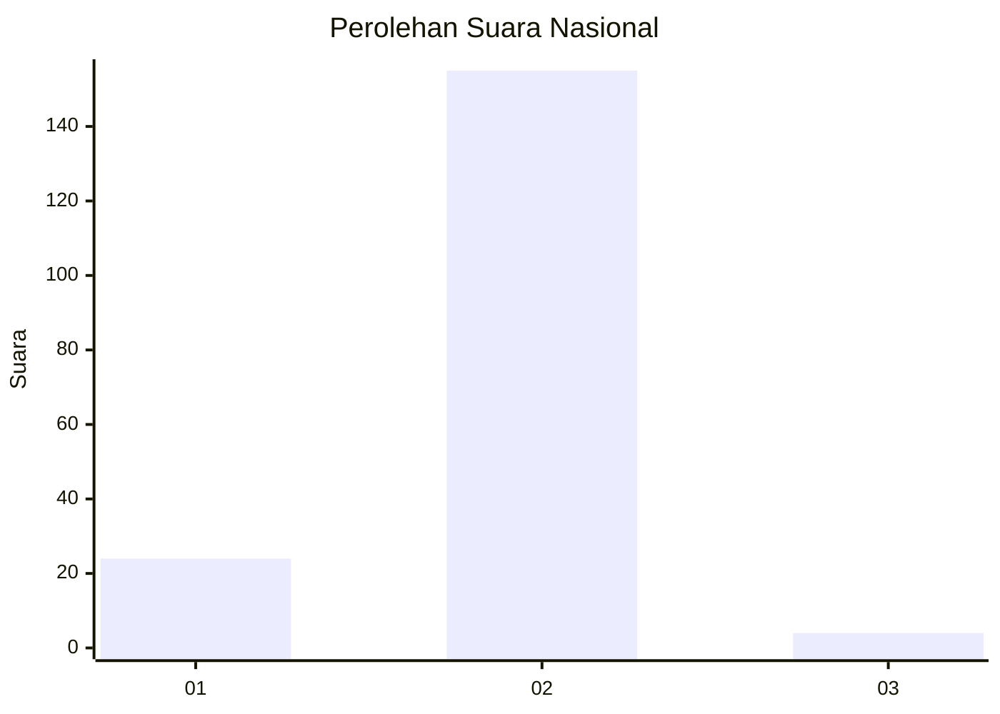
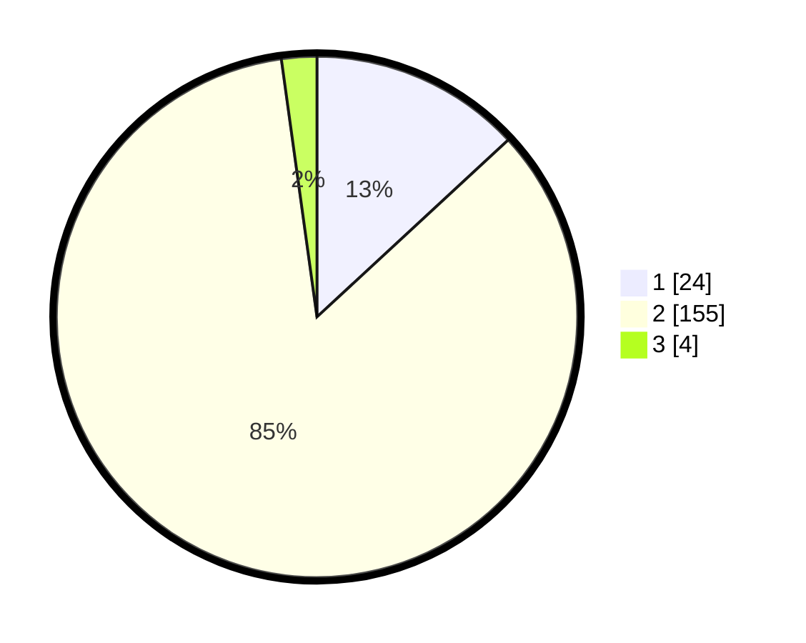

# Hasil

## Grafik

## Tabel

| No. | Nama Paslon    | Suara | Suara (raw) | Persentase |
|:--- |:-------------- | -----:| -----------:| ----------:|
| 1   | ANIES MUHAIMIN | 24    | [24][p-1]   | 13,11      |
| 2   | PRABOWO GIBRAN | 155   | [155][p-2]  | 84,70      |
| 3   | GANJAR MAHFUD  | 4     | [4][p-3]    | 2,19       |

[p-1]: https://github.com/gigit-pemilu/pemilu-2024/blob/main/pilpres/hitung-suara/sub/72-sulawesi-tengah/sub/10-sigi/sub/12-dolo/sub/2010-potoya/sub/003-tps/sub/paslon-1.txt
[p-2]: https://github.com/gigit-pemilu/pemilu-2024/blob/main/pilpres/hitung-suara/sub/72-sulawesi-tengah/sub/10-sigi/sub/12-dolo/sub/2010-potoya/sub/003-tps/sub/paslon-2.txt
[p-3]: https://github.com/gigit-pemilu/pemilu-2024/blob/main/pilpres/hitung-suara/sub/72-sulawesi-tengah/sub/10-sigi/sub/12-dolo/sub/2010-potoya/sub/003-tps/sub/paslon-3.txt

## Foto C Plano

https://sirekap-obj-formc.kpu.go.id/c441/pemilu/ppwp/72/10/12/20/10/7210122010003-20240215-184157--c1e9a10b-d861-4cf5-8d3d-afaaa729edda.jpg

https://sirekap-obj-formc.kpu.go.id/c441/pemilu/ppwp/72/10/12/20/10/7210122010003-20240215-184448--aea3c296-1258-4d82-8883-047d800605c1.jpg

https://sirekap-obj-formc.kpu.go.id/c441/pemilu/ppwp/72/10/12/20/10/7210122010003-20240215-184404--4b8a71b2-22f4-4114-b18f-387ea6f1db61.jpg

## Metadata

| Key        | Value               |
| ---------- | ------------------- |
| Time Stamp | 2024-02-17 12:00:00 |

## DATA PEMILIH TETAP

Jumlah pemilih dalam DPT: **333**.
 * L: **605**.
 * P: **113**.

## DATA PENGGUNA HAK PILIH

Jumlah pengguna hak pilih dalam DPT: **173**.
 * L: **35**.
 * P: **107**.

Jumlah pengguna hak pilih dalam DPTb: **80**.
 * L: **505**.
 * P: **31**.

Jumlah pengguna hak pilih dalam DPK: **335**.
 * L: **1**.
 * P: **34**.

Jumlah pengguna hak pilih: **135**.
 * L: **74**.
 * P: **105**.

## JUMLAH SUARA SAH DAN TIDAK SAH

JUMLAH SELURUH SUARA SAH: **183**.

JUMLAH SUARA TIDAK SAH: **2**.

JUMLAH SELURUH SUARA SAH DAN SUARA TIDAK SAH: **185**.

