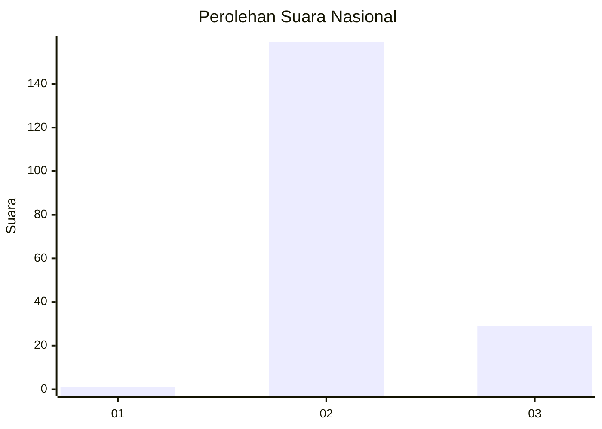
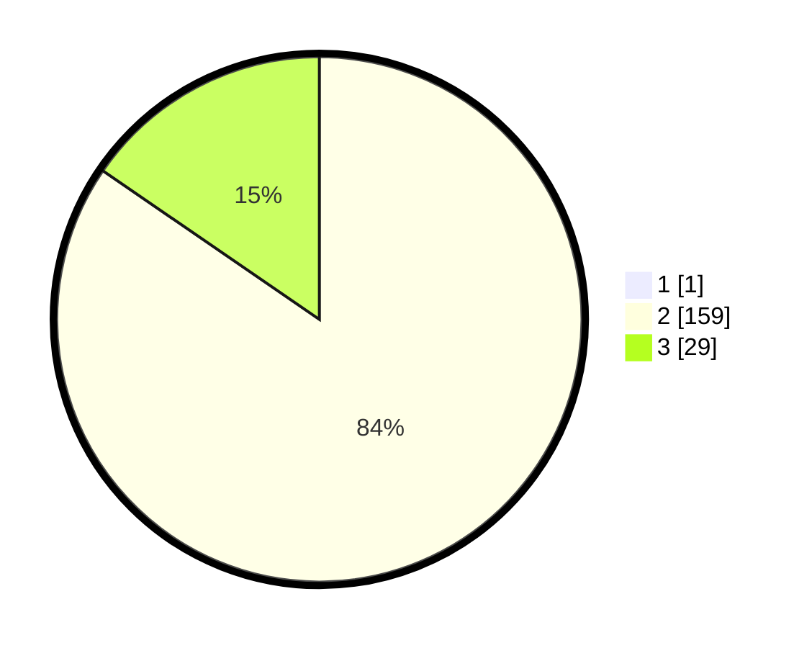

# Hasil

## Grafik

## Tabel

| No. | Nama Paslon    | Suara | Suara (raw) | Persentase |
|:--- |:-------------- | -----:| -----------:| ----------:|
| 1   | ANIES MUHAIMIN | 1     | [1][p-1]    | 0,53       |
| 2   | PRABOWO GIBRAN | 159   | [159][p-2]  | 84,13      |
| 3   | GANJAR MAHFUD  | 29    | [29][p-3]   | 15,34      |

[p-1]: https://github.com/gigit-pemilu/pemilu-2024/blob/main/pilpres/hitung-suara/sub/72-sulawesi-tengah/sub/12-morowali-utara/sub/03-lembo-raya/sub/2001-dolupo-karya/sub/004-tps/sub/paslon-1.txt
[p-2]: https://github.com/gigit-pemilu/pemilu-2024/blob/main/pilpres/hitung-suara/sub/72-sulawesi-tengah/sub/12-morowali-utara/sub/03-lembo-raya/sub/2001-dolupo-karya/sub/004-tps/sub/paslon-2.txt
[p-3]: https://github.com/gigit-pemilu/pemilu-2024/blob/main/pilpres/hitung-suara/sub/72-sulawesi-tengah/sub/12-morowali-utara/sub/03-lembo-raya/sub/2001-dolupo-karya/sub/004-tps/sub/paslon-3.txt

## Foto C Plano

https://sirekap-obj-formc.kpu.go.id/4b59/pemilu/ppwp/72/12/03/20/01/7212032001004-20240215-044333--fb860e49-3f88-4c4a-9808-fe0e0c162775.jpg

https://sirekap-obj-formc.kpu.go.id/4b59/pemilu/ppwp/72/12/03/20/01/7212032001004-20240215-044446--d56f42a0-253b-461b-a51f-1f5fe1cca37d.jpg

https://sirekap-obj-formc.kpu.go.id/4b59/pemilu/ppwp/72/12/03/20/01/7212032001004-20240215-044543--9146893c-4a6a-4b2e-8257-d81251fea2af.jpg

## Metadata

| Key        | Value               |
| ---------- | ------------------- |
| Time Stamp | 2024-02-15 21:30:27 |

