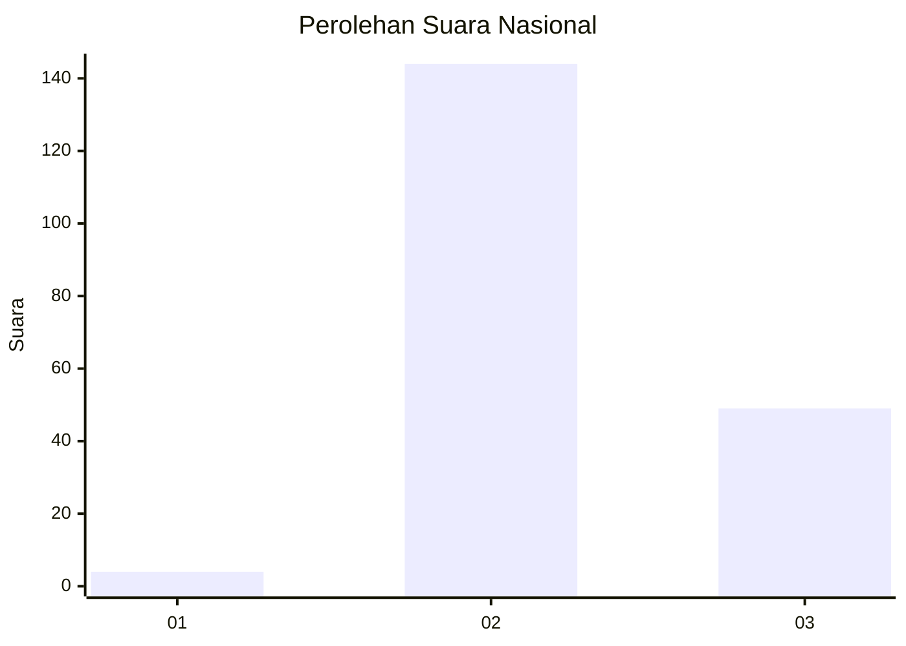
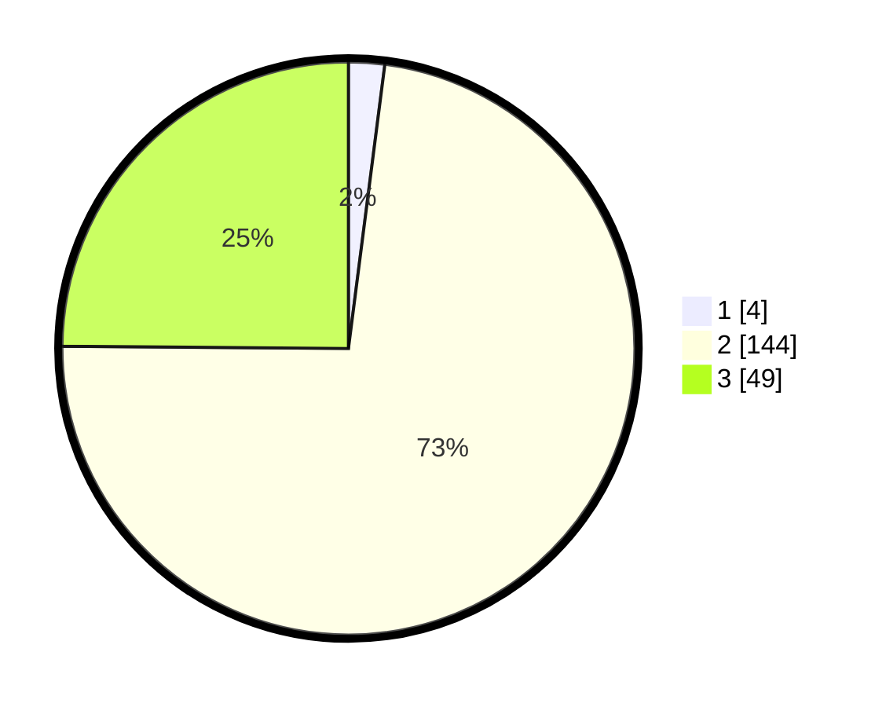

# Hasil

## Grafik

## Tabel

| No. | Nama Paslon    | Suara | Suara (raw) | Persentase |
|:--- |:-------------- | -----:| -----------:| ----------:|
| 1   | ANIES MUHAIMIN | 4     | [4][p-1]    | 2,03       |
| 2   | PRABOWO GIBRAN | 144   | [144][p-2]  | 73,10      |
| 3   | GANJAR MAHFUD  | 49    | [49][p-3]   | 24,87      |

[p-1]: https://github.com/gigit-pemilu/pemilu-2024/blob/main/pilpres/hitung-suara/sub/72-sulawesi-tengah/sub/12-morowali-utara/sub/04-lembo/sub/2001-beteleme/sub/003-tps/sub/paslon-1.txt
[p-2]: https://github.com/gigit-pemilu/pemilu-2024/blob/main/pilpres/hitung-suara/sub/72-sulawesi-tengah/sub/12-morowali-utara/sub/04-lembo/sub/2001-beteleme/sub/003-tps/sub/paslon-2.txt
[p-3]: https://github.com/gigit-pemilu/pemilu-2024/blob/main/pilpres/hitung-suara/sub/72-sulawesi-tengah/sub/12-morowali-utara/sub/04-lembo/sub/2001-beteleme/sub/003-tps/sub/paslon-3.txt

## Foto C Plano

https://sirekap-obj-formc.kpu.go.id/3a2e/pemilu/ppwp/72/12/04/20/01/7212042001003-20240214-215716--8265746e-0700-4792-b2f0-6ee03fb301a4.jpg

https://sirekap-obj-formc.kpu.go.id/3a2e/pemilu/ppwp/72/12/04/20/01/7212042001003-20240214-215819--fd0314e8-0ca6-41d8-901e-f15751057641.jpg

https://sirekap-obj-formc.kpu.go.id/3a2e/pemilu/ppwp/72/12/04/20/01/7212042001003-20240215-024311--208e4935-4f11-4c6a-bc84-54465eea3c04.jpg

## Metadata

| Key        | Value               |
| ---------- | ------------------- |
| Time Stamp | 2024-02-24 22:31:28 |

